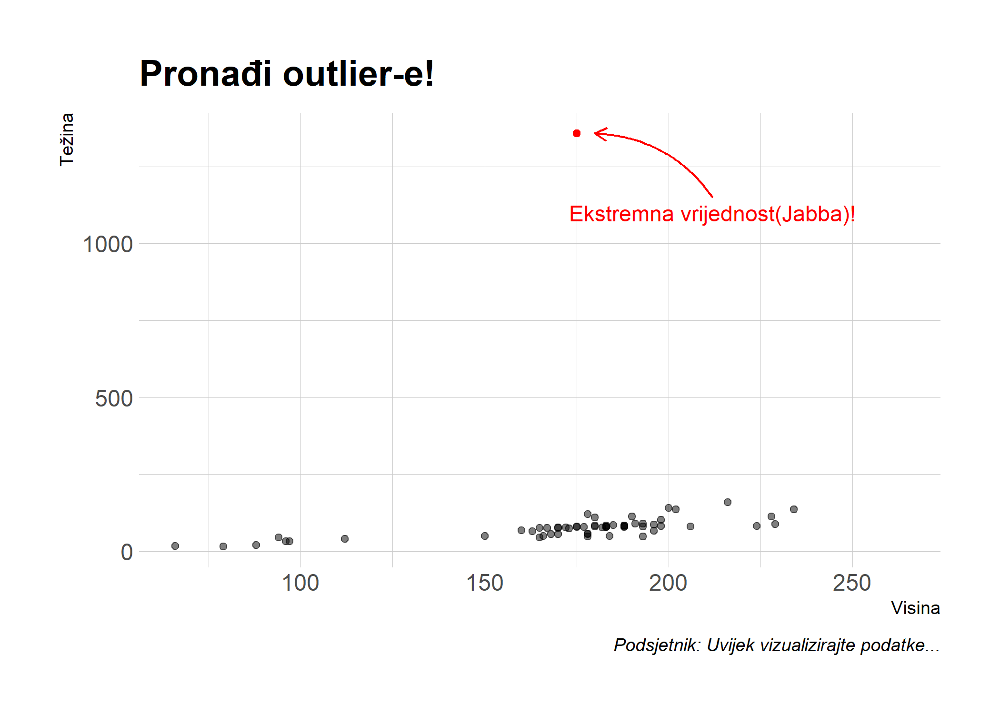
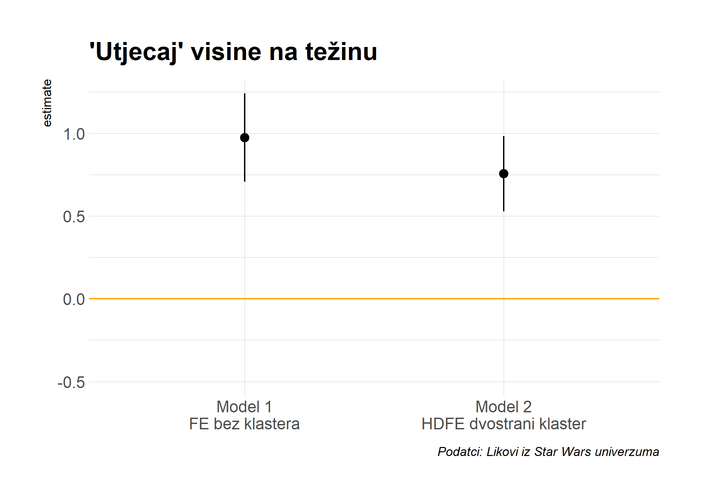

Današnje predavanje se odnosi na regresijsku analizu, najpopularniji analitički pristup u statistici i *data science-u*. Modeli koje ćemo spominjati se dominantno koriste u ekonomiji, odnosno ekonometriji no primjenjivost imaju i u drugim društvenim znanostima i analitičko-poslovnim rješenjima. Cilj predavanja je izložiti pregled najvažnijih funkcija i paketa, a ne raspravljati o kakrakteristikama i teoretskim aspektima pojedinih modela. 


## Software preduvjeti

### R paketi 

*Base R* sadržava većinu potrebnih funkcija za osnovnu regresisjsku analizu no u današnjem predavanju ćemo dodatno koristiti još nekoliko paketa. Korištenje dodatnih paketa će olakšati provedbu analize i omogućiti provođenje sofisticiranijih modela.

- Novi: **broom**, **estimatr**, **fixest**, **sandwich**, **lmtest**, **AER**, **lfe**, **mfx**, **margins**, **modelsummary**, **vtable**
- Korišteni: **tidyverse**, **hrbrthemes**, **listviewer**

Praktičan način za instalaciju i učitavanje svih paketa je izvršavanje donjeg koda. Za pakete **broom** i **modelsummary** ćemo koristiti razvojne pakete jer sadržavaju nekoliko funkcionalnosti koje nisu dostupne u ekvivalentnim CRAN verzijama.


```r
## učitaj i instaliraj pakete
if (!require("pacman")) install.packages("pacman")
pacman::p_load(mfx, tidyverse, hrbrthemes, estimatr, fixest, sandwich, lmtest, AER, lfe, margins, vtable)
## razvojne verzije
pacman::p_install_gh("tidymodels/broom") 
pacman::p_install_gh("vincentarelbundock/modelsummary")
##  ggplot2 teme
theme_set(hrbrthemes::theme_ipsum())
```


Sada kada su potrebni paketi učitani, pogledajmo `starwars` podatke (*već korišteni u prethodnim predavanjima*) koje ćemo koristiti u svrhu demonstracije modela:


```r
starwars
```

```
## # A tibble: 87 x 14
##    name  height  mass hair_color skin_color eye_color birth_year sex   gender
##    <chr>  <int> <dbl> <chr>      <chr>      <chr>          <dbl> <chr> <chr> 
##  1 Luke~    172    77 blond      fair       blue            19   male  mascu~
##  2 C-3PO    167    75 <NA>       gold       yellow         112   none  mascu~
##  3 R2-D2     96    32 <NA>       white, bl~ red             33   none  mascu~
##  4 Dart~    202   136 none       white      yellow          41.9 male  mascu~
##  5 Leia~    150    49 brown      light      brown           19   fema~ femin~
##  6 Owen~    178   120 brown, gr~ light      blue            52   male  mascu~
##  7 Beru~    165    75 brown      light      blue            47   fema~ femin~
##  8 R5-D4     97    32 <NA>       white, red red             NA   none  mascu~
##  9 Bigg~    183    84 black      light      brown           24   male  mascu~
## 10 Obi-~    182    77 auburn, w~ fair       blue-gray       57   male  mascu~
## # ... with 77 more rows, and 5 more variables: homeworld <chr>, species <chr>,
## #   films <list>, vehicles <list>, starships <list>
```

## Osnove regresijskog modela

### `lm()` funkcija

Glavna naredba za provedbu regresijskog modela u R je `lm()` funkcija. "**lm**" je kratica za "**l**inear **m**odels", a funkcijska sintaksa je vrlo intuitivna.

```r
lm(y ~ x1 + x2 + x3 + ..., data = df)
```

`lm()` ima izvor podataka kao funkcijski argument (u ovom slučaju hipotetski datat frame pod nazivom `df`). Razlog za to je mogućnost supostojanja različitih objekata u radnom prostoru R pa je potrebno eksplicitno naznačiti koji objekt nas zanima. To je potrebno čak i ako je `df` jedini data frame u radnom prostoru R u trenutku izođenja regresije. Alternativna opcija je indeksiranje varijabli:

```r
lm(df$y ~ df$x1 + df$x2 + df$x3 + ...)
```

Provedimo sada jednostavnu regresiju težine (mass) na visinu (height) koristeći starwars podatkovni skup.


```r
ols1 = lm(mass ~ height, data = starwars)
# ols1 = lm(starwars$mass ~ starwars$height) ## alternativno
ols1
```

```
## 
## Call:
## lm(formula = mass ~ height, data = starwars)
## 
## Coefficients:
## (Intercept)       height  
##    -13.8103       0.6386
```
Ovaj regresijski ispis je vrlo jednostavan i sažet, a razlog je što se većina korisnih informacija *skriva* u internoj (list) strukturi "ols1" objekta. U RStudio-u je moguće pregledati tu strukturu pomoću naredbe `View(ols1)` ili klikom na "ols1" objekt u gornjem desnom panelu. To će otvorriti interaktivni panel u kojem možete detaljnije proučiti ovaj objekt. Taj pristup ne funkcionira u (knitt-anom) R Markdown dokumentu, pa ćemo koristiti `listviewer::jsonedit()` funkciju za interaktivni pregled.


```r
# View(ols1) ## u uobičajnoj skripti koristi
listviewer::jsonedit(ols1, mode="view") ## za R Markdown
```

<!--html_preserve--><div id="htmlwidget-809656c6c2acdfd379d9" style="width:100%;height:10%;" class="jsonedit html-widget"></div>
<script type="application/json" data-for="htmlwidget-809656c6c2acdfd379d9">{"x":{"data":{"coefficients":{"(Intercept)":-13.8103136287303,"height":0.638571004587035},"residuals":{"1":-19.0238991602397,"2":-17.8310441373046,"3":-15.4925028116251,"4":20.8189707021492,"5":-32.9753370593249,"6":20.1446748122381,"7":-16.5539021281305,"8":-16.1310738162121,"9":-19.0481802106971,"10":-25.4096092061101,"11":-22.2410352336323,"13":-19.7838754171137,"14":-21.132467196936,"15":-22.6624701648268,"16":1260.060387826,"17":-17.7467571510656,"18":8.86753280306401,"19":-11.335372674014,"20":-19.7467571510656,"21":-24.8481802106971,"22":26.0961127113233,"23":5.48182275719366,"24":-20.2167541831749,"25":-18.9396121740008,"26":-18.132467196936,"29":-22.3839347749288,"30":-20.3610471051953,"31":-20.4338902565674,"32":-18.1567482473934,"34":-45.3496032703285,"35":-47.2295913987655,"39":-17.7096388850176,"42":-17.9396121740008,"44":-44.8553251877619,"45":-1.21536080245101,"47":-25.2767601189564,"48":-22.2410352336323,"49":-30.6267452795026,"50":-24.3496032703285,"52":-53.6867512152841,"55":-26.2410352336323,"57":-19.3253222198712,"60":-23.0481802106971,"61":-38.5467571510656,"62":-42.1924731327175,"64":-29.4338902565674,"66":-24.0481802106971,"67":-38.4696151418916,"68":-10.6267452795026,"69":-44.4224464217007,"72":-21.6367957336455,"74":-61.4338902565674,"76":-42.8553251877619,"77":34.8789766379308,"78":0.384698555364138,"79":-27.2410352336323,"80":-51.8553251877619,"81":-37.7353133161989,"87":-46.5539021281305},"effects":{"(Intercept)":-747.466613505303,"height":172.783889465672,"3":-8.91507473191356,"4":21.4194000157428,"5":-29.4427951434848,"6":22.0983868653301,"7":-13.8671619244769,"8":-9.61003251731303,"9":-17.3764020616673,"10":-23.6814442762678,"11":-20.8511909886646,"12":-20.6495024046433,"13":-19.2915287054689,"14":-20.4268242076726,"15":1262.18326022153,"16":-15.3419508514742,"17":10.7084712945311,"18":-3.06634116992952,"19":-17.3419508514742,"20":-23.1764020616673,"21":26.8093155865418,"22":6.75889344053645,"23":-18.2066553492705,"24":-16.8167397784715,"25":-16.2915287054689,"26":-15.3554124487178,"27":-17.3923729974795,"28":-19.325979915662,"29":-16.936064344863,"30":-44.4108532718604,"31":-47.8696712630455,"32":-12.034399298305,"33":-15.8167397784715,"34":-42.9016131346699,"35":5.47484083888537,"36":-22.4772463536779,"37":-20.8511909886646,"38":-29.8007688426593,"39":-23.4108532718604,"40":-52.0713598470667,"41":-24.8511909886646,"42":-17.7663176324662,"43":-21.3764020616673,"44":-36.1419508514742,"45":-39.5621197098763,"46":-28.325979915662,"47":-22.3764020616673,"48":-35.9520352806753,"49":-9.80076884265929,"50":-45.3444601900428,"51":-14.1007923801226,"52":-60.325979915662,"53":-40.9016131346699,"54":34.6899910201503,"55":-0.819249117040137,"56":-25.8511909886646,"57":-49.9016131346699,"58":-37.360431125855,"59":-43.8671619244768},"rank":2,"fitted.values":{"1":96.0238991602397,"2":92.8310441373046,"3":47.4925028116251,"4":115.181029297851,"5":81.9753370593249,"6":99.8553251877619,"7":91.5539021281305,"8":48.1310738162121,"9":103.048180210697,"10":102.40960920611,"11":106.241035233632,"13":131.783875417114,"14":101.132467196936,"15":96.6624701648267,"16":97.939612174001,"17":94.7467571510657,"18":101.132467196936,"19":28.335372674014,"20":94.7467571510657,"21":103.048180210697,"22":113.903887288677,"23":107.518177242806,"24":99.2167541831749,"25":97.9396121740008,"26":101.132467196936,"29":42.3839347749288,"30":88.3610471051953,"31":109.433890256567,"32":108.156748247393,"34":111.349603270329,"35":129.229591398766,"39":57.7096388850176,"42":97.9396121740008,"44":99.8553251877619,"45":46.215360802451,"47":90.2767601189564,"48":106.241035233632,"49":112.626745279503,"50":111.349603270329,"52":103.686751215284,"55":106.241035233632,"57":104.325322219871,"60":103.048180210697,"61":94.7467571510656,"62":92.1924731327175,"64":109.433890256567,"66":103.048180210697,"67":93.4696151418916,"68":112.626745279503,"69":132.422446421701,"72":36.6367957336455,"74":109.433890256567,"76":99.8553251877619,"77":124.121023362069,"78":135.615301444636,"79":106.241035233632,"80":99.8553251877619,"81":117.735313316199,"87":91.5539021281305},"assign":[0,1],"qr":{"qr":[[-7.68114574786861,-1336.64954904012],[0.130188910980824,270.578977473948],[0.130188910980824,0.287474707506684],[0.130188910980824,-0.104277826225194],[0.130188910980824,0.0879026620206325],[0.130188910980824,-0.0155791393425051],[0.130188910980824,0.0324659827189516],[0.130188910980824,0.283778928886571],[0.130188910980824,-0.0340580324430654],[0.130188910980824,-0.0303622538229533],[0.130188910980824,-0.0525369255436257],[0.130188910980824,-0.200368070348108],[0.130188910980824,-0.0229706965827292],[0.130188910980824,0.00289975375805518],[0.130188910980824,-0.00449180348216893],[0.130188910980824,0.0139870896183913],[0.130188910980824,-0.0229706965827292],[0.130188910980824,0.398348066110045],[0.130188910980824,0.0139870896183913],[0.130188910980824,-0.0340580324430654],[0.130188910980824,-0.0968862689849704],[0.130188910980824,-0.0599284827838498],[0.130188910980824,-0.011883360722393],[0.130188910980824,-0.00449180348216893],[0.130188910980824,-0.0229706965827292],[0.130188910980824,0.31704093646758],[0.130188910980824,0.0509448758195119],[0.130188910980824,-0.0710158186441859],[0.130188910980824,-0.0636242614039618],[0.130188910980824,-0.0821031545045221],[0.130188910980824,-0.18558495586766],[0.130188910980824,0.228342249584891],[0.130188910980824,-0.00449180348216893],[0.130188910980824,-0.0155791393425051],[0.130188910980824,0.294866264746908],[0.130188910980824,0.0398575399591757],[0.130188910980824,-0.0525369255436257],[0.130188910980824,-0.0894947117447462],[0.130188910980824,-0.0821031545045221],[0.130188910980824,-0.0377538110631774],[0.130188910980824,-0.0525369255436257],[0.130188910980824,-0.0414495896832895],[0.130188910980824,-0.0340580324430654],[0.130188910980824,0.0139870896183913],[0.130188910980824,0.0287702040988396],[0.130188910980824,-0.0710158186441859],[0.130188910980824,-0.0340580324430654],[0.130188910980824,0.0213786468586155],[0.130188910980824,-0.0894947117447462],[0.130188910980824,-0.20406384896822],[0.130188910980824,0.350302944048588],[0.130188910980824,-0.0710158186441859],[0.130188910980824,-0.0155791393425051],[0.130188910980824,-0.156018726906763],[0.130188910980824,-0.22254274206878],[0.130188910980824,-0.0525369255436257],[0.130188910980824,-0.0155791393425051],[0.130188910980824,-0.119060940705643],[0.130188910980824,0.0324659827189516]],"qraux":[1.13018891098082,1.02507442547873],"pivot":[1,2],"tol":1e-07,"rank":2},"df.residual":57,"na.action":{},"xlevels":{},"call":{},"terms":{},"model":{"mass":[77,75,32,136,49,120,75,32,84,77,84,112,80,74,1358,77,110,17,75,78.2,140,113,79,79,83,20,68,89,90,66,82,40,80,55,45,65,84,82,87,50,80,85,80,56.2,50,80,79,55,102,88,15,48,57,159,136,79,48,80,45],"height":[172,167,96,202,150,178,165,97,183,182,188,228,180,173,175,170,180,66,170,183,200,190,177,175,180,88,160,193,191,196,224,112,175,178,94,163,188,198,196,184,188,185,183,170,166,193,183,168,198,229,79,193,178,216,234,188,178,206,165]}},"options":{"mode":"view","modes":["code","form","text","tree","view"]}},"evals":[],"jsHooks":[]}</script><!--/html_preserve-->

Kao što je vidljivo `ols1` objekt sadržava mnoštvo slotova... koji sadržavaju regresijske koeficijente,vektorr rezidualnih i *fitted* (i.e. predicted) vrijednosti, rangove matrice dizajna, imput podataka...itd. Za deskriptivni pregled najvažniji vrijednosti se uobičajno koristi generička `summary()` funkcija. 


```r
summary(ols1) # (slično kao u Stata-i)
```

```
## 
## Call:
## lm(formula = mass ~ height, data = starwars)
## 
## Residuals:
##     Min      1Q  Median      3Q     Max 
##  -61.43  -30.03  -21.13  -17.73 1260.06 
## 
## Coefficients:
##             Estimate Std. Error t value Pr(>|t|)
## (Intercept) -13.8103   111.1545  -0.124    0.902
## height        0.6386     0.6261   1.020    0.312
## 
## Residual standard error: 169.4 on 57 degrees of freedom
##   (28 observations deleted due to missingness)
## Multiple R-squared:  0.01792,	Adjusted R-squared:  0.0006956 
## F-statistic:  1.04 on 1 and 57 DF,  p-value: 0.312
```

Izvucimo sada regresijske koeficijente:


```r
summary(ols1)$coefficients
```

```
##               Estimate  Std. Error    t value  Pr(>|t|)
## (Intercept) -13.810314 111.1545260 -0.1242443 0.9015590
## height        0.638571   0.6260583  1.0199865 0.3120447
```


### Korištenje "tidy" regresijskih koeficijenata iz `broom` paketa

Iako je najjednostavniji način "vađenja" koeficijenata `summary()` funkcija, u praksi je **broom** ([paket](https://broom.tidyverse.org/)) bolji način. **broom** ima niz korisnih funkcioinalnosti koji regresijske (i druge statističke) objekte pretvaraju u "tidy" data frame-ove. To je jako korisno jer se regresijski output često koristi kao input u nešto drugo, npr. za vizualizaciju marginalnih efekata. Sada ćemo pogledati kako pomoću funkcije `broom::tidy(..., conf.int = TRUE)` možemo prebaciti `ols1` regresijski objekt u *tidy data frame* koeficijenata i bitnih statistika.


```r
# library(broom) ## učitano
tidy(ols1, conf.int = TRUE)
```

```
## # A tibble: 2 x 7
##   term        estimate std.error statistic p.value conf.low conf.high
##   <chr>          <dbl>     <dbl>     <dbl>   <dbl>    <dbl>     <dbl>
## 1 (Intercept)  -13.8     111.       -0.124   0.902 -236.       209.  
## 2 height         0.639     0.626     1.02    0.312   -0.615      1.89
```

Ove "očišćene" (tidy) koeficijente bismo sada mogli koristiti za **ggplot2** vizualizaciju, primjerice koristeći `geom_pointrange()` za prikaz *error bar*-ova.

**broom** ima još nekoliko korisnih funkcionalnosti. Npr. `broom::glance()` daje prikaz modelskih meta podataka (R<sup>2</sup>, AIC, etc.) u data frame-u .


```r
glance(ols1)
```

```
## # A tibble: 1 x 12
##   r.squared adj.r.squared sigma statistic p.value    df logLik   AIC   BIC
##       <dbl>         <dbl> <dbl>     <dbl>   <dbl> <dbl>  <dbl> <dbl> <dbl>
## 1    0.0179      0.000696  169.      1.04   0.312     1  -386.  777.  783.
## # ... with 3 more variables: deviance <dbl>, df.residual <int>, nobs <int>
```

Tehnike izvoza podataka u druge formate (npr. LaTeX tablice) ćemo spomenuti na kraju ovog predavanja.


### Regresija na dijelu podastaka

Prethodno procijenjeni regresijski model i nije baš nešto... R<sup>2</sup> je 0.018. Nizak R<sup>2</sup> baca sumnju na ekstremne vrijednosti u podatcima...

<!-- -->

Čini se da bi imalo smisla maknuti ekstremnu vrijednost iz regresijskog modela!? To je moguće napraviti na dva načina: 1) napravi novi data frame i provedi regresiju 2) subset-aj podatke (direktno) unutar `lm()` funkcije.


#### 1) Napravi novi data frame

R dozvoljava mnoštvo objekata u radnom prostoru pa je moguće napraviti novi data frame objekt koji isključuje ekstremnu vrijednost *Jabba*. Za to je moguće koroistiti **dplyr** ([predavanje](https://raw.githack.com/BrbanMiro/Obrada-podataka/main/Predavanja/05_MANIPULACIJA_tidy.html#1)) ili  **data.table** ([predavanje](https://raw.githack.com/BrbanMiro/Obrada-podataka/main/Predavanja/05_MANIPULACIJA_dt.html#1)). U ovom slučaju ćemo koristiti **dplyr** jer je to trenutno kompatiblno sa starwars podatcima.


```r
starwars2 =
  starwars %>% 
  filter(name != "Jabba Desilijic Tiure")
  # filter(!(grepl("Jabba", name))) ## Regex također funkcionira
ols2 = lm(mass ~ height, data = starwars2)
summary(ols2)
```

```
## 
## Call:
## lm(formula = mass ~ height, data = starwars2)
## 
## Residuals:
##     Min      1Q  Median      3Q     Max 
## -39.382  -8.212   0.211   3.846  57.327 
## 
## Coefficients:
##              Estimate Std. Error t value Pr(>|t|)    
## (Intercept) -32.54076   12.56053  -2.591   0.0122 *  
## height        0.62136    0.07073   8.785 4.02e-12 ***
## ---
## Signif. codes:  0 '***' 0.001 '**' 0.01 '*' 0.05 '.' 0.1 ' ' 1
## 
## Residual standard error: 19.14 on 56 degrees of freedom
##   (28 observations deleted due to missingness)
## Multiple R-squared:  0.5795,	Adjusted R-squared:  0.572 
## F-statistic: 77.18 on 1 and 56 DF,  p-value: 4.018e-12
```

#### 2) Subset unutar `lm()` funkcije

Provedi regresiju i subset-aj direktno u funkcijskom pozivu.


```r
ols2a = lm(mass ~ height, data = starwars %>% filter(!(grepl("Jabba", name))))
summary(ols2a)
```

```
## 
## Call:
## lm(formula = mass ~ height, data = starwars %>% filter(!(grepl("Jabba", 
##     name))))
## 
## Residuals:
##     Min      1Q  Median      3Q     Max 
## -39.382  -8.212   0.211   3.846  57.327 
## 
## Coefficients:
##              Estimate Std. Error t value Pr(>|t|)    
## (Intercept) -32.54076   12.56053  -2.591   0.0122 *  
## height        0.62136    0.07073   8.785 4.02e-12 ***
## ---
## Signif. codes:  0 '***' 0.001 '**' 0.01 '*' 0.05 '.' 0.1 ' ' 1
## 
## Residual standard error: 19.14 on 56 degrees of freedom
##   (28 observations deleted due to missingness)
## Multiple R-squared:  0.5795,	Adjusted R-squared:  0.572 
## F-statistic: 77.18 on 1 and 56 DF,  p-value: 4.018e-12
```

Kvaliteta modela je znatno unaprijeđena kada je maknut outlier pa je sada R<sup>2</sup> porastao na 0.58. To ne znači da valja olako izbacivati podatke...ponekad je moguće ekstremne vrijednosti *uzeti u obzir* kroz statistički model...primjerice kroz nestandardnu rezidualnu strukturu!

## Nestandardna rezidualna struktura

Statističke neregularnosti (heteroskedastičnost, klasteri  itd) su regularna stvar u statistici. Dobra stvar je da postoji mnoštvo načina za uvažavanje nestandardne rezudualne strukture u R. Tu je izvsrni **sandwich**  ([paket](https://cran.r-project.org/web/packages/sandwich/index.html)). Nešto "moderniji" pristup je **estimatr** ([paket](https://declaredesign.org/r/estimatr/articles/getting-started.html)) koji poboljšava brzinu i praktičnost. slijedi nekoliko oglednih primjera... 

### Robusne standardne pogreške

Heteroskedstične (HC), "robusne" standardne pogreške možemo uvažiti korištenjem `estimatr::lm_robust()` funkcije. Prikažimo to na primjeru `ols1` regresijskog objekta koji smo koristili u prethodnim primjerima. **estimatr** će prikaz dati u "tidy" formatu, no valja imati na umu da je objekt moguće ugnijezditi i u  `tidy()` funkciju.


```r
# library(estimatr) ## učitano
ols1_robust = lm_robust(mass ~ height, data = starwars)
# tidy(ols1_robust, conf.int = TRUE) ## tidy() alternativa
ols1_robust
```

```
##               Estimate  Std. Error    t value     Pr(>|t|)    CI Lower
## (Intercept) -13.810314 23.45557632 -0.5887859 5.583311e-01 -60.7792950
## height        0.638571  0.08791977  7.2631109 1.159161e-09   0.4625147
##               CI Upper DF
## (Intercept) 33.1586678 57
## height       0.8146273 57
```

Paket koristi* Eicker-Huber-White* robusnu rezidualnu strukturu kao default, što se često navodi kao *"HC2" standard errors*. Default je moguće promijeniti sa `se_type = ` argumentom^[Pogledaj za detalje!](https://declaredesign.org/r/estimatr/articles/mathematical-notes.html#lm_robust-notes)]. To je korisno ako doalzite iz Stata-e pa želite replicirati rezultate. Replikacija rezultata nije uvijek elegantna stvar, a za raspravu na temu replikacije između Stata-e, R i Python-a pogledajte [ovdje](https://declaredesign.org/r/estimatr/articles/stata-wls-hat.html). 


```r
lm_robust(mass ~ height, data = starwars, se_type = "stata")
```

```
##               Estimate  Std. Error    t value     Pr(>|t|)    CI Lower
## (Intercept) -13.810314 23.36219608 -0.5911394 5.567641e-01 -60.5923043
## height        0.638571  0.08616105  7.4113649 6.561046e-10   0.4660365
##               CI Upper DF
## (Intercept) 32.9716771 57
## height       0.8111055 57
```

**estimatr** podržava i robusnu regresiju u modelu instrumentalnih varijabli (IV) no to ćemo detaljnije objasniti u narednom dijelu predavanja.

#### Usputni komentar o HAC (Newey-West) rezidualnoj strukturi

**estimatr** nema podršku za HAC (i.e. heteroskedasticity *and* autocorrelation consistent) rezidualnu strukturu *a la* [Newey-West](https://en.wikipedia.org/wiki/Newey%E2%80%93West_estimator).[Inicijativa](https://github.com/DeclareDesign/estimatr/issues/272) za dodavanje te funkcionalnosti postoji na GitHub-u no za sada je HAC moguć kroz **sandwich** paket. Npr. korištenje `sandwich::NeweyWest()`funkcije na `ols1` objektu:


```r
# library(sandwich) ## učitano
# NeweyWest(ols1) ## HAC VCOV
sqrt(diag(NeweyWest(ols1))) ## prikaži HAC SEs
```

```
## (Intercept)      height 
##  21.2694130   0.0774265
```

Ako želite koristiti HAC SE u modelue, preporuča se primjena `ols1` objekta u `lmtest::coeftest()`funkciju. Ova funkcija koristi **sandwich** paket i omogućava praktičan način testiranja hipoteza u modelu sa raznim specifikacijama. Ovdje je samo jedan, osnovni primjer:


```r
# library(lmtest) ## već učitano
ols1_hac = lmtest::coeftest(ols1, vcov = NeweyWest)
ols1_hac
```

```
## 
## t test of coefficients:
## 
##               Estimate Std. Error t value  Pr(>|t|)    
## (Intercept) -13.810314  21.269413 -0.6493    0.5187    
## height        0.638571   0.077427  8.2474 2.672e-11 ***
## ---
## Signif. codes:  0 '***' 0.001 '**' 0.01 '*' 0.05 '.' 0.1 ' ' 1
```

Obratite pozornost i na lakoću kojom se `coeftest()` uklapa u **broom** paket: 


```r
tidy(ols1_hac, conf.int = TRUE)
```

```
## # A tibble: 2 x 7
##   term        estimate std.error statistic  p.value conf.low conf.high
##   <chr>          <dbl>     <dbl>     <dbl>    <dbl>    <dbl>     <dbl>
## 1 (Intercept)  -13.8     21.3       -0.649 5.19e- 1  -56.4      28.8  
## 2 height         0.639    0.0774     8.25  2.67e-11    0.484     0.794
```

### Klasteri u rezidualnoj strukturi

Klasteri u rezidualnoj strukturi se najčešće javljaju u panel podatcima. Panel podatke ćemo spomenuti kasnije no ovdje je jedan praktični primjer klastera sa `estimatr::lm_robust()` funkcijom:


```r
lm_robust(mass ~ height, data = starwars, clusters = homeworld)
```

```
##               Estimate  Std. Error    t value     Pr(>|t|)    CI Lower
## (Intercept) -9.3014938 28.84436408 -0.3224718 0.7559158751 -76.6200628
## height       0.6134058  0.09911832  6.1886211 0.0002378887   0.3857824
##               CI Upper       DF
## (Intercept) 58.0170751 7.486034
## height       0.8410291 8.195141
```


## *Dummie* varijable i interakcije varijabli

Za demonstraciju principa u ovom poglavlju je potrebno *subset-ati* starwars podatke tako da uključuju samo ljudsku vrstu. Zbog toga ćemo napraviti novi podatkovni skup,a dodatno ćemo još i napraviti novu (faktorsku) varijablu "spol" ("gender") jer je važno pokazati kako R tretira faktorske varijable:


```r
humans = 
  starwars %>% 
  filter(species=="Human") %>%
  mutate(gender_factored = as.factor(gender)) %>% ## faktorska verzija varijable "gender"
  select(contains("gender"), everything())
humans
```

```
## # A tibble: 35 x 15
##    gender gender_factored name  height  mass hair_color skin_color eye_color
##    <chr>  <fct>           <chr>  <int> <dbl> <chr>      <chr>      <chr>    
##  1 mascu~ masculine       Luke~    172    77 blond      fair       blue     
##  2 mascu~ masculine       Dart~    202   136 none       white      yellow   
##  3 femin~ feminine        Leia~    150    49 brown      light      brown    
##  4 mascu~ masculine       Owen~    178   120 brown, gr~ light      blue     
##  5 femin~ feminine        Beru~    165    75 brown      light      blue     
##  6 mascu~ masculine       Bigg~    183    84 black      light      brown    
##  7 mascu~ masculine       Obi-~    182    77 auburn, w~ fair       blue-gray
##  8 mascu~ masculine       Anak~    188    84 blond      fair       blue     
##  9 mascu~ masculine       Wilh~    180    NA auburn, g~ fair       blue     
## 10 mascu~ masculine       Han ~    180    80 brown      fair       brown    
## # ... with 25 more rows, and 7 more variables: birth_year <dbl>, sex <chr>,
## #   homeworld <chr>, species <chr>, films <list>, vehicles <list>,
## #   starships <list>
```

### *Dummie* varijable kao faktori


*Dummie* varijable su ključna komponenta velikog broja regresijskih modela, a podrška za rukovanje tim varijablama je dosta loša u nekim (i.e. većini) statističkim programima (npr. potrebna tabulacija nove matrice binarnih varijabli, a potom pripisivanje orginalnim podtacima...). R ima dobar pristup za stvaranje i evaluacijju *dummie* varijabli: jednostavno specificirajte varijablu kao  [faktor](https://r4ds.had.co.nz/factors.html).^[Faktori su varijable sa jedinstvenim kvalitativnim razinama, npr. "muški", "ženski", "trans", itd.]

Ovdje je primjer regresije sa "gendered_factored" varijablom koju smo maločas stvorili:


```r
summary(lm(mass ~ height + gender_factored, data = humans))
```

```
## 
## Call:
## lm(formula = mass ~ height + gender_factored, data = humans)
## 
## Residuals:
##     Min      1Q  Median      3Q     Max 
## -16.068  -8.130  -3.660   0.702  37.112 
## 
## Coefficients:
##                          Estimate Std. Error t value Pr(>|t|)  
## (Intercept)              -84.2520    65.7856  -1.281   0.2157  
## height                     0.8787     0.4075   2.156   0.0441 *
## gender_factoredmasculine  10.7391    13.1968   0.814   0.4259  
## ---
## Signif. codes:  0 '***' 0.001 '**' 0.01 '*' 0.05 '.' 0.1 ' ' 1
## 
## Residual standard error: 15.19 on 19 degrees of freedom
##   (13 observations deleted due to missingness)
## Multiple R-squared:  0.444,	Adjusted R-squared:  0.3855 
## F-statistic: 7.587 on 2 and 19 DF,  p-value: 0.003784
```

Cijela stvar sa prebacivanjem string (i.e. character) varijable u faktorsku nije bila nužna u regresijskom pozivu jer će R to učinii automatski...no valja znati što se događa. Pogledajte isti primjer: 


```r
## ne faktorska verzija "gender" varijable; R zna!!!
summary(lm(mass ~ height + gender, data = humans))
```

```
## 
## Call:
## lm(formula = mass ~ height + gender, data = humans)
## 
## Residuals:
##     Min      1Q  Median      3Q     Max 
## -16.068  -8.130  -3.660   0.702  37.112 
## 
## Coefficients:
##                 Estimate Std. Error t value Pr(>|t|)  
## (Intercept)     -84.2520    65.7856  -1.281   0.2157  
## height            0.8787     0.4075   2.156   0.0441 *
## gendermasculine  10.7391    13.1968   0.814   0.4259  
## ---
## Signif. codes:  0 '***' 0.001 '**' 0.01 '*' 0.05 '.' 0.1 ' ' 1
## 
## Residual standard error: 15.19 on 19 degrees of freedom
##   (13 observations deleted due to missingness)
## Multiple R-squared:  0.444,	Adjusted R-squared:  0.3855 
## F-statistic: 7.587 on 2 and 19 DF,  p-value: 0.003784
```


### Interakcijski efekti

Kao i kod *dummie* varijabli, R ima praktičnu sintaksu za specifikaciju interakcijskih varijabli direktno u regresijskom modelu.^[Iako postoji mnoštvo razloga da to napravite u zasebnom koraku (npr. standardizacija).] Ovo je standardna sintaksa:

- `x1:x2` "križanje" varijabli (ekvivalentno uključivanju x1 × x2 interakcije)
- `x1/x2` "ugnježđivanje" druge varijable u prvu (ekvivalentno `x1 + x1:x2`)
- `x1*x2`uključuje sve glavne i interakcijske varijable (eekvivalentno `x1 + x2 + x1:x2`) 

AOpćenito je prporučljivo uključiti sve glavne (*parent*) odnose uz njihove interakcije pa je `*` default opcija. 

Primjerice, može nas zanimati da li je odnos između težine i visine posredovan spolom osobe!? Tada bismo proveli regresiju u ovakvom obliku:

$$Mass = \beta_0 + \beta_1 D_{Male} + \beta_2 Height + \beta_3 D_{Male} \times Height$$

Za implementaciju u R:


```r
ols_ie = lm(mass ~ gender * height, data = humans)
summary(ols_ie)
```

```
## 
## Call:
## lm(formula = mass ~ gender * height, data = humans)
## 
## Residuals:
##     Min      1Q  Median      3Q     Max 
## -16.250  -8.158  -3.684  -0.107  37.193 
## 
## Coefficients:
##                        Estimate Std. Error t value Pr(>|t|)
## (Intercept)            -61.0000   204.0565  -0.299    0.768
## gendermasculine        -15.7224   219.5440  -0.072    0.944
## height                   0.7333     1.2741   0.576    0.572
## gendermasculine:height   0.1629     1.3489   0.121    0.905
## 
## Residual standard error: 15.6 on 18 degrees of freedom
##   (13 observations deleted due to missingness)
## Multiple R-squared:  0.4445,	Adjusted R-squared:  0.3519 
## F-statistic: 4.801 on 3 and 18 DF,  p-value: 0.01254
```


## Analiza panel podataka

### Fiksni ekefti sa **fixest** paketom

Najjednostavniji način za uključivanje fiksnih efekata u regresijski model je korištenje *dummie* varijabli, no to je vrlo neučinkovito...Uostalom koji je smisao svih [teoretskih](https://en.wikipedia.org/wiki/Frisch%E2%80%93Waugh%E2%80%93Lovell_theorem) aspekata *within-group* transformacija ako ih ne možemo praktično primijeniti u statsitičkom programu?! U R-u postoji više opcija za analizu fiksnih efekata: **lfe** ([paket](https://cran.r-project.org/web/packages/lfe/index.html)) koji je dosta sličan Stata-inom **reghdfe** ([pristupu](http://scorreia.com/software/reghdfe/)) i **fixest**  ([paket](https://github.com/lrberge/fixest)) koji ćemo koristiti u ovom predavanju.

**fixest** je relativno novi paket koji ima podršku za analizu nelinearnih modela, visko-dimenzionalnih fiksnih efekata, višestrukih klastera itd. Procedure u paketu su jako brze ([vidi!](https://github.com/lrberge/fixest#benchmarking)) o odnosu na  **lfe** i **reghdfe** pakete. Ovdje ćemo razmotriti samo najosnovnije principe rada sa **fixest** paketom, a za detalje [pogledajte](https://cran.r-project.org/web/packages/fixest/vignettes/fixest_walkthrough.html).

#### Jednostavni FE model

Glavna funkcija u ovom paketu je `fixest::feols()`, a koristi se za procjenu fiksnih efekata u linearnim modelima. Sintaksa zahtjeva da se prvo specificira "normalni" regresijski model, a lista fiksnih efekata  nakon `|`. Pogledajmo jedan primjer regeresije težine (mass) na visinu (height) pri čemu ćemo kontrolira za fiksne efekte na razini vrste (starwars podatci!).^[Pošto smo specificirali "species" u slotu za fiksne efekte, `feols()` funkcija će automatski pretvoriti potrebne varijable u faktorske.]


```r
# library(fixest) ## učitano
ols_fe = feols(mass ~ height | species, data = starwars) ## fiksni efekti nakon "|"
ols_fe
```

```
## OLS estimation, Dep. Var.: mass
## Observations: 58 
## Fixed-effects: species: 31
## Standard-errors: Clustered (species) 
##        Estimate Std. Error t value  Pr(>|t|)    
## height 0.974876   0.044291   22.01 < 2.2e-16 ***
## ---
## Signif. codes:  0 '***' 0.001 '**' 0.01 '*' 0.05 '.' 0.1 ' ' 1
## Log-likelihood: -214.02   Adj. R2: 0.99282 
##                         R2-Within: 0.66249
```

Modelski objekt je automatski klasterirao standardne pogreške po varijabli fiksnih efekata (i.e. species). Za obične (*vanilla*) reziduale je potrebno specificirati `se` argument u `summary.fixest()` funkciji na sljedeći način:


```r
summary(ols_fe, se = 'standard')
```

```
## OLS estimation, Dep. Var.: mass
## Observations: 58 
## Fixed-effects: species: 31
## Standard-errors: Standard 
##        Estimate Std. Error t value Pr(>|t|)    
## height 0.974876   0.136463  7.1439 1.38e-07 ***
## ---
## Signif. codes:  0 '***' 0.001 '**' 0.01 '*' 0.05 '.' 0.1 ' ' 1
## Log-likelihood: -214.02   Adj. R2: 0.99282 
##                         R2-Within: 0.66249
```

Podatkovni skup sa koeficijentima ćemo pospremiti u zasebni objekt jer će nam trebati kasnije. Pri tome ćemo koristiti *vanilla* reziduale. Usput primjetite na koji način`broom::tidy()` metoda za `fixest` objekte prihvaća `se` argument. Ova procedura je ujedno i jako praktična za provjeru više različitih modela:


```r
# coefs_fe = tidy(summary(ols_fe, se = 'standard'), conf.int = TRUE) ## isto kao dolje
coefs_fe = tidy(ols_fe, se = 'standard', conf.int = TRUE)
```

#### Visko-dimenzionalni FE i višetruki klasteri

Kako što smo naveli prije **fixest** omogućava proizvoljan broj varijabli za fiksne efekte i višestruke klastere (do 4). Pogledajmo kako to izgleda u prkasi uz dodavanje "homeworld" varijable fiksnim efektima:


```r
## We now have two fixed effects: species and homeworld
ols_hdfe = feols(mass ~ height |  species + homeworld, data = starwars)
ols_hdfe
```

```
## OLS estimation, Dep. Var.: mass
## Observations: 55 
## Fixed-effects: species: 30,  homeworld: 38
## Standard-errors: Clustered (species) 
##        Estimate Std. Error t value Pr(>|t|)    
## height 0.755844   0.332888  2.2706  0.03078 *  
## ---
## Signif. codes:  0 '***' 0.001 '**' 0.01 '*' 0.05 '.' 0.1 ' ' 1
## Log-likelihood: -188.55   Adj. R2: 1.00768 
##                         R2-Within: 0.48723
```

Rezidualna struktura prethodnog modela je automatski klasterirana po vrsti (species), odnosno prvoj varijabli iza `|`. Ukoliko želimo klaster po "species" i "homeworld" varijablama^[Ovo je samo demonstrativni primjer.] možemo koristit funkcijske argumente `se` ili `cluster` u `summary.fixest()` funkciji. Pripisati ćemo model `ols_hdfe` objektu:


```r
## klaster po species i homeworld
# ols_hdfe = summary(ols_hdfe, se = 'twoway') ## Isto kao niže
ols_hdfe = summary(ols_hdfe, cluster = c('species', 'homeworld'))
ols_hdfe
```

```
## OLS estimation, Dep. Var.: mass
## Observations: 55 
## Fixed-effects: species: 30,  homeworld: 38
## Standard-errors: Two-way (species & homeworld) 
##        Estimate Std. Error t value Pr(>|t|)    
## height 0.755844   0.116416  6.4926 4.16e-07 ***
## ---
## Signif. codes:  0 '***' 0.001 '**' 0.01 '*' 0.05 '.' 0.1 ' ' 1
## Log-likelihood: -188.55   Adj. R2: 1.00768 
##                         R2-Within: 0.48723
```

#### Usporedba modelskih koeficijenata

**fixest** ima ugrađenu `coefplot()` funkciju za prikaz rezulatat  procjene. Ovo je korisno za pregled efekata kroz vrijeme iako ([Pogledaj!](https://cran.r-project.org/web/packages/fixest/vignettes/fixest_walkthrough.html#23_adding_interactions:_yearly_treatment_effect).) se procjena koeficijenata ta različite modele se najčešće radi sa **ggplot2** paketom. Sljedeći primjer se zasniva na funkcionalnosti koju omogućava spremanje objekta kao data frame-a pomoću`broom::tidy()` funkcije. Upravo to olakšava vizualizaciju u ovom slučaju:


```r
# library(ggplot2) ## učitano
## "tidy" output od ols_hdfe objekta
coefs_hdfe = tidy(ols_hdfe, conf.int = TRUE)
bind_rows(
  coefs_fe %>% mutate(reg = "Model 1\nFE bez klastera"),
  coefs_hdfe %>% mutate(reg = "Model 2\nHDFE dvostrani klaster")
  ) %>%
  ggplot(aes(x=reg, y=estimate, ymin=conf.low, ymax=conf.high)) +
  geom_pointrange() +
  labs(Title = "Marginalni efekt visine na težinu") +
  geom_hline(yintercept = 0, col = "orange") +
  ylim(-0.5, NA) + ## Added a bit more bottom space to emphasize the zero line
  labs(
    title = "'Utjecaj' visine na težinu",
    caption = "Podatci: Likovi iz Star Wars univerzuma"
    ) +
  theme(axis.title.x = element_blank())
```

```
## Warning in grid.Call(C_textBounds, as.graphicsAnnot(x$label), x$x, x$y, : font
## family not found in Windows font database

## Warning in grid.Call(C_textBounds, as.graphicsAnnot(x$label), x$x, x$y, : font
## family not found in Windows font database

## Warning in grid.Call(C_textBounds, as.graphicsAnnot(x$label), x$x, x$y, : font
## family not found in Windows font database

## Warning in grid.Call(C_textBounds, as.graphicsAnnot(x$label), x$x, x$y, : font
## family not found in Windows font database

## Warning in grid.Call(C_textBounds, as.graphicsAnnot(x$label), x$x, x$y, : font
## family not found in Windows font database

## Warning in grid.Call(C_textBounds, as.graphicsAnnot(x$label), x$x, x$y, : font
## family not found in Windows font database

## Warning in grid.Call(C_textBounds, as.graphicsAnnot(x$label), x$x, x$y, : font
## family not found in Windows font database

## Warning in grid.Call(C_textBounds, as.graphicsAnnot(x$label), x$x, x$y, : font
## family not found in Windows font database

## Warning in grid.Call(C_textBounds, as.graphicsAnnot(x$label), x$x, x$y, : font
## family not found in Windows font database

## Warning in grid.Call(C_textBounds, as.graphicsAnnot(x$label), x$x, x$y, : font
## family not found in Windows font database

## Warning in grid.Call(C_textBounds, as.graphicsAnnot(x$label), x$x, x$y, : font
## family not found in Windows font database
```

```
## Warning in grid.Call.graphics(C_text, as.graphicsAnnot(x$label), x$x, x$y, :
## font family not found in Windows font database
```

```
## Warning in grid.Call(C_textBounds, as.graphicsAnnot(x$label), x$x, x$y, : font
## family not found in Windows font database

## Warning in grid.Call(C_textBounds, as.graphicsAnnot(x$label), x$x, x$y, : font
## family not found in Windows font database
```

<!-- -->

Normalno bismo očekivali veće standardne pogreške sa klasteringom no ovdje je taj efekt poništen kroz povećanu preciznost koju donose fiksni efekti. Ipak ne treba zboraviti da je cjelokupni primjer zasnovan na imaginarnim podatcima pa nema smisla previše razmišljati o substantivnim implikacijama ovih rezultata. Bitna je sintaksa!

#### Komentar o standardnim pogreškama


Upravo smo vidjeli koje opcije ima **fixest** pri specifikaciji različitih rezidualnih struktura. Ukratko provedite model sa `se` ili `cluster` argumentima u  `summary.fixest()` (ili `broom::tidy()`) ako niste zaovoljni sa *default* varijantama. Tu postoje još dvije stvari na koje valja skrenutu pozornost!

Prvo, ako dolazite iz drugog statističkog jezika (Stata!?), prilagodba rezidualne strukture nakon što je proveden model može izgledati neobično no taj način ima znatne prednosti. Primjerice, to nam omogućava analizu različitih specifikacija po *on-the-fly* principu bez da je potrebno ponovno provesti model.**fixest** je uistinu brz no vremenski gubitci kod većih modela mogu biti znatni.

Drugo, usporedba standardnih pogrešaka u različitim programima je komplicirana stvar. Osim mnoštva nerješenih teoretskih aspekata (posebno kod višestrukih klastera) tu je i problem specifičnosti svakog pojedinog statističkog paketa([Pogledaj za diskusiju!](https://github.com/sgaure/lfe/issues/1#issuecomment-530643808)) Usporedba u slučaju **fixest** je je detaljno opisana u [vignette](https://cran.r-project.org/web/packages/fixest/vignettes/standard_errors.html) o replikaciji rezidualne strukture kod drugih paketa.^[Za detalje vrijedi pročitati!](https://cran.r-project.org/web/packages/sandwich/vignettes/sandwich-CL.pdf)]

### Slučajni (random) i mješoviti (mixed) efekti

Fiksni efekti su znatno češće sreću
 
Fixed effects models are more common than random or mixed effects models in economics (in my experience, anyway). I'd also advocate for [Bayesian hierachical models](http://www.stat.columbia.edu/~gelman/arm/) if we're going down the whole random effects path. However, it's still good to know that R has you covered for random effects models through the **plm** ([link](https://cran.r-project.org/web/packages/plm/)) and **nlme** ([link](https://cran.r-project.org/web/packages/nlme/index.html)) packages.^[As I mentioned above, **plm** also handles fixed effects (and pooling) models. However, I prefer **fixest** and **lfe** for the reasons already discussed.] I won't go into detail , but click on those links if you would like to see some examples.


