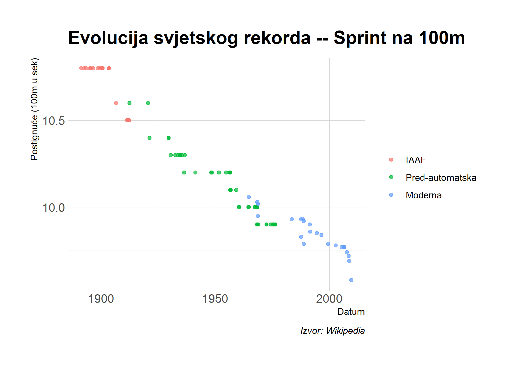

## Software podrška 

### "Vanjski" software

Za današnje pedavanje je potrebno instaliriati [SelectorGadget](https://selectorgadget.com/). SelectorGadget je Chrome ekstenzija koja omogućava jednostavno pronalaženje CSS selektora.(Instalacija je moguća preko [linka](https://chrome.google.com/webstore/detail/selectorgadget/mhjhnkcfbdhnjickkkdbjoemdmbfginb).) SelectorGadget je dostupan isključivo za Chrome. U slučaju da preferirate Firefox, opcija je [ScrapeMate](https://addons.mozilla.org/en-US/firefox/addon/scrapemate/).

### R paketi 

- Novi: **rvest**, **janitor**
- Korišteni u prethodnim predavanjima: **tidyverse**, **lubridate**, **hrbrthemes**

Prisjetite se da je **rvest** automatski instaliran sa *tidyverse* paketom. Ipak, ovo je prigodan način da instalirate i učitate sve prethodno pobrojane pakete ukoliko to niste već napravili. 


```r
## učitaj i instaliraj pakete
if (!require("pacman")) install.packages("pacman")
pacman::p_load(tidyverse, rvest, lubridate, janitor, hrbrthemes)
## ggplot2 tema (po želji)
theme_set(hrbrthemes::theme_ipsum())
```

## Webscraping osnove

Ovo predavanje se odnosi na preuzimanje sadržaja sa web-a na lokalno računalo. Svi već imamo iskustvo sa pregledom web sadržaja u browser-u (Chrome, Firefox,...) pa razumijemo da taj sadržaj mora postojati negdje (podatci). Važno je razumjeti da postoje dva osnovna načina na koja se web sadržaj prikazuje (*engl.render*) u browser-u:

1. na strani servera (*Server-side*)
2. na strani klijenta (*Client side*)

[Pročitajte](https://www.codeconquest.com/website/client-side-vs-server-side/) za više detalje (uključujući primjere). Za potrebe ovog predavanja, glavni su sljedeći elementi: 


### 1. Server-strana

- Skripte koje "grade" web stranicu se ne izvršavaju na lokalnom računalu nego na (host) serveru
koji šalje sav HTML kod. 
  - npr. Wikipedia tablice su već popupunjene sa svim informacijama (brojevi, datumi, nazivi...) koje vidimo u browser-u. 
- Drugačije rečeno, sve informacije koje vidimo u našem browser-u su već procesuirane od strane (host) servera. 
- "Zamislite" kao da su informacije ugrađene u HTML web stranice.
- **Izazov za Webscraping:** Pronaći odgovarajuće CSS (ili Xpath) "selektore". Snalaženje u dinamičkim web stranicama (npr. "Next page" i "Show More" tabovi).
- **Ključni koncepti:** CSS, Xpath, HTML
  
### 2. Client-strana
- Web stranica sadržava prazni HTML ili CSS okvi.  
  - Npr. Moguće je da se stranica sastoji od praznog predloška tablice bez ikakvih vrijednosti.
- Kada posjetimo URL takve web stranice, naš browser šalje zahtijev (*request*) na host server.
- U slučaju da je sve u redu sa zahtjevom (*valid request*), server šalje odgovor (*response*) kao skriptu (*script*), koju naš browser izivršava i koristi kako bi popunio HTML predložak sa (specifičnim) informacijama koje smo zatražili.
- **Izazov za Webscraping:** Pronaći "API točke" može biti problematično pošto one nisu uvijek direktno vidljive.
- **Ključni koncepti:** API, API točke

U ovom predavanju ćemo proći kroz glavne razlike između ova dva pristupa i dati pregled implikacija koje svaki ima za preuzimanje web sadržaja. Važno je istaknuti da webscraping uključuje ponešto "detektivskog" posla.  Često će biti potrebno prilagoditi korake s obzirom na podatke koje želimo preuzeti, a procedure koje funkcioniraju na jednoj stranici neće nužno funkcionirati i na drugoj (ponekad neće funkcionirati ni na istoj nakon nekog vremena!). Zbog toga se je moguće reći da  webscraping podjednako uključuje umjetnost i znanost.

Pozitivna strana priče je da server-strana i client-strana dozvoljavaju preuzimanje web sadržaja. Kao što ćemo vidjeti u ostatku predavanja, preuzimanje podataka sa web stranice koja funkcionira na client-strani (API) je često jednostavnije, pogotovo kada se radi o preuzimanju veće količine podataka (*bulk*). Za webscraping vrijedi općenito pravilo: *ako vidite podatke u browseru, možete ih i preuzeti*.


### Savjet: Etička i zakonska ograničenja

Prethodna rečenica ne uzima u obzir važne etičke i zakonske aspekte preuzimanja sadržaja sa interneta. Samo zato što možete nešto preuzeti sa interneta, ne zanči da biste to i trebali učiniti. Vaša je odgovornost procijeniti da li web stranica ima zakonska ograničenja na sadržaj koji se tamo nalazi. Alati koje ćemo koristiti u ovom predavanju su uistinu moćni i mogu prenapregnuti server i izazvati poteškoće u radu ili pad web stranice. Glavna krilatice kod webscraping je stoga "budite pristojni"!


## Webscraping sa **rvest** paketom (server-strana)

Glavni paket koji se u R koristi za preuzimanje web sadržaja na strani severa je**rvest** ([link](https://rvest.tidyverse.org/)). To je jednostavan ali moćan paket za webscraping inspiriran Python-ovom **Beautiful Soup** ([link](https://www.crummy.com/software/BeautifulSoup/)) platformom, ali uz dodatne tidyverse funkcionalnosti :-). **rvest** je osmišljen za rad sa stranicama koje su procesuirane na srani severa i zbog toga zahtijeva razumijevanje CSS selektora...pa pogledajmo što je to točno.

### CSS i SelectorGadget

Za detaljnije informacije o [CSS](https://developer.mozilla.org/en-US/docs/Learn/CSS/Introduction_to_CSS/How_CSS_works) (i.e Cascading Style Sheets) i [SelectorGadget](http://selectorgadget.com/) pročitajte više na interentu. Ukratko, CSS je jezik koji određuje izled HTML dokumenata (uključujući i web stranice). To postiže tako što omogućuje browseru skup pravila za prikaz koja se formiraju na osnovi: 

1. _Properties._ CSS svojstva određuju **kako** će se nešto prkazati. To su npr. fontovi, stilovi, boje, širina stranice itd. 
2. _Selectors._ CSS selektori odrđuju **što** što će se prikazivati. Oni definirajz pravila koja se pripisuju pojedinim elementima stranice. Npr Tekstualni elementi definirani kao ".h1" (i.e. naslovi) su obično veći i naglašeniji nego elementi definirani kao ".h2" (i.e. podnaslovi).

Za preuzimanje sadržaja sa web stranice je bitno identificirati CSS selektore sadržaja koji želimo skinuti jer tako izoliramo djelove stranice od interesa. Upravo tu dolazi do izražaja korisnost *SelectorGadget-a*. U ovom predavanj ućemo proći kroz primjer korištenja *SelectorGadget-a* no preporučljivo je pogledati [vignette](https://cran.r-project.org/web/packages/rvest/vignettes/selectorgadget.html) prije nastavka.

## Praktični primjer: Sprint na 100m (Wikipedia)

Stavimo sve ovo u praktični kontekst. Želimo preuzeti podatke sa Wikipedia stranice [**Men's 100 metres world record progression**](http://en.wikipedia.org/wiki/Men%27s_100_metres_world_record_progression). 

Prvo, otvorite ovu stranicu u vašem browser-u. Upoznajte se sa strukturom stranice: Kakve objekte stranica sadrži? Koliko ima tablica? Da li tablice imaju iste kolone? Kakvi su rasponi redova i kolona? itd.

Sada kada ste se upoznali sa strukturom stranice, učitajte cijelu stranicu u R koristeći `rvest::read_html()` funkciju


```r
# library(rvest) ## već učitano
m100 <- read_html("http://en.wikipedia.org/wiki/Men%27s_100_metres_world_record_progression") 
m100
```

```
## {html_document}
## <html class="client-nojs" lang="en" dir="ltr">
## [1] <head>\n<meta http-equiv="Content-Type" content="text/html; charset=UTF-8 ...
## [2] <body class="mediawiki ltr sitedir-ltr mw-hide-empty-elt ns-0 ns-subject  ...
```

Kao što vidite, ovo je [XML](https://en.wikipedia.org/wiki/XML) dokument^[XML je kratica za Extensible Markup Language i jedan je od glavnih jezika za formatiranje web stranica.] koji sadrži sve potrebno za procesuiranje Wikipedia stranice. To je otprilike kao da promatrate cjelokupni LaTeX ili .pdf dokument (specifikacije, formule, itd.), a želite preuzeti samo jednu tablicu ili dio poglavlja.

### Tablica 1: Pred-IAAF era (1881--1912)

Pokušajmo izolirati prvu tablicu sa naslovom [Unofficial progression before the IAAF](https://en.wikipedia.org/wiki/Men%27s_100_metres_world_record_progression#Unofficial_progression_before_the_IAAF). Kao što je objašnjeno u rvest vignette, možemo koristiti funkciju `rvest::html_nodes()` kako bismo izolirali i preuzeli ovu tablicu iz ostatka HTML dokumenta kroz specifikaciju odggovarajućih CSS selektor.Potom je potrebno pretvoriti objekt u data frame koristeći `rvest::html_table()` funkciju. Preporuča se korištenje `fill=TRUE` opcije u ovom slučaju, jer će se u suprotnom javiti problemi sa formatiranjem redova zbog razmaka u Wiki tablici. 

Koristiti ćemo [SelectorGadget](http://selectorgadget.com/) za identifikaciju CSS selektora. U ovom slučaju je riječ o "div+ .wikitable :nth-child(1)", pa pogledajmo kako to funkcionira.


```r
m100 %>%
  html_nodes("div+ .wikitable :nth-child(1)") %>%
  html_table(fill=TRUE) 
```

```
## Error in xml_ns.xml_document(x): external pointer is not valid
```

Nešto nije u redu...!? Dobili smo error. Bez da ulazimo u detalje, valja naglasiti da je SelectorGadget ponekad neprecizan....riječ je o izvrsnom alatu koji uglavnom radi dobro. Ipak, ponekad ono što izgleda kao dobar selektor (i.e. naglašeno žuto) nije ono što točno tražimo. Ovo je prikazano namjerno radi skretanja pažnje na potencijalne probleme koji se mogu javiti pri korištenu SelectorGadget. Ponovno valja istaknuti: Webscraping je u jednakoj mjeri umjetnost i znanost!

Na sreću, postoji i precizniji način određivanja točnog selektora,a odnosi se na korištenje "inspect web element" opcije koju ima [većina modernih browser-a](https://www.lifewire.com/get-inspect-element-tool-for-browser-756549). U ovom slučaju koristimo (**Ctrl+Shift+I**, ili desni klik miša i izaberi "Inspect"). Potom ćemo proći kroz *source elemente* dok Chrome ne istakne tablicu koja nas zanima. Potom opet desni klik miša i izaberite **Copy -> Copy selector**. Pogledajte opisanu proceduru:


Koristeći ovu metodu dobijemo selektor "#mw-content-text > div > table:nth-child(8)". Pogledajmo da li će opvaj put sve funkcionirati bez error-a. Ponovno ćemo koristiti `rvest::html_table(fill=TRUE)` funkciju za prebacivanje tablice u data frame.


```r
m100 <- read_html("http://en.wikipedia.org/wiki/Men%27s_100_metres_world_record_progression")
```

```
## [[1]]
##    Time               Athlete    Nationality           Location of races
## 1  10.8           Luther Cary  United States               Paris, France
## 2  10.8             Cecil Lee United Kingdom           Brussels, Belgium
## 3  10.8         Étienne De Ré        Belgium           Brussels, Belgium
## 4  10.8          L. Atcherley United Kingdom     Frankfurt/Main, Germany
## 5  10.8          Harry Beaton United Kingdom      Rotterdam, Netherlands
## 6  10.8 Harald Anderson-Arbin         Sweden         Helsingborg, Sweden
## 7  10.8      Isaac Westergren         Sweden               Gävle, Sweden
## 8  10.8                  10.8         Sweden               Gävle, Sweden
## 9  10.8          Frank Jarvis  United States               Paris, France
## 10 10.8      Walter Tewksbury  United States               Paris, France
## 11 10.8            Carl Ljung         Sweden           Stockholm, Sweden
## 12 10.8      Walter Tewksbury  United States Philadelphia, United States
## 13 10.8          André Passat         France            Bordeaux, France
## 14 10.8            Louis Kuhn    Switzerland            Bordeaux, France
## 15 10.8      Harald Gronfeldt        Denmark             Aarhus, Denmark
## 16 10.8            Eric Frick         Sweden           Jönköping, Sweden
## 17 10.6         Knut Lindberg         Sweden          Gothenburg, Sweden
## 18 10.5         Emil Ketterer        Germany          Karlsruhe, Germany
## 19 10.5           Richard Rau        Germany       Braunschweig, Germany
## 20 10.5           Richard Rau        Germany             Munich, Germany
## 21 10.5            Erwin Kern        Germany             Munich, Germany
##                  Date
## 1        July 4, 1891
## 2  September 25, 1892
## 3      August 4, 1893
## 4      April 13, 1895
## 5     August 28, 1895
## 6      August 9, 1896
## 7  September 11, 1898
## 8  September 10, 1899
## 9       July 14, 1900
## 10      July 14, 1900
## 11 September 23, 1900
## 12    October 6, 1900
## 13      June 14, 1903
## 14      June 14, 1903
## 15       July 5, 1903
## 16     August 9, 1903
## 17    August 26, 1906
## 18       July 9, 1911
## 19    August 13, 1911
## 20       May 12, 1912
## 21       May 26, 1912
```

Sjajno, čini se da sve radi! Sada ćemo sve pripisati novom objektu `pre_iaaf` i provjeriti objektnu klasu (class).


```r
pre_iaaf <-
  m100 %>%
  html_nodes("#mw-content-text > div > table:nth-child(8)") %>%
  html_table(fill=TRUE) 
class(pre_iaaf)
```

```
## [1] "list"
```

Izgleda da smo dobili list-u! Pretvorimo taj objekt  *stvarno* u data frame. To je moguće učiniti na više načina. U ovom slučaju ćemo koristiti `dplyr::bind_rows()` funkciju. Riječ je o izvrsnom načinu za pretvaranje više list-a u jedan data frame.^[Ovu funkciju ćemo susresti još nekoliko puta u daljem tijeku kolegija.]


```r
## pretvori list-u u data_frame
# pre_iaaf <- pre_iaaf[[1]] ## također moguće
# library(tidyverse) ## A++već učitano
pre_iaaf <- 
  pre_iaaf %>%
  bind_rows() %>%
  as_tibble()
pre_iaaf
```

```
## # A tibble: 21 x 5
##     Time Athlete            Nationality    `Location of races`   Date           
##    <dbl> <chr>              <chr>          <chr>                 <chr>          
##  1  10.8 Luther Cary        United States  Paris, France         July 4, 1891   
##  2  10.8 Cecil Lee          United Kingdom Brussels, Belgium     September 25, ~
##  3  10.8 Étienne De Ré      Belgium        Brussels, Belgium     August 4, 1893 
##  4  10.8 L. Atcherley       United Kingdom Frankfurt/Main, Germ~ April 13, 1895 
##  5  10.8 Harry Beaton       United Kingdom Rotterdam, Netherlan~ August 28, 1895
##  6  10.8 Harald Anderson-A~ Sweden         Helsingborg, Sweden   August 9, 1896 
##  7  10.8 Isaac Westergren   Sweden         Gävle, Sweden         September 11, ~
##  8  10.8 10.8               Sweden         Gävle, Sweden         September 10, ~
##  9  10.8 Frank Jarvis       United States  Paris, France         July 14, 1900  
## 10  10.8 Walter Tewksbury   United States  Paris, France         July 14, 1900  
## # ... with 11 more rows
```

Sada je potrebno urediti nazive varijabli (kolona)...ovdje koristimo `janitor::clean_names()` funkciju, koja je napravljena isključivo za tu namjenu. (Q: Na koji drugi način se to može učiniti?)


```r
# library(janitor) ## učitano
pre_iaaf <-
  pre_iaaf %>%
  clean_names()
pre_iaaf
```

```
## # A tibble: 21 x 5
##     time athlete            nationality    location_of_races     date           
##    <dbl> <chr>              <chr>          <chr>                 <chr>          
##  1  10.8 Luther Cary        United States  Paris, France         July 4, 1891   
##  2  10.8 Cecil Lee          United Kingdom Brussels, Belgium     September 25, ~
##  3  10.8 Étienne De Ré      Belgium        Brussels, Belgium     August 4, 1893 
##  4  10.8 L. Atcherley       United Kingdom Frankfurt/Main, Germ~ April 13, 1895 
##  5  10.8 Harry Beaton       United Kingdom Rotterdam, Netherlan~ August 28, 1895
##  6  10.8 Harald Anderson-A~ Sweden         Helsingborg, Sweden   August 9, 1896 
##  7  10.8 Isaac Westergren   Sweden         Gävle, Sweden         September 11, ~
##  8  10.8 10.8               Sweden         Gävle, Sweden         September 10, ~
##  9  10.8 Frank Jarvis       United States  Paris, France         July 14, 1900  
## 10  10.8 Walter Tewksbury   United States  Paris, France         July 14, 1900  
## # ... with 11 more rows
```

Primijetimo da postoji još nešto "nereda" u zapisima Isaac-a Westergren-a u Gävle, Sweden. Mogli bismo to popraviti na nekoliko načina. U ovom slučaju ćemo pokušati pretvoriti "athlete" varijablu  numeričkui zamijeniti je sa prethodnom vrijednosti.


```r
pre_iaaf <-
  pre_iaaf %>%
  mutate(athlete = ifelse(is.na(as.numeric(athlete)), athlete, lag(athlete)))
```

```
## Warning: Problem with `mutate()` input `athlete`.
## i NAs introduced by coercion
## i Input `athlete` is `ifelse(is.na(as.numeric(athlete)), athlete, lag(athlete))`.
```

```
## Warning in ifelse(is.na(as.numeric(athlete)), athlete, lag(athlete)): NAs
## introduced by coercion
```

Na kraju je potrebno urediti "date" varijablu tako da R može prepoznati string vrijednosti kao datum.


```r
# library(lubridate) ## već učitano
pre_iaaf <-
  pre_iaaf %>%
  mutate(date = mdy(date))
pre_iaaf
```

```
## # A tibble: 21 x 5
##     time athlete               nationality    location_of_races       date      
##    <dbl> <chr>                 <chr>          <chr>                   <date>    
##  1  10.8 Luther Cary           United States  Paris, France           1891-07-04
##  2  10.8 Cecil Lee             United Kingdom Brussels, Belgium       1892-09-25
##  3  10.8 Étienne De Ré         Belgium        Brussels, Belgium       1893-08-04
##  4  10.8 L. Atcherley          United Kingdom Frankfurt/Main, Germany 1895-04-13
##  5  10.8 Harry Beaton          United Kingdom Rotterdam, Netherlands  1895-08-28
##  6  10.8 Harald Anderson-Arbin Sweden         Helsingborg, Sweden     1896-08-09
##  7  10.8 Isaac Westergren      Sweden         Gävle, Sweden           1898-09-11
##  8  10.8 Isaac Westergren      Sweden         Gävle, Sweden           1899-09-10
##  9  10.8 Frank Jarvis          United States  Paris, France           1900-07-14
## 10  10.8 Walter Tewksbury      United States  Paris, France           1900-07-14
## # ... with 11 more rows
```

Sada imamo čisti data frame i mogli bismo napraviti vizualizaciju pre-IAAF podataka. To ćemo ipak malo odgoditi dok ne preuzmemo ostatak tablica sa stranice...


### Tablica 2: Pred-automatska era (1912--1976)

Yapo;nimo sa drugom tablicom.

```r
m100 <- read_html("http://en.wikipedia.org/wiki/Men%27s_100_metres_world_record_progression")
```

Potrebno je popuniti vrijednosti koje nedostaju (NA!) za athlete varijablu (potrebna malo drugačija procedura nego u prošloj tablici --- Zašto?) i urediti datume. 


```r
iaaf_76 <-
  iaaf_76 %>%
  mutate(athlete = ifelse(athlete=="", lag(athlete), athlete)) %>%
  mutate(date = mdy(date)) 
```

```
## Warning: Problem with `mutate()` input `date`.
## i  3 failed to parse.
## i Input `date` is `mdy(date)`.
```

```
## Warning: 3 failed to parse.
```

Čini se da su neki datumi ostali u čudnom zapisu zbog loših podataka (jednaki datumi za različite dane) u tablici:


```r
iaaf_76 %>% tail(20)
```

```
## # A tibble: 20 x 8
##     time wind    auto athlete   nationality  location_of_race   date       ref  
##    <dbl> <chr>  <dbl> <chr>     <chr>        <chr>              <date>     <chr>
##  1  10   "2.0"  10.2  Jim Hines "United Sta~ Modesto, USA       1967-05-27 "[2]"
##  2  10   "1.8"  NA    Enrique ~ "Cuba"       Budapest, Hungary  1967-06-17 "[2]"
##  3  10   "0.0"  NA    Paul Nash "South Afri~ Krugersdorp, Sout~ 1968-04-02 "[2]"
##  4  10   "1.1"  NA    Oliver F~ "United Sta~ Albuquerque, USA   1968-05-31 "[2]"
##  5  10   "2.0"  10.2  Oliver F~ "Charles Gr~ Sacramento, USA    1968-06-20 "[2]"
##  6  10   "2.0"  10.3  Oliver F~ "Charles Gr~ Roger Bambuck      NA         ""   
##  7   9.9 "0.8"  10.0  Jim Hines "United Sta~ Sacramento, USA    1968-06-20 "[2]"
##  8   9.9 "0.9"  10.1  Ronnie R~ "United Sta~ Sacramento, USA    1968-06-20 ""   
##  9   9.9 "0.9"  10.1  Charles ~ "United Sta~ Sacramento, USA    1968-06-20 ""   
## 10   9.9 "0.3"   9.95 Jim Hines "United Sta~ Mexico City, Mexi~ 1968-10-14 "[2]"
## 11   9.9 "0.0"  NA    Eddie Ha~ "United Sta~ Eugene, USA        1972-07-01 "[2]"
## 12   9.9 "0.0"  NA    Eddie Ha~ "United Sta~ United States      NA         ""   
## 13   9.9 "1.3"  NA    Steve Wi~ "United Sta~ Los Angeles, USA   1974-06-21 "[2]"
## 14   9.9 "1.7"  NA    Silvio L~ "Cuba"       Ostrava, Czechosl~ 1975-06-05 "[2]"
## 15   9.9 "0.0"  NA    Steve Wi~ "United Sta~ Siena, Italy       1975-07-16 "[2]"
## 16   9.9 "-0.2" NA    Steve Wi~ ""           Berlin, Germany    1975-08-22 "[2]"
## 17   9.9 "0.7"  NA    Steve Wi~ ""           Gainesville, USA   1976-03-27 "[2]"
## 18   9.9 "0.7"  NA    Steve Wi~ "Harvey Gla~ Columbia, USA      1976-04-03 "[2]"
## 19   9.9 ""     NA    Steve Wi~ ""           Baton Rouge, USA   1976-05-01 "[2]"
## 20   9.9 "1.7"  NA    Don Quar~ "Jamaica"    Modesto, USA       1976-05-22 "[2]"
```

Problem ćemo riješiti tako da vrijednosti popunimo sa prethohdnim realizacijama (lag-ovima). Prvo je potrebno isprobati:


```r
iaaf_76 %>%
  mutate(date = ifelse(is.na(date), lag(date), date))
```

```
## # A tibble: 54 x 8
##     time wind   auto athlete      nationality   location_of_race      date ref  
##    <dbl> <chr> <dbl> <chr>        <chr>         <chr>                <dbl> <chr>
##  1  10.6 ""     NA   Donald Lipp~ United States Stockholm, Sweden   -20998 [2]  
##  2  10.6 ""     NA   Jackson Sch~ United States Stockholm, Sweden   -18004 [2]  
##  3  10.4 ""     NA   Charley Pad~ United States Redlands, USA       -17785 [2]  
##  4  10.4 "0.0"  NA   Eddie Tolan  United States Stockholm, Sweden   -14756 [2]  
##  5  10.4 ""     NA   Eddie Tolan  United States Copenhagen, Denmark -14739 [2]  
##  6  10.3 ""     NA   Percy Willi~ Canada        Toronto, Ontario, ~ -14390 [2]  
##  7  10.3 "0.4"  10.4 Eddie Tolan  United States Los Angeles, USA    -13667 [2]  
##  8  10.3 ""     NA   Eddie Tolan  Ralph Metcal~ Budapest, Hungary   -13291 [2]  
##  9  10.3 ""     NA   Eddie Tolan  Eulace Peaco~ Oslo, Norway        -12932 [2]  
## 10  10.3 ""     NA   Chris Berger Netherlands   Amsterdam, Netherl~ -12912 [2]  
## # ... with 44 more rows
```

Izgleda da su datumi postali numerička varijabla (brojevi). Razlog je korištenje (probajte pronaći na Google) base R funkcije `ifelse()`. U ovom će slučaju biti bolja tidyverse ekvivalentna funkcija, i.e. `if_else()`.


```r
iaaf_76 <-
  iaaf_76 %>%
  mutate(date = if_else(is.na(date), lag(date), date))
iaaf_76
```

```
## # A tibble: 54 x 8
##     time wind   auto athlete    nationality  location_of_race   date       ref  
##    <dbl> <chr> <dbl> <chr>      <chr>        <chr>              <date>     <chr>
##  1  10.6 ""     NA   Donald Li~ United Stat~ Stockholm, Sweden  1912-07-06 [2]  
##  2  10.6 ""     NA   Jackson S~ United Stat~ Stockholm, Sweden  1920-09-16 [2]  
##  3  10.4 ""     NA   Charley P~ United Stat~ Redlands, USA      1921-04-23 [2]  
##  4  10.4 "0.0"  NA   Eddie Tol~ United Stat~ Stockholm, Sweden  1929-08-08 [2]  
##  5  10.4 ""     NA   Eddie Tol~ United Stat~ Copenhagen, Denma~ 1929-08-25 [2]  
##  6  10.3 ""     NA   Percy Wil~ Canada       Toronto, Ontario,~ 1930-08-09 [2]  
##  7  10.3 "0.4"  10.4 Eddie Tol~ United Stat~ Los Angeles, USA   1932-08-01 [2]  
##  8  10.3 ""     NA   Eddie Tol~ Ralph Metca~ Budapest, Hungary  1933-08-12 [2]  
##  9  10.3 ""     NA   Eddie Tol~ Eulace Peac~ Oslo, Norway       1934-08-06 [2]  
## 10  10.3 ""     NA   Chris Ber~ Netherlands  Amsterdam, Nether~ 1934-08-26 [2]  
## # ... with 44 more rows
```


### Tablica 3: Moderna era (1977 nadalje)

Zadnja tablica također sadržava neke specifičnosti vezano uz razmake u redovima i dr. Probajte sami izvršiti sljedeći kod! Ovdje sve izvršavamo u jednom komadu (*engl. chunk*) koda:


```r
iaaf <-
  m100 %>%
  html_nodes("#mw-content-text > div > table:nth-child(19)") %>%
  html_table(fill=TRUE) 
## Pretvori list-u u data_frame i uredi nazve varijabli (kolona)
iaaf <- 
  iaaf %>%
  bind_rows() %>%
  as_tibble() %>%
  clean_names()
## Uredi datum. 
iaaf <-
  iaaf %>%
  mutate(date = mdy(date))
## Usain Bolt  je pripisan Asafa Powell-u zbog
## razmaka u Wikipedia redovima (ista zemlja, i dr.). E.g.
iaaf %>% tail(8)
```

```
## # A tibble: 8 x 8
##    time wind   auto athlete nationality location_of_race date       notes_note_2
##   <dbl> <chr> <dbl> <chr>   <chr>       <chr>            <date>     <chr>       
## 1  9.77 1.6    9.77 Asafa ~ Jamaica     Athens, Greece   2005-06-14 [2]         
## 2  9.77 1.7    9.77 Justin~ United Sta~ Doha, Qatar      2006-05-12 [5][9][note~
## 3  9.77 1.5    9.76 Asafa ~ Jamaica     Gateshead, Engl~ 2006-06-11 [2]         
## 4  9.77 1.0    9.76 Asafa ~ 9.762       Zürich, Switzer~ 2006-08-18 [2]         
## 5  9.74 1.7    9.76 Asafa ~ 9.735       Rieti, Italy     2007-09-09 [1][10]     
## 6  9.72 1.7   NA    Asafa ~ Usain Bolt  New York, USA    2008-05-31 [2]         
## 7  9.69 0.0    9.68 Asafa ~ Asafa Powe~ Beijing, China   2008-08-16 OR[2]       
## 8  9.58 0.9    9.57 Asafa ~ Asafa Powe~ Berlin, Germany  2009-08-16 CR[1][11][1~
```

```r
## Popravljeno
iaaf <-
  iaaf %>%
  mutate(
    athlete = ifelse(athlete==nationality, NA, athlete),
    athlete = ifelse(!is.na(as.numeric(nationality)), NA, athlete),
    athlete = ifelse(nationality=="Usain Bolt", nationality, athlete),
    nationality = ifelse(is.na(athlete), NA, nationality),
    nationality = ifelse(athlete==nationality, NA, nationality)
    ) %>%
  fill(athlete, nationality)
```

```
## Warning: Problem with `mutate()` input `athlete`.
## i NAs introduced by coercion
## i Input `athlete` is `ifelse(!is.na(as.numeric(nationality)), NA, athlete)`.
```

```
## Warning in ifelse(!is.na(as.numeric(nationality)), NA, athlete): NAs introduced
## by coercion
```

### Kombinirane tablice

Povežimo odvojena razdoblja u jedan data frame. Ponovno ćemo koristiti funkciju `dplyr:: bind_rows()` i zadržati samo zajedničke varijable. Također ćemo dodati varijablu (kolonu) koja se refeira na razdoblje za koje su zabilježeni rezultati. 


```r
wr100 <- 
  bind_rows(
    pre_iaaf %>% select(time, athlete, nationality:date) %>% mutate(era = "IAAF"),
    iaaf_76 %>% select(time, athlete, nationality:date) %>% mutate(era = "Pred-automatska"),
    iaaf %>% select(time, athlete, nationality:date) %>% mutate(era = "Moderna")
  )
wr100
```

```
## # A tibble: 99 x 7
##     time athlete  nationality location_of_rac~ date       era   location_of_race
##    <dbl> <chr>    <chr>       <chr>            <date>     <chr> <chr>           
##  1  10.8 Luther ~ United Sta~ Paris, France    1891-07-04 IAAF  <NA>            
##  2  10.8 Cecil L~ United Kin~ Brussels, Belgi~ 1892-09-25 IAAF  <NA>            
##  3  10.8 Étienne~ Belgium     Brussels, Belgi~ 1893-08-04 IAAF  <NA>            
##  4  10.8 L. Atch~ United Kin~ Frankfurt/Main,~ 1895-04-13 IAAF  <NA>            
##  5  10.8 Harry B~ United Kin~ Rotterdam, Neth~ 1895-08-28 IAAF  <NA>            
##  6  10.8 Harald ~ Sweden      Helsingborg, Sw~ 1896-08-09 IAAF  <NA>            
##  7  10.8 Isaac W~ Sweden      Gävle, Sweden    1898-09-11 IAAF  <NA>            
##  8  10.8 Isaac W~ Sweden      Gävle, Sweden    1899-09-10 IAAF  <NA>            
##  9  10.8 Frank J~ United Sta~ Paris, France    1900-07-14 IAAF  <NA>            
## 10  10.8 Walter ~ United Sta~ Paris, France    1900-07-14 IAAF  <NA>            
## # ... with 89 more rows
```

Vizualizaciju podataka...


```r
wr100 %>%
  ggplot(aes(x=date, y=time, col=fct_reorder2(era, date, time))) + 
  geom_point(alpha = 0.7) +
  labs(
    title = "Evolucija svjetskog rekorda -- Sprint na 100m",
    x = "Datum", y = "Postignuće (100m u sek)",
    caption = "Izvor: Wikipedia"
    ) +
  theme(legend.title = element_blank()) ## Makni legendu
```

<!-- -->


## Sažetak

- Web sadržaj je procesuiran na strani 1) servera ili 2) klijenta
- Za preuzimanje sadržaja na strani servera, potrebno je identificirati CSS selektore
- Selektore (CSS) možemo identificirati pomoću SelectorGadget-a ili korz *inspekciju* elemenata u browser-u
- Koristi se `rvest` paket za učitavanje HTML dokumenta u R i parsanje nodova od interesa. 
- tipični pristup rada uključuje:`read_html(URL) %>% html_nodes(CSS_SELECTORS) %>% html_table()`.
  - Druge funkcije mogu biti potrebne ovisno o vrsti podataka koje preuzimamo (npr. `?html_text`).
- Samo zato što *možete* scrapati neku stranicu, ne znači i da *trebate*  (i.e. etički i zakonski aspekti).
- Webscraping je u jednakoj mjeri umjetnost kao i znanost. Budite spremni na dosta eksperimentiranja i  čišćenja podataka.
- Nastavak predavanja: Webscraping: (2) Client-strana i API.


##Doddatni resursi i vježba

Probajte koristiti novo-stečene `rvest` vještine na nekom od (mnogih) online tutoriala. Dodatno valja istakunti:

### Web manire i bonton

Smomenuli smo princip  "lijepog ponašanja" na web-u...ovdje vrijedi istaknuti **polite** paket ([link](https://github.com/dmi3kno/polite)). Paket omogućava korisne alate u maniri dobrog ponašanja na web-u poput provjere dopuštenja i opterećenja stranice sa koje preuzimamo sadržaj. Paket se također nadopunjuje sa **rvest** pristupom koji smo prikazali u predavanju. 

### Modeliranje i predviđanje

Preuzeti podatci predstavljaju dobru osnovu za statističku analizu pa ih je dobro promotriti u tom kontekstu. kako biste modelirali napredak u svjetskim sprint rekordima na 100m? Zamislite da želite predvidjeti današnji svjetski rekord u 2005. godini! Kako bi se predviđanje odnosilo na aktualni rekord iz 2009. godine (i.e. Usain Bolt, 9.58 sec)?  Kako biste to interpretirali?

*Savjet: Pogledajte `?broom::tidy()`funkciju za ekstrakciju regresijskih koeficijenata u prikladnom data frame objektu. Već smo vidjeli `geom_smooth()` funkciju u predavanju o vizualizaciji podataka. Za ideje o vizualizaciji predviđanja pogledajte [Poglavlje 23](http://r4ds.had.co.nz/model-basics.html#visualising-models)  R4DS knjige, ili [Poglavlje 6.4](http://socviz.co/modeling.html#generate-predictions-to-graph) SocViz knjige. Razmotrite `base::predict()` funkcij. Alternativno koristite tidyverse's `modelr` paket.*

