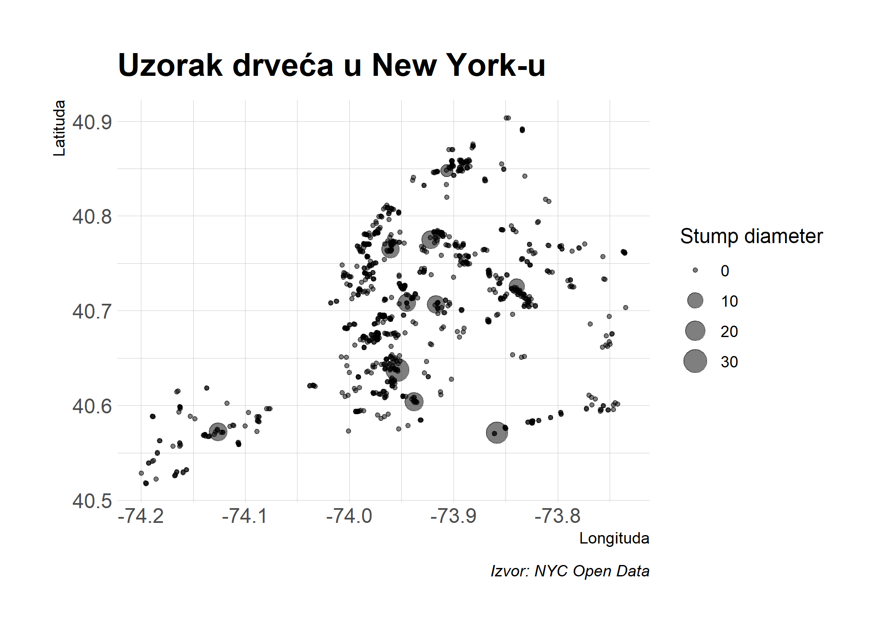
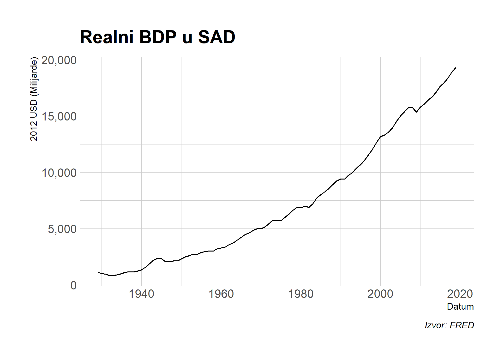
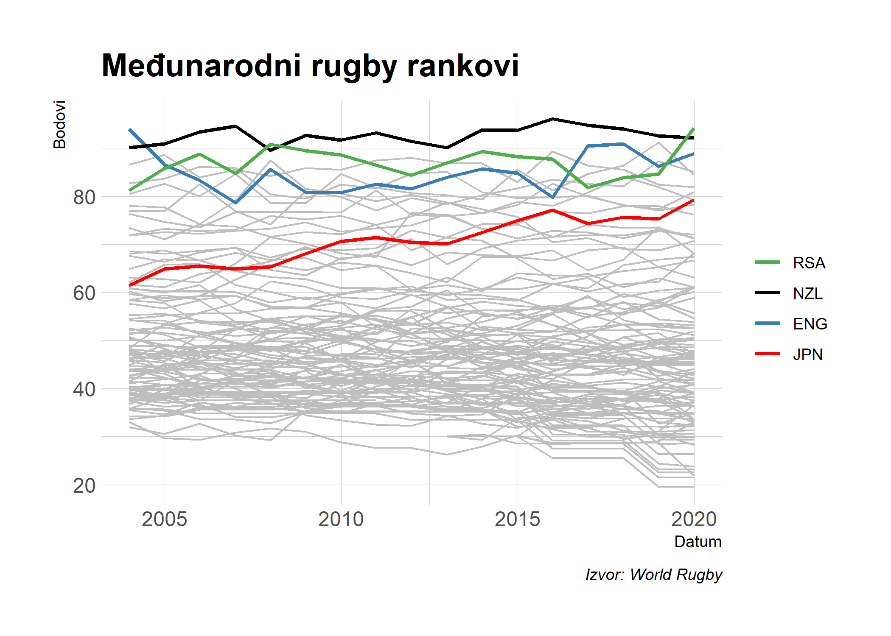

## Registracija i softwerski set-up

### Registracija

U ovom dijelu predavanja ćemo preuzeti ekonomske podatke (između ostalog) sa FRED API-ja. To zatijeva [registraciju](https://research.stlouisfed.org/useraccount/apikey) i pohranu [API ključa](https://research.stlouisfed.org/useraccount/apikey).

### *Eksterni* software

Koristiti ćemo [JSONView](https://jsonview.com/) browser ekstenziju koja omogućava pregled JSON output-a u Chrome-u i Firefox-u. (Nije nužno ali preporučeno!)

### R paketi 

- Novi: **jsonlite**, **httr**, **listviewer**, **usethis**, **fredr**
- Otprije korišteni: **tidyverse**, **lubridate**, **hrbrthemes**, **janitor**

Prigodan način za instalaciju i učitavanje svih prethodno pobrojanih paketa (ukoliko to niste već napravili):

```r
## učitaj i instaliraj pakete
if (!require("pacman")) install.packages("pacman")
pacman::p_load(tidyverse, httr, lubridate, hrbrthemes, janitor, jsonlite, listviewer, usethis)
pacman::p_install_gh("sboysel/fredr") ## https://github.com/sboysel/fredr/issues/75
#tema
theme_set(hrbrthemes::theme_ipsum())
```


## Prisjetimo se...

U prvom dijelu predavanja o preuzimanju sadržaja sa interneta smo vidjeli da web stranice i web aplikacije mogu biti: 1) na strani servera i 2) na strani klijenta. Već smo pokazali kako preuzeti podatke koji su procesuirani na strani servera koristeći **rvest** paket. Ta se tehnika fokusira na CSS selektore ([SelectorGadget](http://selectorgadget.com/)) i HTML tagove. Također smo vidjeli da webscraping nije egzaktna zanost već dijelom i umjetnost! Mnoštvo CSS opcija i fleksibilnost HTML-a čine preuzimanje podataka specifičnim za svaku pojedinu stranicu i trenutak. To ne znači da opći principi ne funkcioniraju!

Fokus ovog dijela predavanja je preuzimanje podataka koji su procesuirani na strani klijenta (**client-side**). Ovaj je pristup u najvećem broju slučajeva jednostavniji način za preuzimanje podataka sa web-a. To ne znači da određena doza "umjetnosti" nije potrebna...! Još jednom valja naglasiti **etičke** i **zakonske** aspekte preuzimanja web sadržaja...pogledajte u prvom dijelu predavanja!

## Strana klijenta (*Client-side*), API i API *izvori*


Webstranice i aplikacije koje su procesuirane na **strani klijenta**  zahtijevaju sljedeći pristup:

- Posjetite URL koji koristi predložak statičkog sadržaja (HTML tablice, CSS, itd). Taj predložak  sadržava podatke "u sebi".
- U procesu otvaranja URL-a, browser šalje zahtijev (*request*) na (host) server.
- Ukoliko je zahtjev ispravan (*valid*), server će vratiti odgovor (*response*) koji poziva tražene podatke i dinamički ih procesuira u browser-u.
- Stranica koju vidite u browseru je stoga mješavina statičkog sadržaja (predloška) i dinamički generiranih informacija koje su procesuirane u browseru (i.e. *klijent*).

Cijelokupni proces slanja zahtjeva, odgovora i procesuiranja se odvija kroz **API** (or **A**pplication **P**rogram **I**nterface) host aplikacije.

### API

Ako prvi put čujete za API, pogledajte Zapier- ov pregled [An Introduction to APIs](https://zapier.com/learn/apis/). Pregled je opširan ali ne morate proći sve detalje...Zaključak je da API predstavlja skup pravila i metoda koje omogućavaju interakciju različitih software-skih aplikacija u razmjeni informacija. To se ne odnosi samo na web servere i browser-e nego i na npr. neke pakete koje smo već koristili u ovom kolegiju.^[Zanimljivost: Brojn i paketi koje ćemo koristiti u ovom kolegiju (npr. **leaflet**, **plotly**, etc.) su samo skup *wrapper* funkcija koje komuniciraju sa API-jima i pretvaraju R kod u neki drugi jezik (npr. JavaScript).] Ključni koncepti su:

- **Server:** Računalo koje izvršava (*engl. run*).
- **Klijent:** Program koji izmjenjuje podatke sa serverom kroz API.
- **Protokol:** "Bonton" koji određuje način međusobne interakcije između računala (npr. HTTP).
- **Metode:** "Naredbe" koje klijenti koriste za komunikaciju sa serverom. Glavna naredba koju ćemo koristiti u ovom dijelu predavanja je  `GET` (i.e. "zamoli" server za informaciju), a neke druge su `POST`, `PUT` i `DELETE`.
- **Zahtjevi:** Ono što klijent traži od servera (vidi Metode!).
- **Odgovor:** Odgovor servera. Odgovor uključuje *Status Code* (npr. "404" *if not found*, ili "200" *if successfu*l),  *Header* (i.e. meta-informacije o odgovoru) i *Body* (i.e sadržaj onoga što zahtjevamo od servera).
- Etc.

### API *izvori*

Ključna točka u razumijevanju API-ja je da možemo pristupiti informacijama *direktno* iz API baze podataka ukoliko na ispravan način specificiramo URL-ove. Ti URL-ovi su ono što nazivamo API izvorima (*engl. API endpoints*).

API izvori su u mnogočemu sličini normalnim web URL-ovima koje stalno posjećujemo. Za početak, možete navigirati do njih u browser-u. "Normalne" web stranice prikazuju informacije u "lijepom" HTML-u (slike, video, GFI itd.),  a API izvori su "ružni". Navigirajte browser do API izvora i vidjeti ćete samo hrpu neformatiranog teksta. Ono što uistinu vidite je najvjerojatnije [JSON](https://en.wikipedia.org/wiki/JSON) (**J**ava**S**cript **O**bject **No**tation) ili [XML](https://en.wikipedia.org/wiki/XML) (E**x**tensible **M**arkup **L**anguage). 

Sintaksa tih jezika (JSON i XML) vas ne treba zabrinjavati. Važno je da objekt u vašem browser-u (koji učitava hrpu nestrukturiranog teksta) zapravo ima vrlo precizno definiranu strukturu i format. Taj objekt akođer sadžava informacije (podatke) koje je moguće vrlo jednostavno učitati u R (ili Python, Julia...). Potrebno je samo znati točan API izvor za podatke koje želimo!

Vrijeme je za nekoliko primjera...Započeti ćemo sa najjednostavnijim slučajem (bez API ključa i sa eksplicitnim API izvorom), a nakon toga nastaviti sa složenijim primjerima.


## Praktični primjer 1: Drveće u New York-u

[NYC Open Data](https://opendata.cityofnewyork.us/) je zanimljiva inicijativa. Njezina misija je *"make the wealth of public data generated by various New York City agencies and other City organizations available for public use*". Podatci koje možete preuzeti uključuju uhićenja, lokacije wifi spotova, oglase za posao, broj beskućnika, licence za pse, popis wc-a u javnim parkovima...Pogledajte popis dostupnih podataka kada stignete! U ovom primjeru ćemo preuzeti podatke o drveću [**2015 NYC Street Tree Census**](https://data.cityofnewyork.us/Environment/2015-Street-Tree-Census-Tree-Data/uvpi-gqnh).

Ovaj izvor koristimo na početku pošto nije potrebno postaviti API ključ unaprijed.^[Ipak, da biste smanjili opterećenje na server --- i.e. broj zahtjeva u vremenu --- najbolje je napraviti [registraciju](https://data.cityofnewyork.us/profile/app_tokens) za **NYC Open Data app token**. Za svrhe ovog predavanja ćemo napraviti jedan ili dva zahtjeva na server pa registracija nije nužna.] Podatke ćemo preuzeti u nekoliko koraka:

- Otvorite [web stranicu](https://data.cityofnewyork.us/Environment/2015-Street-Tree-Census-Tree-Data/uvpi-gqnh) u browseru. 
- Odmah ćete vidjeti **API** tab. Kliknite na njega!. 
- Kopirajte [API izvor](https://data.cityofnewyork.us/resource/nwxe-4ae8.json) koji se pojavi u *pop-up* prozoru. 
- *Doatano:* Zalijepite taj izvor u novi tab u browser-u. Pojaviti će se hrpa JSON teksta, koji možete procesuirati sa JSONView browser ekstenziji koju smo instalirali na početku predavanja.

Pogledajte animirani prikaz:


<br>

Nakon što smo locirali API izvor, možemo učitati podatke u R pomoću`fromJSON()` funkcije iz **jsonlite** paketa ([vidi!](https://cran.r-project.org/web/packages/jsonlite/index.html)). To će automatski prisiliti JSON *array* (vrsta objetka;slično kao data frame) objekt u data frame. Ovdje ćemo taj data frame pretvoriti u tibble zbog funkcionalnosti koje tibble objekt pruža.


```r
# library(jsonlite) ## već učitano
nyc_trees <- 
  fromJSON("https://data.cityofnewyork.us/resource/nwxe-4ae8.json") %>%
  as_tibble()
nyc_trees
```

```
## # A tibble: 1,000 x 45
##    tree_id block_id created_at tree_dbh stump_diam curb_loc status health
##    <chr>   <chr>    <chr>      <chr>    <chr>      <chr>    <chr>  <chr> 
##  1 180683  348711   2015-08-2~ 3        0          OnCurb   Alive  Fair  
##  2 200540  315986   2015-09-0~ 21       0          OnCurb   Alive  Fair  
##  3 204026  218365   2015-09-0~ 3        0          OnCurb   Alive  Good  
##  4 204337  217969   2015-09-0~ 10       0          OnCurb   Alive  Good  
##  5 189565  223043   2015-08-3~ 21       0          OnCurb   Alive  Good  
##  6 190422  106099   2015-08-3~ 11       0          OnCurb   Alive  Good  
##  7 190426  106099   2015-08-3~ 11       0          OnCurb   Alive  Good  
##  8 208649  103940   2015-09-0~ 9        0          OnCurb   Alive  Good  
##  9 209610  407443   2015-09-0~ 6        0          OnCurb   Alive  Good  
## 10 192755  207508   2015-08-3~ 21       0          OffsetF~ Alive  Fair  
## # ... with 990 more rows, and 37 more variables: spc_latin <chr>,
## #   spc_common <chr>, steward <chr>, guards <chr>, sidewalk <chr>,
## #   user_type <chr>, problems <chr>, root_stone <chr>, root_grate <chr>,
## #   root_other <chr>, trunk_wire <chr>, trnk_light <chr>, trnk_other <chr>,
## #   brch_light <chr>, brch_shoe <chr>, brch_other <chr>, address <chr>,
## #   zipcode <chr>, zip_city <chr>, cb_num <chr>, borocode <chr>,
## #   boroname <chr>, cncldist <chr>, st_assem <chr>, st_senate <chr>, nta <chr>,
## #   nta_name <chr>, boro_ct <chr>, state <chr>, latitude <chr>,
## #   longitude <chr>, x_sp <chr>, y_sp <chr>, council_district <chr>,
## #   census_tract <chr>, bin <chr>, bbl <chr>
```

**Komentar:** Primjetite da puni podatkovni skup sadržava skoro 700.000 drveća. U ovom primjeru  preuzimamo samo mali dio tih podataka zbog *default* postavke API limita od 1000 redova. Ionako nije potrebno preuzeti sve podatke u ovom demonstrativnom primjeru! Važno je znati ([pročitajte API upute](https://dev.socrata.com/docs/queries/limit.html)) da ostatak podataka možete preuzeti tako da dodate `?$limit=LIMIT` u API izvor. Da biste učitali prvih pet redova:


```r
## !izvrši
fromJSON("https://data.cityofnewyork.us/resource/nwxe-4ae8.json?$limit=5")
```

Vratimo se primjeru sa drvećem i vizualizirajmo podatke koje smo preuzeli. Još jedan dodatni komentar je da `jsonlite::fromJSON()` funkcija automatski pretvara sav sadržaj u string (character ) pa je potrebno promijeniti kolone u numeričke prije vizualizacije.


```r
nyc_trees %>% 
  select(longitude, latitude, stump_diam, spc_common, spc_latin, tree_id) %>% 
  mutate_at(vars(longitude:stump_diam), as.numeric) %>% 
  ggplot(aes(x=longitude, y=latitude, size=stump_diam)) + 
  geom_point(alpha=0.5) +
  scale_size_continuous(name = "Stump diameter") +
  labs(
    x = "Longituda", y = "Latituda",
    title = "Uzorak drveća u New York-u",
    caption = "Izvor: NYC Open Data"
    )
```

<!-- -->

Ovo bi bilo zanimljivije kada bi mapa sadržavala prave geolokacijske podatke New York-a. Prostorna analiza je zanimljivo istraživačko područje, a vizualizacija tog tipa bi zahtijvela zasebno predavanje...

Cilj ovog praktičnog primjera je pokazati kako za preuzimanje API podataka nije uvijek potrebna registracija. To nije tipično jer najveći broj API sučelja dozvoljava pristup isključivo nakon registracije (*potreban je ključ!*). To se najčešće odnosi na preuzimanje javnih podataka ( npr. sudski registar, HNB, etc.). Pogledajmo sada jedan primjer gdje je potrebna API registracija.


## Praktični primjer 2: FRED podatci

Drugi primjer uključuje preuzimanje podataka sa [**FRED API**](https://research.stlouisfed.org/docs/api/fred/). Potrebna je [registracija API ključa](https://research.stlouisfed.org/useraccount/apikey) ako želite provesti primjer sami. 


[FRED](https://fred.stlouisfed.org/) je ekonomska baza Federalne banke u St. Louis-u, podružnice Američke središnje banke. Stranica ima ugrađene alate za vizualizaciju podataka [poput ovog](https://fred.stlouisfed.org/series/GNPCA#0) za seriju BDP/per capita SAD-a od 1929. godine.

<iframe src="https://fred.stlouisfed.org/graph/graph-landing.php?g=mPCo&width=670&height=475" scrolling="no" frameborder="0"style="overflow:hidden; width:670px; height:525px;" allowTransparency="true"></iframe>


</br>

U ovom primjeru preuzimamo podatke na osnovi kojih je napravljen prethodni grafikon kroz **FRED API** kako biste naučili što se događa "u pozadini". Nakon toga ćemo preuzeti iste podatke kroz R paket kojii je netko napisau za tu svrhu.


### Napravite sami

Njabolje je započeti sa [FRED API dokumentacijom](https://research.stlouisfed.org/docs/api/fred/). Na osnovi pročitanog je moguće zaključiti da se pripadajući API izvor nalazi pod [**series/observations**](https://research.stlouisfed.org/docs/api/fred/series_observations.html). 
Ovaj izvor je opisan kao: "*gets the observations or data values for an economic data series*". U API dokumentaciji sa linka ćete pronaći više detalja, uključujući i parametre koji su dozvoljeni u API pozivu.^[API *parameteri* su nešto kao funkcijski *argumenti*. To su imputi (upute) koji karakteriziraju API zahtjev.] Parametri koje ovdje koristimo (i.e. kalibriramo):

- **file_type:** "json" (Nije nužno ali želimo JSON output.)
- **series_id:** "GNPCA" (Nužno. Serija koju tražimo.)
- **api_key:** "YOUR_API_KEY" (Nužno. Sada dohvatite vaš ključ.)

Potrebno je podesiti ove parametre sukladno API izvoru kako bismo pogledali podatke direktno u browser-u. Unesite [https://api.stlouisfed.org/fred/series/observations?series_id=GNPCA&api_key=<mark>YOUR_API_KEY</mark>&file_type=json](https://api.stlouisfed.org/fred/series/observations?series_id=GNPCA&api_key=YOUR_API_KEY&file_type=json)  uz vaš specifični "YOUR_API_KEY". Trebali biste vidjeti nešto poput ovoga:


<br>

U ovom trenutku zasigurno želite učitati JSON objekt direktno u radni prostor R koristeći `jsonlite::readJSON()` funkciju. To bi ujedno i funkcioniralo! Ipak, ovdje ćemo koristiti **httr** [paket](https://httr.r-lib.org/). Zašto? Zbog toga što **httr** ima mnoštvo funkcionalnosti koje omogućuju fleksibilnu i sigurnu interakciju sa web API-jem. 

Definirajmo prvo neke verijable poput puta (*path*) do API izvora i pripadajućih parametara. Sve ćemo pospremiti u list-e.


```r
endpoint = "series/observations"
params = list(
  api_key= "YOUR_FRED_KEY", ## Unesite svoj ključ
  file_type="json", 
  series_id="GNPCA"
  )
```

Potom ćemo koristiti `httr::GET()` funkciju za zahtijev (i.e. download) preuzimanja podataka. To ćemo pripisati objektu `fred`.


```r
# library(httr) ## Učitano
fred <- 
  httr::GET(
    url = "https://api.stlouisfed.org/", ## Osnovni URL
    path = paste0("fred/", endpoint), ## API izvor
    query = params ## Popis parametara
    )
```

Pogledajte`fred` objekt u konzoli. To što vidite je pravi API odgovor (i.e. response), uključujući *Status Code* i *Content*. Izgleda otprilike ovako:

```
## Response [https://api.stlouisfed.org/fred/series/observations?api_key=YOUR_API_KEY&file_type=json&series_id=GNPCA]
##   Date: 2020-11-11 00:06
##   Status: 200
##   Content-Type: application/json; charset=UTF-8
##   Size: 9.09 kB
```

Da bismo uzeli sadržaj (i.e. podatke) iz ovog odgovora, koristiti ćemo `httr::content()` funkciju. Pošto već znamo da je riječ o JSON array-u, možemo koristiti `jsonlite::fromJSON()` kao u prethodnom slučaju. Možemo očekivati da će taj objekt u R biti učitan kao lista, a za provjeru objekta koristite`str()` funkciju. Ovdje je korisno ukazati na **listviewer**  [paket](https://github.com/timelyportfolio/listviewer) ::jsonedit()`koji omogućava interaktivni pregled podataka.^[Ugnježđene liste (*engl.nested lists*) su karakteristika JSON podataka. Ovo nije previše važno jer R ima podršku za procesuiranje takvih formata.]

```r
fred %>% 
  httr::content("text") %>%
  jsonlite::fromJSON() %>%
  listviewer::jsonedit(mode = "view")
```

<!--html_preserve--><div id="htmlwidget-10722d5c533184ad8696" style="width:100%;height:10%;" class="jsonedit html-widget"></div>
<script type="application/json" data-for="htmlwidget-10722d5c533184ad8696">{"x":{"data":{"realtime_start":"2020-11-12","realtime_end":"2020-11-12","observation_start":"1600-01-01","observation_end":"9999-12-31","units":"lin","output_type":1,"file_type":"json","order_by":"observation_date","sort_order":"asc","count":91,"offset":0,"limit":100000,"observations":{"realtime_start":["2020-11-12","2020-11-12","2020-11-12","2020-11-12","2020-11-12","2020-11-12","2020-11-12","2020-11-12","2020-11-12","2020-11-12","2020-11-12","2020-11-12","2020-11-12","2020-11-12","2020-11-12","2020-11-12","2020-11-12","2020-11-12","2020-11-12","2020-11-12","2020-11-12","2020-11-12","2020-11-12","2020-11-12","2020-11-12","2020-11-12","2020-11-12","2020-11-12","2020-11-12","2020-11-12","2020-11-12","2020-11-12","2020-11-12","2020-11-12","2020-11-12","2020-11-12","2020-11-12","2020-11-12","2020-11-12","2020-11-12","2020-11-12","2020-11-12","2020-11-12","2020-11-12","2020-11-12","2020-11-12","2020-11-12","2020-11-12","2020-11-12","2020-11-12","2020-11-12","2020-11-12","2020-11-12","2020-11-12","2020-11-12","2020-11-12","2020-11-12","2020-11-12","2020-11-12","2020-11-12","2020-11-12","2020-11-12","2020-11-12","2020-11-12","2020-11-12","2020-11-12","2020-11-12","2020-11-12","2020-11-12","2020-11-12","2020-11-12","2020-11-12","2020-11-12","2020-11-12","2020-11-12","2020-11-12","2020-11-12","2020-11-12","2020-11-12","2020-11-12","2020-11-12","2020-11-12","2020-11-12","2020-11-12","2020-11-12","2020-11-12","2020-11-12","2020-11-12","2020-11-12","2020-11-12","2020-11-12"],"realtime_end":["2020-11-12","2020-11-12","2020-11-12","2020-11-12","2020-11-12","2020-11-12","2020-11-12","2020-11-12","2020-11-12","2020-11-12","2020-11-12","2020-11-12","2020-11-12","2020-11-12","2020-11-12","2020-11-12","2020-11-12","2020-11-12","2020-11-12","2020-11-12","2020-11-12","2020-11-12","2020-11-12","2020-11-12","2020-11-12","2020-11-12","2020-11-12","2020-11-12","2020-11-12","2020-11-12","2020-11-12","2020-11-12","2020-11-12","2020-11-12","2020-11-12","2020-11-12","2020-11-12","2020-11-12","2020-11-12","2020-11-12","2020-11-12","2020-11-12","2020-11-12","2020-11-12","2020-11-12","2020-11-12","2020-11-12","2020-11-12","2020-11-12","2020-11-12","2020-11-12","2020-11-12","2020-11-12","2020-11-12","2020-11-12","2020-11-12","2020-11-12","2020-11-12","2020-11-12","2020-11-12","2020-11-12","2020-11-12","2020-11-12","2020-11-12","2020-11-12","2020-11-12","2020-11-12","2020-11-12","2020-11-12","2020-11-12","2020-11-12","2020-11-12","2020-11-12","2020-11-12","2020-11-12","2020-11-12","2020-11-12","2020-11-12","2020-11-12","2020-11-12","2020-11-12","2020-11-12","2020-11-12","2020-11-12","2020-11-12","2020-11-12","2020-11-12","2020-11-12","2020-11-12","2020-11-12","2020-11-12"],"date":["1929-01-01","1930-01-01","1931-01-01","1932-01-01","1933-01-01","1934-01-01","1935-01-01","1936-01-01","1937-01-01","1938-01-01","1939-01-01","1940-01-01","1941-01-01","1942-01-01","1943-01-01","1944-01-01","1945-01-01","1946-01-01","1947-01-01","1948-01-01","1949-01-01","1950-01-01","1951-01-01","1952-01-01","1953-01-01","1954-01-01","1955-01-01","1956-01-01","1957-01-01","1958-01-01","1959-01-01","1960-01-01","1961-01-01","1962-01-01","1963-01-01","1964-01-01","1965-01-01","1966-01-01","1967-01-01","1968-01-01","1969-01-01","1970-01-01","1971-01-01","1972-01-01","1973-01-01","1974-01-01","1975-01-01","1976-01-01","1977-01-01","1978-01-01","1979-01-01","1980-01-01","1981-01-01","1982-01-01","1983-01-01","1984-01-01","1985-01-01","1986-01-01","1987-01-01","1988-01-01","1989-01-01","1990-01-01","1991-01-01","1992-01-01","1993-01-01","1994-01-01","1995-01-01","1996-01-01","1997-01-01","1998-01-01","1999-01-01","2000-01-01","2001-01-01","2002-01-01","2003-01-01","2004-01-01","2005-01-01","2006-01-01","2007-01-01","2008-01-01","2009-01-01","2010-01-01","2011-01-01","2012-01-01","2013-01-01","2014-01-01","2015-01-01","2016-01-01","2017-01-01","2018-01-01","2019-01-01"],"value":["1120.076","1025.091","958.378","834.291","823.156","911.019","992.537","1118.944","1177.572","1138.989","1230.22","1337.075","1574.74","1870.911","2187.818","2361.622","2337.63","2068.966","2048.293","2134.291","2121.201","2305.668","2493.148","2594.934","2715.067","2700.542","2893.97","2957.097","3020.083","2994.683","3201.683","3285.454","3371.35","3579.446","3736.061","3951.902","4208.08","4481.593","4604.613","4831.761","4980.667","4989.534","5156.41","5428.368","5746.389","5723.068","5697.677","6011.215","6293.525","6637.838","6868.092","6849.819","7011.223","6889.371","7199.441","7711.063","8007.532","8266.358","8549.125","8912.281","9239.186","9425.052","9406.669","9734.705","10000.831","10389.663","10672.832","11076.879","11556.745","12064.59","12647.632","13179.965","13327.458","13553.208","13953.961","14503.006","15006.043","15398.622","15748.3","15771.553","15359.37","15803.886","16081.66","16429.308","16722.335","17146.51","17647.607","17955.437","18421.034","18951.897","19338.371"]}},"options":{"mode":"view","modes":["code","form","text","tree","view"]}},"evals":[],"jsHooks":[]}</script><!--/html_preserve-->

Preuzeti objekt nije posebno složen. Ono što nas zanima je njegov `fred$observations` pod-element (*sub-element*). Sada ćemo izvršiti gornji kod i izvući željeni element. To je moguće napraviti na više načina ali ovdje ćemo koristiti `purrr::pluck()` funkciju.


```r
fred <-
  fred %>% 
  httr::content("text") %>%
  jsonlite::fromJSON() %>%
  purrr::pluck("observations") %>% ## izvuci"$observations" element iz liste
  # .$observations %>% ## Alternativno...
  # magrittr::extract("observations") %>% ## Alternativno...
  as_tibble() ## Zbog formatiranja
fred
```

```
## # A tibble: 91 x 4
##    realtime_start realtime_end date       value   
##    <chr>          <chr>        <chr>      <chr>   
##  1 2020-11-12     2020-11-12   1929-01-01 1120.076
##  2 2020-11-12     2020-11-12   1930-01-01 1025.091
##  3 2020-11-12     2020-11-12   1931-01-01 958.378 
##  4 2020-11-12     2020-11-12   1932-01-01 834.291 
##  5 2020-11-12     2020-11-12   1933-01-01 823.156 
##  6 2020-11-12     2020-11-12   1934-01-01 911.019 
##  7 2020-11-12     2020-11-12   1935-01-01 992.537 
##  8 2020-11-12     2020-11-12   1936-01-01 1118.944
##  9 2020-11-12     2020-11-12   1937-01-01 1177.572
## 10 2020-11-12     2020-11-12   1938-01-01 1138.989
## # ... with 81 more rows
```


U redu! Povukli smo podatke i sve je spremno za vizualizaciju. Sjetite se da `jsonlite::fromJSON()`  automatski sve prebacuje u *stringove* pa ćemo prilagoditi datume (koristeći `lubridate::ymd()`) i pretvoriti neke kolone u numeričke.


```r
# library(lubridate) ## Već učitano
fred <-
  fred %>%
  mutate_at(vars(realtime_start:date), ymd) %>%
  mutate(value = as.numeric(value)) 
```

Konačno...vizualizacija!


```r
fred %>%
  ggplot(aes(date, value)) +
  geom_line() +
  scale_y_continuous(labels = scales::comma) +
  labs(
    x="Datum", y="2012 USD (Milijarde)",
    title="Realni BDP u SAD", caption="Izvor: FRED"
    )
```

<!-- -->


### Dodatak primjeru: Spremite API ključeve kao varijable u radnom prostoru


U gornjem primjeru je bilo potrebno unijeti vaš osobni "YOUR_FRED_KEY" API ključ. To nije baš sigurno jer implicira otkrivanje vašeg (privatnog) ključa.^[Isto vrijedi i za kompilirane R Markdown dokumente poput ovih predavanjas.] Postoji sigurniji način za rad sa API ključevim i lozinkama. Jednostavno ih spremite kao R [**environment variables**](https://stat.ethz.ch/R-manual/R-devel/library/base/html/EnvVar.html). Dva su načina:

1. Postavite *environment variable* za tekuću R sesiju (*session*).
2. Postavite *environment variable* za sve R sesije.

Razmotrimo svaku opciju pojedinačno.

#### 1) Postavite *environment variable* samo za tekuću R sesiju

Definiranje *environment variable* za tekuću R sesiju je jednostavno. Koristite `Sys.setenv()` funkciju iz base R. Npr.:


```r
## postavite novu environmet variable MY_API_KEY. Samo za tekuću sesiju.
Sys.setenv(MY_API_KEY="xyxyzaqzazsda13e3243") 
```

Kada ste to napravili, možete sigurno pripisati ključ objektu, uključujući i R Markdown dokument koji ćete potencijalno djeliti sa drugima. To napravite pomoću `Sys.getenv()` funkcije. Npr.:


```r
## Pripišite environment variable R objektu
my_api_key <- Sys.getenv("MY_API_KEY")
## Pregled
my_api_key
```

```
## [1] "xyxyzaqzazsda13e3243"
```

**Važno:** Iako je ovo jednostavno, valja primijetiti da `Sys.setenv()` dio trebate izvršiti u konzoli. *Nikada* nemojte uključivati osjetljive podatke poput `Sys.setenv()` poziva u R Markdown ili druge dokumente koje dijelite.^[Pošto je nova environment variable definirana samo u trajanju tekuće sesije R Markdown neće imati pristup do nje osim ako nije eksplicitno zadržana u skripti unutar dokumenta.] Cilj je sakriti ovakve podatke! Alternativna opcija postavljanja ključa ne zahtijeva da sistemske varijable unose svaki put kada otvorite R. Ovo može biti posebno korisno za API izvore koje često koristite.

#### 2) Postavite *environment variable* za sve R sesije

Postavljanje R environment variable koja je dostupna u svim sesijama uključuje manipulaciju  `~/.Renviron` file-a. To je tekstualni file u vašem *home drectoriju* (obratite pozornost na `~/` path) koji R automatski učitava kada se podiže. Pošto je `~/.Renviron` obični tekstualni file, možete ga prilagoditi u bilo kojem text editor-u. Ipak, možda taj file morate prvo stvoriti, u slučaju da ga već nemate. Način za to u RStudio-u je korištenje `usethis::edit_r_environ()` funkcije. Izvršite sljdeći kod interaktivno:


```r
## otvorite .Renviron file. Ovdje dodajemo API ključeve koji vrijede u svim R sesijama.
usethis::edit_r_environ() 
```

Ovo će otvoriti vaš `~/.Renviron` file u novom RStudio prozoru koji onda možete prilagoditi po potrebi. Postavite za primjer vaš FRED API ključ kao environment variable koja vrijedi u svim sesijama. Jednostavo dodajte donju liniju u  `~/.Renviron` file i spremite ga.^[Prijedlog je koristit neki intuitivan naziv poput "FRED_API_KEY".]

```
FRED_API_KEY="abcdefghijklmnopqrstuvwxyz0123456789" ## Zamijenite sa vašim ključem.
```

Kada ste spremili promjene, potrebno je restartati R sesiju tako da nova varijabla postane dostupna u svim sljedećim sesijama.


```r
## Opcionalno: Osvježite .Renviron file.  
readRenviron("~/.Renviron") ## Potrebno samo ako učitavate u novi R environment
```

**Izazov:** Kada ste podesili vaš `~/.Renviron` file, pokušajte preuzeti FRED podatke od prije... Ovaj put pozovite vaš FRED API kluč kao environment variable u vašoj listi parametara koristeći `Sys.getenv()`na ovaj način:


```r
params = list(
  api_key= Sys.getenv("FRED_API_KEY"), ## uzmi API direktno kao environment variable
  file_type="json", 
  series_id="GNPCA"
  )
```

Environment variable su važne za interakciju sa *cloud*-om što omogućuje dodatni računalni potencijal i rad sa super-računalima.

### Koristite paket

Sjana stvar kod R-a je da vjerojatno postoji paket za to....! Ovdje vrijedi istaknuti **fredr** [paket](http://sboysel.github.io/fredr/index.html). Pokušajte sada iste podatke preuzeti kroz ovaj paket!


## Praktični primjer 3: Svjetska ljestvica rugby timova

Zadnji praktični primjer koji ćemo prikazati je nešto složeniji zbog toga što je API izvor "sakriven" u web stranici. U ovom primjeru preuzimamo [**World Rugby rankings**](https://www.world.rugby/rankings/mru) podatke. 

*<b>Oprez:</b> World Rugby [Uvjeti & Korištenje](https://www.world.rugby/terms-and-conditions) dozvoljava preuzimanje podataka u nekomercijalne svrhe, a ovo predavanje ulazi u tu kategoriju!*

Za početak valja pogledati relativno kompliciranu strukturu [stranice](http://www.worldrugby.org/rankings). Obratite pažnju na različite tablice i druge interaktivne elemente poput kalendara. Pokušajte preuzeti kopletna rangiranja po zemljamam koristeći  `rvest` + CSS selektore kao u prethodnim primjerima...

Preuzimanje podatka korištenjem `rvest` + CSS selektora nije optimalan pristup u ovom slučaju. U najboljem slučaju ćemo preuzeti samo dio podataka, ukoliko uopće dobijemo ono što namjeravamo preuzeti...(npr. samo nazive kolona, ili prvih 10ak redova nakon klika na "VIEW MORE RANKINGS" tab). To uopće ne uključuje preuzimanje podataka za dulji vremenski period (više različitih datuma).^[Primjetite da URL ostaje nepromijenjen čak i kada podesimo različite datume na kalendaru.]

### Lociranje skrivenog API izvora

Na sreću postoji bolji način: pristupite cijeloj bazi kroz API! Prvo je potrebno identificirati API izvor pa slijede upute kako to učiniti. Procedura je relativno "neugodna", ali intuitivna jednom kada shvatite što se događa. Možete pogledati i animaciju ako želite preskočiti opis pojedinačnih koraka.

- Započnite pregledom stranice.(**Ctr+Shift+I** u Chrome-u. **Ctrl+Shift+Q** u Firefox-u.)
- Pogledajte **Network** tab na vrhu panela za inspekciju elemenata. 
- Kliknite na **XHR** tab.^[XHR označava **X**ML**H**ttp**R**equest. Riječ je o vrsti zahtjeva koji dohvaća XML ili JSON podatke.]
- Osvježite stranicu (**Ctrl+R**). To će omogućiti da vidite sav promet po stranici u inspkecijskom panelu. 
- Sada valja pogledati različite linkove za protok prometa i odabrati onaj koji sadržava podatke koje tražimo.
- Gornji lik sadržava URL po nazivom [https://cms<b>api</b>.pulselive.com/rugby/<b>rankings</b>/mru?language=en&client=pulse](https://cmsapi.pulselive.com/rugby/rankings/mru?language=en&client=pulse). *Hmmm. "API", moguće? "Rankings" , možda? Ima smisla probati...* 
- Kliknite ovaj link i otvorite **Preview** tab.
- U ovom slučaju, vidimo nešto što bi moglo izgledati kao prvi redak tablice rangiranja ("New Zealand", itd...) 
- Za provjeru uzmite link [https://cmsapi.pulselive.com/rugby/rankings/mru?language=en&client=pulse](URL) i zalijepite ga u browser (koristeći [JSONView](https://chrome.google.com/webstore/detail/jsonview/chklaanhfefbnpoihckbnefhakgolnmc?hl=en) plugin) koji smo instalirali prije.

Izvrsno! Izgleda da smo locirali API izvor. Pregled svih koraka u ovoj proceduri: 


### Povlačenje podataka u R

U ovom koraku je potrebno povući podatke sa API izvora u R. Ponovno ćemo koristiti `jsonlite::readJSON()` funkciju. 


```r
endpoint <- "https://cmsapi.pulselive.com/rugby/rankings/mru?language=en&client=pulse"
rugby <- fromJSON(endpoint)
str(rugby)
```

```
## List of 3
##  $ label    : chr "Mens Rugby Union"
##  $ entries  :'data.frame':	105 obs. of  6 variables:
##   ..$ team       :'data.frame':	105 obs. of  5 variables:
##   .. ..$ id          : int [1:105] 39 37 34 42 36 38 35 33 49 40 ...
##   .. ..$ altId       : logi [1:105] NA NA NA NA NA NA ...
##   .. ..$ name        : chr [1:105] "South Africa" "New Zealand" "England" "France" ...
##   .. ..$ abbreviation: chr [1:105] "RSA" "NZL" "ENG" "FRA" ...
##   .. ..$ annotations : logi [1:105] NA NA NA NA NA NA ...
##   ..$ matches    : int [1:105] 212 224 209 205 201 231 196 218 174 186 ...
##   ..$ pts        : num [1:105] 94.2 90.2 88.4 84.6 84.1 ...
##   ..$ pos        : int [1:105] 1 2 3 4 5 6 7 8 9 10 ...
##   ..$ previousPts: num [1:105] 94.2 91.8 88.4 84.6 84.1 ...
##   ..$ previousPos: int [1:105] 1 2 3 4 5 6 7 8 9 10 ...
##  $ effective:List of 3
##   ..$ millis   : num 1.6e+12
##   ..$ gmtOffset: num 0
##   ..$ label    : chr "2020-11-09"
```

Dobili smo (nested) list-u, a dio koji nas zanima, `$entries`, je također list-a.^[Iako R javlja da je `rugby$entries` data.frame, funkcijskim pozivom`str()` ipak vidimo da ima strukturu list-e. `rugby$entries$team` pod-element je data-frame.] Sada ćemo izvući `$entries` element i pogledati njegovu strukturu. Mogli bismo koristiti i `str()` funkciju, ali `listviewer::jsonedit()` je bolja opcija. 


```r
# str(rugby$entries) ## opcija iz base R
listviewer::jsonedit(rugby, mode = "view")
```

<!--html_preserve--><div id="htmlwidget-708304cd8b4e0d69a7fc" style="width:100%;height:10%;" class="jsonedit html-widget"></div>
<script type="application/json" data-for="htmlwidget-708304cd8b4e0d69a7fc">{"x":{"data":{"label":"Mens Rugby Union","entries":{"team":{"id":[39,37,34,42,36,38,35,33,49,40,46,720,47,41,45,51,43,68,52,756,44,725,50,58,64,703,699,770,708,721,736,735,711,753,57,777,714,1030,775,776,2537,681,1247,738,713,751,766,745,741,774,740,712,769,759,760,739,707,723,743,729,3223,734,737,726,710,784,732,700,1031,761,715,692,704,722,752,772,702,781,2476,709,698,701,750,727,696,1029,2382,2340,2861,2857,2397,2387,2585,748,749,771,697,768,762,2576,705,744,2529,780,3674],"altId":[null,null,null,null,null,null,null,null,null,null,null,null,null,null,null,null,null,null,null,null,null,null,null,null,null,null,null,null,null,null,null,null,null,null,null,null,null,null,null,null,null,null,null,null,null,null,null,null,null,null,null,null,null,null,null,null,null,null,null,null,null,null,null,null,null,null,null,null,null,null,null,null,null,null,null,null,null,null,null,null,null,null,null,null,null,null,null,null,null,null,null,null,null,null,null,null,null,null,null,null,null,null,null,null,null],"name":["South Africa","New Zealand","England","France","Ireland","Australia","Scotland","Wales","Japan","Argentina","Fiji","Georgia","Tonga","Italy","Samoa","USA","Spain","Uruguay","Romania","Russia","Portugal","Hong Kong","Canada","Namibia","Netherlands","Brazil","Belgium","Switzerland","Chile","Germany","Korea","Kenya","Colombia","Poland","Zimbabwe","Ukraine","Czechia","Malta","Tunisia","Uganda","Philippines","Cote D'Ivoire","Mexico","Lithuania","Croatia","Paraguay","Sri Lanka","Morocco","Malaysia","Trinidad & Tobago","Madagascar","Cook Islands","Sweden","Senegal","Singapore","Luxembourg","Cayman Islands","Guyana","Moldova","Israel","United Arab Emirates","Kazakhstan","Latvia","Hungary","Chinese Taipei","Zambia","Jamaica","Bermuda","Nigeria","Slovenia","Denmark","Andorra","Bulgaria","Guam","Peru","Thailand","Botswana","Venezuela","St Vincent and Grenadines","China","Barbados","Bosnia & Herzegovina","Papua New Guinea","India","Austria","Finland","Ghana","Serbia","Uzbekistan","Mauritius","Pakistan","Rwanda","Costa Rica","Niue Island","Norway","Tahiti","Bahamas","Swaziland","Solomon Islands","Indonesia","Cameroon","Monaco","Greece","Vanuatu","American Samoa"],"abbreviation":["RSA","NZL","ENG","FRA","IRE","AUS","SCO","WAL","JPN","ARG","FIJ","GEO","TGA","ITA","SAM","USA","ESP","URU","ROU","RUS","POR","HKG","CAN","NAM","NED","BRA","BEL","SUI","CHI","GER","KOR","KEN","COL","POL","ZIM","UKR","CZE","MLT","TUN","UGA","PHI","CIV","MEX","LTU","CRO","PAR","SRI","MAR","MAS","TTO","MAD","COK","SWE","SEN","SGP","LUX","CAY","GUY","MDA","ISR","UAE","KAZ","LAT","HUN","TPE","ZAM","JAM","BER","NGR","SLO","DEN","AND","BUL","GUM","PER","THA","BOT","VEN","VIN","CHN","BAR","BIH","PNG","IND","AUT","FIN","GHA","SRB","UZB","MRI","PAK","RWA","CRC","NIU","NOR","PYF","BAH","SWZ","SOL","INA","CMR","MON","GRE","VAN","ASA"],"annotations":[null,null,null,null,null,null,null,null,null,null,null,null,null,null,null,null,null,null,null,null,null,null,null,null,null,null,null,null,null,null,null,null,null,null,null,null,null,null,null,null,null,null,null,null,null,null,null,null,null,null,null,null,null,null,null,null,null,null,null,null,null,null,null,null,null,null,null,null,null,null,null,null,null,null,null,null,null,null,null,null,null,null,null,null,null,null,null,null,null,null,null,null,null,null,null,null,null,null,null,null,null,null,null,null,null]},"matches":[212,224,209,205,201,231,196,218,174,186,119,167,108,196,119,131,131,140,164,154,143,108,139,107,92,99,100,76,90,111,71,100,60,87,78,90,91,77,58,81,33,52,33,78,76,65,57,50,52,36,49,27,82,48,49,70,38,38,83,70,28,57,75,74,48,48,28,38,26,71,78,68,59,24,49,50,39,49,14,38,38,58,33,37,74,59,16,66,7,23,15,14,11,21,70,19,27,18,23,5,25,12,17,16,13],"pts":[94.195526,90.17286,88.415955,84.58669,84.103294,83.85587,82.08079,80.21756,79.28815,78.306725,76.206474,72.861885,71.438095,71.084984,70.719154,68.09613,67.51223,67.01548,65.32507,62.11656,61.268044,61.231342,61.107006,61.038483,60.092175,58.88319,57.16768,54.12384,53.811684,53.133595,53.108067,52.552643,51.869125,51.127777,50.707024,50.346695,50.033516,49.12602,48.54903,47.853954,47.795654,47.62494,47.219975,47.15552,46.921276,46.87132,46.72597,46.33345,46.11886,45.509857,45.14458,45.106884,45.03536,44.88653,44.045013,43.406265,42.97033,42.862232,42.13647,41.675648,41.232292,40.8637,40.845963,40.67712,39.229748,39.042282,39.00289,38.911465,38.371357,37.564312,37.35562,36.974022,36.543625,36.378345,36.34963,36.276844,36.21395,35.872917,34.914616,34.91419,34.724777,33.78127,33.683735,33.39797,33.03452,33.01362,32.520187,32.345737,31.329367,30.5581,29.99046,29.783758,29.355816,28.626186,28.26697,27.788961,27.756924,26.041035,23.808434,21.948198,20.32657,17.171558,16.546452,15.453693,13.532106],"pos":[1,2,3,4,5,6,7,8,9,10,11,12,13,14,15,16,17,18,19,20,21,22,23,24,25,26,27,28,29,30,31,32,33,34,35,36,37,38,39,40,41,42,43,44,45,46,47,48,49,50,51,52,53,54,55,56,57,58,59,60,61,62,63,64,65,66,67,68,69,70,71,72,73,74,75,76,77,78,79,80,81,82,83,84,85,86,87,88,89,90,91,92,93,94,95,96,97,98,99,100,101,102,103,104,105],"previousPts":[94.195526,91.83748,88.415955,84.58669,84.103294,82.191246,82.08079,80.21756,79.28815,78.306725,76.206474,72.861885,71.438095,71.084984,70.719154,68.09613,68.449326,66.078384,65.32507,62.11656,61.268044,61.231342,61.107006,61.038483,60.092175,58.88319,57.16768,54.12384,53.811684,53.133595,53.108067,52.552643,51.869125,51.127777,50.707024,50.346695,50.033516,49.12602,48.54903,47.853954,47.795654,47.62494,47.219975,47.15552,46.921276,46.87132,46.72597,46.33345,46.11886,45.509857,45.14458,45.106884,45.03536,44.88653,44.045013,43.406265,42.97033,42.862232,42.13647,41.675648,41.232292,40.8637,40.845963,40.67712,39.229748,39.042282,39.00289,38.911465,38.371357,37.564312,37.35562,36.974022,36.543625,36.378345,36.34963,36.276844,36.21395,35.872917,34.914616,34.91419,34.724777,33.78127,33.683735,33.39797,33.03452,33.01362,32.520187,32.345737,31.329367,30.5581,29.99046,29.783758,29.355816,28.626186,28.26697,27.788961,27.756924,26.041035,23.808434,21.948198,20.32657,17.171558,16.546452,15.453693,13.532106],"previousPos":[1,2,3,4,5,6,7,8,9,10,11,12,13,14,15,17,16,18,19,20,21,22,23,24,25,26,27,28,29,30,31,32,33,34,35,36,37,38,39,40,41,42,43,44,45,46,47,48,49,50,51,52,53,54,55,56,57,58,59,60,61,62,63,64,65,66,67,68,69,70,71,72,73,74,75,76,77,78,79,80,81,82,83,84,85,86,87,88,89,90,91,92,93,94,95,96,97,98,99,100,101,102,103,104,105]},"effective":{"millis":1604880000000,"gmtOffset":0,"label":"2020-11-09"}},"options":{"mode":"view","modes":["code","form","text","tree","view"]}},"evals":[],"jsHooks":[]}</script><!--/html_preserve-->

Pogledajmo također `rugby$entries$team` data frame kako bismo provjerili  informacije koje taj objekt sadržava. 


```r
head(rugby$entries$team)
```

```
##   id altId         name abbreviation annotations
## 1 39    NA South Africa          RSA          NA
## 2 37    NA  New Zealand          NZL          NA
## 3 34    NA      England          ENG          NA
## 4 42    NA       France          FRA          NA
## 5 36    NA      Ireland          IRE          NA
## 6 38    NA    Australia          AUS          NA
```

Sada stvari polako postaju jasnije. Čini se da možemo povezati (bind) kolone `rugby$entries$team` data frame-a direktno sa drugim elementima `$team` data frame-a (zapravo: "list-e"). Napravimo to pomoću `dplyr::bind_cols()` i uredimo podatke. Taj objekt možemo nazvati `rankings`.


```r
# library(janitor) ## Već učitano
rankings <-
  bind_cols(
    rugby$entries$team,
    rugby$entries %>% select(matches:previousPos)
    ) %>%
  clean_names() %>%
  select(-c(id, alt_id, annotations)) %>% ## Ove kolone nisu od posebnog interesat
  select(pos, pts, everything()) %>% ## Reorganizacija
  as_tibble() ## "Napredna" tidyverse verzija data frame-a
rankings
```

```
## # A tibble: 105 x 7
##      pos   pts name         abbreviation matches previous_pts previous_pos
##    <int> <dbl> <chr>        <chr>          <int>        <dbl>        <int>
##  1     1  94.2 South Africa RSA              212         94.2            1
##  2     2  90.2 New Zealand  NZL              224         91.8            2
##  3     3  88.4 England      ENG              209         88.4            3
##  4     4  84.6 France       FRA              205         84.6            4
##  5     5  84.1 Ireland      IRE              201         84.1            5
##  6     6  83.9 Australia    AUS              231         82.2            6
##  7     7  82.1 Scotland     SCO              196         82.1            7
##  8     8  80.2 Wales        WAL              218         80.2            8
##  9     9  79.3 Japan        JPN              174         79.3            9
## 10    10  78.3 Argentina    ARG              186         78.3           10
## # ... with 95 more rows
```

### BONUS: Napravi grafikon i povijesni pregled rang ljestvice 

*NOTE: Ovaj dio uključuje progamiranje i loop-ove. Nemojte se fokusirati na detalje već pokušajte pratiti širu sliku.*

Gornja tablica izgleda dobro...osim što se radi o "snapshot-u" zadnjih rangiranja. Nas ovdje više zanimaju promjene rangiranja kroz vrijeme. 

Kako bismo došli do tih podataka? U duhu "umjetnost-vs-znaost" pristupa...otvorite *inspect* prozor stranice rangova i proučite što se događa...Što se događa ako kliknemo na "kalendarski element" stranice rangiranja? Promijenite godinu u npr. "2018" i zaberite npr. mjesec "April"...

To izgleda obećavajuće! Zapravo se radi o istom API izvoru kao u prethodnome primjeru ali sada imamo i datum: https://cmsapi.pulselive.com/rugby/rankings/mru?date=2018-05-01&client=pulse. Ako nastavimo na ovaj način (klikanje na kalendar stranice i promatranje XHR prometa) primjetiti ćemo da sufiksi datuma imaju predvidljiv obrazac. Dolaze u tjednim razmacima (frekvencijama) i uvijek započinu u ponedjeljak (Monday). Čini se da World Rugby ažurira međunarodna rangiranja na tjednoj bazi i objavljuje rezultate u ponedjeljak. 

Sada imamo dovoljno informacija za napisati funkciju koja će iterirati kroz skup datuma i povući podatke iz API izvora. Za početak je potrebno definirati vektor datuma za iteraciju! Tu ćemo koristiti nekoliko funkcija iz `lubridate` paketa. Izvući ćemo samo nekoliko datuma (jedna opservacija godišnje kroz cijelo desteljeće) pošto je cilj demonstrirati princip. Nema potrebe opterećivati server!


```r
## Promatramo rangiranja od 01 siječnja svake godine. Uzmamo 2004. godinu
## kao početnu i potom nastavljamo do zadnje godine.
start_date <- ymd("2004-01-01")
end_date <- floor_date(today(), unit="years")
dates <- seq(start_date, end_date, by="years")
## Uzmi najbliži ponedjeljak (Monday do Jan 1st) kako bi se podatci podudarali sa objavom rangova.
dates <- floor_date(dates, "week", week_start = getOption("lubridate.week.start", 1))
dates
```

```
##  [1] "2003-12-29" "2004-12-27" "2005-12-26" "2007-01-01" "2007-12-31"
##  [6] "2008-12-29" "2009-12-28" "2010-12-27" "2011-12-26" "2012-12-31"
## [11] "2013-12-30" "2014-12-29" "2015-12-28" "2016-12-26" "2018-01-01"
## [16] "2018-12-31" "2019-12-30"
```

Sada ćemo napisati funkciju sa nazivom `rugby_scrape`. Ova funkcija ima samo jedan argument, datum koji ćemo koristiti u konstrukciji novog API izvora u svakoj iteraciji. Osim toga, sve je gotovo identično kao u prošlom primjeru. Jedina razlika je što će svaki korak imati pauzu od tri sekunde (i.e. `Sys.sleep(3)`) kako ne bismo preopteretili server sa prečestim zahtjevima.


```r
## Očistite postojeće varijable. Iako ovo nije strogo potrebno, olakšati će R-u
## razlikovanje naziva objekata u funkcijama global environment-a.
## Valja naglasiti da ovdje stvaramo nove podatke.
rm(rugby, rankings, endpoint)
## Naavi funkciju pod nazivom "rugby_scrape".
rugby_scrape <- 
  function(x) {
    endpoint <- paste0("https://cmsapi.pulselive.com/rugby/rankings/mru?date=", x, "&client=pulse")
    rugby <- fromJSON(endpoint)
    rankings <-
      bind_cols(
        rugby$entries$team,
        rugby$entries %>% select(matches:previousPos)
        ) %>%
      clean_names() %>%
      mutate(date = x) %>% ## Nova kolona za datum
      select(-c(id, alt_id, annotations)) %>% ## Nije od velike važnosti
      select(date, pos, pts, everything()) %>% ## Uredi redosljed kolona
      as_tibble() ## "Napredna" tidyverse verzija data frame-a
    Sys.sleep(3) ## Bonton i manire!
    return(rankings)
  }
```

U zadnjem koraku je potrebno provesti iteraciju (i.e. loop) na vektoru `dates` (datuma), na način da se vrijednosti iz vektora sekvencijalno unesu u `rugby_scrape` funkciju. Mnogo je načina za provesti iteraciju u R, a ovdje ćemo koristiti `lapply()` funkciju.^[Fokusirajte se na širu sliku!.] Potom ćemo sve povezati u jedan data frame koristeći `dplyr::bind_rows()` funkciju i taj objekt nazvati `rankings_history`.


```r
rankings_history <-
  lapply(dates, rugby_scrape) %>% ## Izvrši iteraciju
  bind_rows() ## Poveži list-u data frame-ova u jedan data frame
rankings_history
```

```
## # A tibble: 1,674 x 8
##    date         pos   pts name    abbreviation matches previous_pts previous_pos
##    <date>     <int> <dbl> <chr>   <chr>          <int>        <dbl>        <int>
##  1 2003-12-29     1  94.0 England ENG               17         92.1            1
##  2 2003-12-29     2  90.1 New Ze~ NZL               17         88.2            3
##  3 2003-12-29     3  86.6 Austra~ AUS               17         88.4            2
##  4 2003-12-29     4  82.7 France  FRA               17         84.7            4
##  5 2003-12-29     5  81.2 South ~ RSA               15         81.2            5
##  6 2003-12-29     6  80.5 Ireland IRE               15         80.5            6
##  7 2003-12-29     7  78.0 Argent~ ARG               14         78.0            7
##  8 2003-12-29     8  76.9 Wales   WAL               15         76.9            8
##  9 2003-12-29     9  76.4 Scotla~ SCO               15         76.4            9
## 10 2003-12-29    10  73.5 Samoa   SAM               14         73.5           10
## # ... with 1,664 more rows
```

Pregled svih koraka:

- Stvorili smo vektor datuma (kretivno nazvan `dates`) u kojem su opservacije razmaknute (otprilike) jednu godinu, od najbližeg ponedjeljka u prvom datumu prvog mjeseca (01.01.).
- Nakon toga smo proveli iteraciju (i.e. looped) po tim datumima koristeći funkciju `rugby_scrape`, koja je preuzela i očistila podatke sa API izvora. 
- Na kraju svake iteracije smo naredili R-u da pričeka 3 sekunde prije sljedeće iteracije. To smo napravili kako ne bismo preopteretili server i radi bontona!
- Svaka iteracija je proizvela zaseban data frame koji `lapply()` funkcija automatski pretvara u list-u. Potom smo koristili `dplyr::bind_rows()` kako bismo povezali odvojene data frame-ove u jedna frame.

Sada je trenutak za vizualni pregled preuzetih podataka:


```r
teams <- c("NZL", "RSA", "ENG", "JPN")
team_cols <- c("NZL"="black", "RSA"="#4DAF4A", "ENG"="#377EB8", "JPN" = "red")
rankings_history %>%
  ggplot(aes(x=date, y=pts, group=abbreviation)) +
  geom_line(col = "grey") + 
  geom_line(
    data = rankings_history %>% filter(abbreviation %in% teams), 
    aes(col=fct_reorder2(abbreviation, date, pts)),
    lwd = 1
    ) +
  scale_color_manual(values = team_cols) +
  labs(
    x = "Datum", y = "Bodovi", 
    title = "Međunarodni rugby rankovi", caption = "Izvor: World Rugby"
    ) +
  theme(legend.title = element_blank())
```

<!-- -->


New Zealand dominira u globalim rangiranjima što je posebno zanimljivo s obzirom na veličinu te zemlje. Radi se o [najboljem međunarodnom timu](https://www.dailytelegraph.com.au/sport/rugby/are-the-all-blacks-the-greatest-international-team-in-the-history-of-sport/news-story/f61ad2d65623a9586929bbfba386b157) u povijesti profesionalnog sporta.

<iframe width="560" height="315" src="https://www.youtube.com/embed/Forbz3lizUk" frameborder="0" allow="accelerometer; encrypted-media; gyroscope; picture-in-picture" allowfullscreen></iframe>

## Sažetak

- API predstavlja skup pravila i metoda koje omogućavaju komunikaciju kompjutera ili programa (npr. host server) sa drugim kompjuterom ili programom (npr. klijent ili browser).
- Moguće je pristupiti informacijama drirektno kroz API ukoliko smo identificirali API izvor.
  - API izvor za najveći broj web aplikacija će biti URL sa JSON ili XML sadržajem.
- Neki API-ji ne zahtijevaju ključ ili token no najveći broj traži takve podatke. Taj ključ se dodadje kao parametar u API izvor.
- Preuzimanje sadržaja sa API izvora na lokalno računalo (i.e. R environment) je moguće na više načina.
   - Npr.. `jsonlite::readJSON()` za direktno učitavanje JSON array-a, `httr::GET()` za preuzimanje čitavog odgovora, ili pak instalacija paketa koji sve radi automatski (ako postoji paket!).

## Neki dodatni resursi

- [Tyler Clavelle](https://twitter.com/tclavl) je napisao nekoliko [blog postova](https://tclavelle.github.io/blog/) o interakciji sa API-jima kroz R. Pročitajte i replicirajte njegov [GitHub tutorial](https://tclavelle.github.io/blog/r_and_apis/). 

- Jonathan Regenstein ima dobar post na *R Views* blogu, "[GDP Data via API](https://rviews.rstudio.com/2018/09/12/gdp-via-api/)", koji je sličan našem FRED primjeru osim što on koristi Bureau of Economic Analysis (BEA) API.

- Greg Reda je napisao članak  "[Web Scraping 201: finding the API](http://www.gregreda.com/2015/02/15/web-scraping-finding-the-api/)" koji pokriva slične stvari kao u ovom predavanju. Članak koristi Python pa je zanimljivo vidjeti kako ovi principi funkcioniraju u drugom jeziku. (Pogledajte i druge Greg-ove webscraping postove --- [Part 1](http://www.gregreda.com/2013/03/03/web-scraping-101-with-python/) i [Part 2](http://www.gregreda.com/2013/04/29/more-web-scraping-with-python/) --- kao uvod u Python ekvivalente `rvest` alata koje smo ovdje koristili.) 

- Ian London (Python korisnik) je napisao izvrstan blog o "[Skrivenim API-jima ](https://ianlondon.github.io/blog/web-scraping-discovering-hidden-apis/)" na Airbnb-u.


