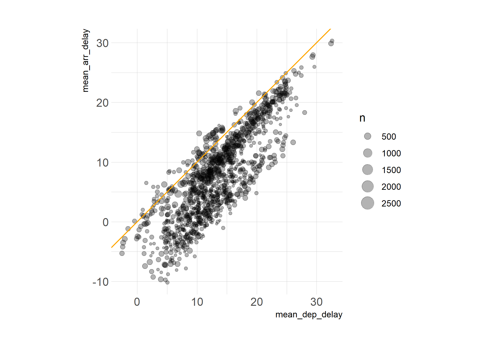
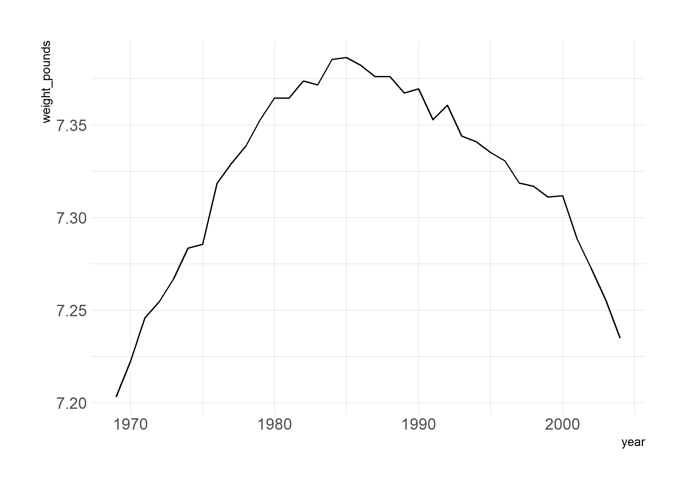
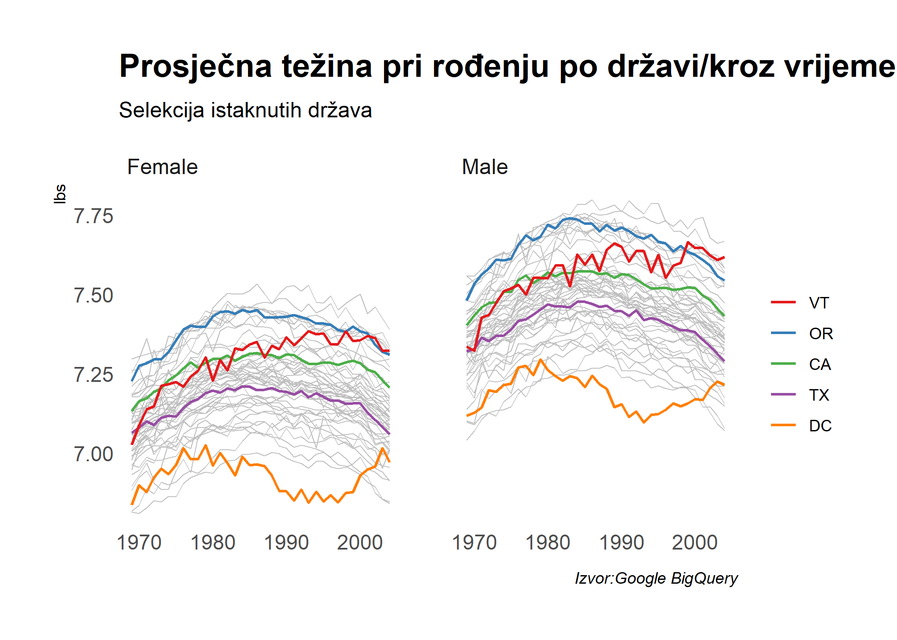
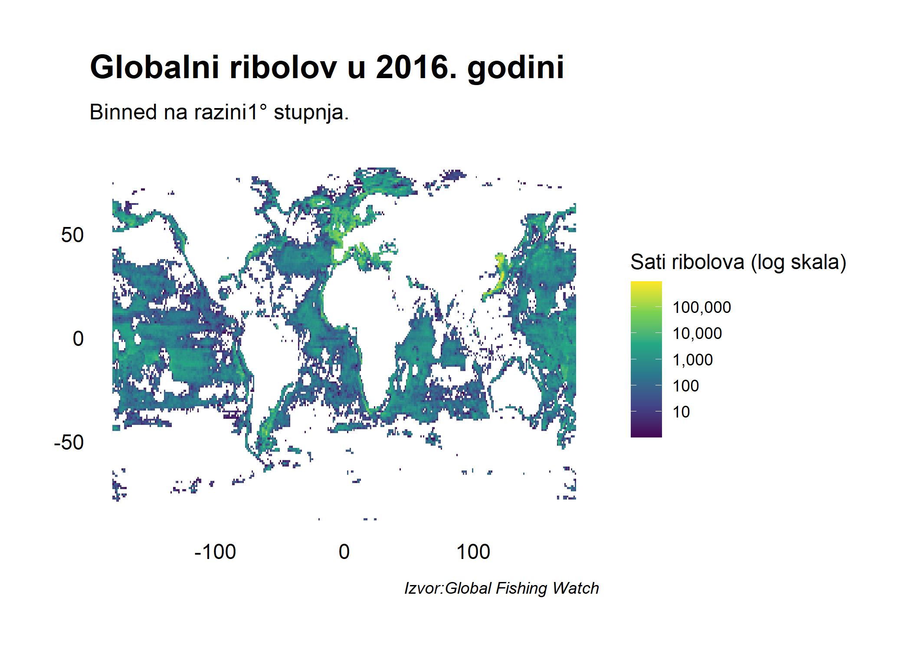

## Software podrška

### Napravite *Google Cloud Platform* račun (besplatno)

1. Prijavite se za 12-mjesečno  [besplatno](https://console.cloud.google.com/freetrial) korištenje *Google Cloud Platform* (GCP).
Ova procedura zahtijeva *Gmail* račun. U procesu prijave na GCP je potrebno unijeti broj kreditne kartice. To će biti kanal za naplatu korištenja servisa u slučaju da potrošite vrijednost dodijeljenu kroz vaučer (USD 300) . Naplata će se izvršiti samo ukoliko to eksplicitno zatražite nakon isteka 12-mjesečnog probnog razdoblja (ili ako registrirate korištenje super-računala u vrijednosti > USD 300). 
2. Preuzmite i pratite instalacijske upute za [Google Cloud SDK](https://cloud.google.com/sdk/), odnosno `gcloud`. Ovo je važno za spajanje na GCP sa lokalnog računala.
3. Spremite identifikacijski broj (ID) GCP projekta kao *environment* varijablu. Prisjetite se procedure spremanja iz [prethodnog predavanja](https://raw.githack.com/BrbanMiro/Obrada-podataka/main/Predavanja/06_WEBSCRAP_I.html). ID projekta će nam biti potreban za spajanje na Google BigQuery bazu podataka u drugom dijelu predavanja. 

### R paketi 

- Novi: **dbplyr**, **DBI**, **RSQLite**,**bigrquery**, **glue**
- Otprije korišteni: **tidyverse**, **hrbrthemes**, **nycflights13**

Pomoću sljedeće naredbe možete instalirati i učitati sve potrebne pakete za ovo predavanje:


```r
## učitaj/instaliraj pakete
if (!require("pacman")) install.packages("pacman")
pacman::p_load(tidyverse, DBI, dbplyr, RSQLite, bigrquery, hrbrthemes, nycflights13, glue)
## Preferencija:ggplot2 tema
theme_set(hrbrthemes::theme_ipsum())
```

## Uvodno o bazama podataka (101)

Dobar dio *Big Data* principa se zapravo može razumijeti kao "uvećani" *small data* principi. Drugačije rečeno, zamislite da se radi samo o jednom, manjem dijelu, većeg skupa podataka...npr. u slučaju analize političkih rezultata bismo razmatrali samo izborne rezultate za jedan grad ili županiju. Sličan primjer možemo zamisliti i u slučaju npr. meteroloških podataka..."usko grlo" je u oba slučaja točka interakcije sa cjelokupnim podatcima koji su "preveliki" i ne stanu u memoriju. Način za upravljanje takvim podatcima su **relacijske baze podataka**.

Baze podataka^[Pri tome se misli na *relacijske baze podatka*.] mogu "postojati" lokalno (*locally*) ili na serveru (*remotely*). Kada "postoje" lokalno (češći slučaj), podatci su uglavnom pohranjeni na tvrdom disku (rijetko u memoriji računala). Dohvat željenih podataka sa tvrdog diska se postiže kroz "upit" (**query**) na bazu. **Query** definira sve što želimo od podataka, a uglavnom se radi o opisu procedure i opsega podataka koje povlačimo u lokalni/radni prostor (memoriju) kako bismo kasnije izvršili neku vrstu analize na podatcima. 

Podatci u bazi su organizirani kao **tablice** (npr. excel) koje se sastoje od redova i kolona, pri čemu je svaki red definiran jedinstvenim ključem. U tom su smislu baze podataka slične *data frame* objektima koje smo već susreli, a još sličnije *list-ama* *data frame*-ova u R-u. Da bismo priostupili željenim informacijama iz baze podataka, prvo moramo "indeksirati" (i.e. odrediti, specificirati) dio koji nas zanima, a potom uputiti upit (**query**) na specifičnu bazu.


> **!** Tablica u relacijskoj bazi je nešto kao data frame u R list-i. Jedna relacijska baza može sadržavati više različitih baza podataka. Baze mogu biti različitih dimenzija i opsega.


## Baze podataka i tidyverse

Skoro svaka relacijska baza podataka koristi [**SQL**](https://en.wikipedia.org/wiki/SQL) (**S**tructured **Q**uery **L**anguage ) jezik. SQL je moćan alat i danas je preduvjet za većinu poslova u data science-u. Riječ je o *arhaičnom* programskom jeziku, znatno manje intuitivnom od većine tidyverse alata koje smo do sada susretali. Kasnije ćemo vidjeti kako izgleda osnovna sintaksa SQL jezika no valja unaprijed reći da već sada (iako možda ne poznajete SQL) možete koristiti taj jezik zbog toga što tidyverse kroz **dplyr**  omogućava direktnu komunikaciju sa bazama podataka iz vašeg lokalnog R envirnoment-a.

Što to znači? 

To jednostavno znači da je moguće raditi sa bazama podataka koji se nalaze u relacijskim bazama upravo kroz *iste* tidyverse naredbe koje smo susretali u prethodnim predavanjima. To je omogućeno kroz [**dbplyr**](https://dbplyr.tidyverse.org/) paket koji omogućava *backend* za `dplyr`. Možda ste primijetili da **dbplyr** paket pri instalaciji učitaiva [**DBI**](https://db.rstudio.com/dbi) paket kao zavisnost (*engl. dependency*). **DBI** omogućava zajedničko sučelje kroz koje **dplyr** može komunicirati sa različitim bazama pomoću iste sintakse. Dakle, nije potrebno izaći izvan okvira tidyverse-a da biste radili sa SQL-om!

> **Dodatno:** Ukoliko se upustite dublje u DataScience, vjerojatno ćete naučiti i SQL. **dplyr** i **dbplyr** će tu biti od pomoći pošto imaju neke funkcionalnosti koje će olakšati učenje i razumijevanje SQL-a.
Iako je **DBI** automatski povezan sa **dbplyr**, za ovo predavanje će biti potrebno instalirati backend paket za baze na koje ćemo se spajati. Popis najpopularnijh backend-ova pogledajte [ovdje](https://db.rstudio.com/dplyr/#getting-started). U ovom predavanju ćemo koristiti sljedeća dva: 
  
1. **RSQLite** koji sadržava SQLite bazu.
2. **bigrquery** koji omogućuje spajanje na Google BigQuery.


**RSQLite** je varijanta SQL u "laganoj kategoriji" koja postoji samo na lokalnom računalu. Zbog toga ćemo ju koristiti u demmonstrativne svrhe na ovom predavanju. Praktičnost ove baze se očituje u jednostavnosti spajanja pri čemu nije potrebna registracija/lozinka. Sa druge strane, **bigrquery** zahtijeva prijavu na Google Cloud servise (+ spremanje login detalja u envrinoment variable).

## Za početak: SQLite

Za detaljniji pregled pogledajte [*Databases using dplyr*](https://db.rstudio.com/dplyr) tutorial o spajanju na baze podataka kroz dplyr. 
Trenutno želimo napraviti improviziranu bazu na lokalnom računalu koristeći SQLite kako bismo razumjeli osnovne principe interakcije sa bazama podataka.

### Spajanje na bazu

Prvo je potrebno napraviti (praznu) vezu pomoću `DBI::dbConnect()` funkcije, a potom ćemo tu vezu spremiti u objekt `con`. U pozadini smo učitali **RSQLite** paket za SQLite backend te dajemo upute R-u da ova lokalna poveznica postoji u memoriji.


```r
# library(DBI) ## učitano
con <- dbConnect(RSQLite::SQLite(), path = ":memory:")
```

Argumenti `DBI::dbConnect()` funkcije mogu varirati od baze do baze. Prvi argument je uvijek  backend baze (i.e. `RSQLite::SQLite()`), a u ovom slučaju koristimo SQLite za R. 

Iako i to može varirati, SQLite baza treba samo jedan argument: `path` do baze. Ovdje koristimo specijalni znak (string), ":memory:", koji daje SQLite bazi do zanja da želimo privremenu (in-memory) bazu. Kasnije ćemo vidjeti složenije procese spajanja koji će ukjučivati više login informacija. 

Stvorena `con` veza je trenutno prazna pa ćemo ju iskoristiti za kopiranje podataka iz *flights* podatkovnog skupa koji se nalazi u **nycflights13** paketu. To je moguće napraviti na više načina, a ovdje ćemo koristiti `dplyr::copy_to()` fukciju. Potrebno je specificirati naziv tablice ("flights") koja će postojati unutar ove baze. Također proslijeđujemo i istu indeksa kroz `copy_to()` funkciju. Indeksi osiguravaju efikasnost u procesuiranju baze, a najčešće su unaprijed definirani od strane onoga tko održava bazu.


```r
# if (!require("nycflights13")) install.packages("nycflights13") ## već učitano
copy_to(
  dest = con, 
  df = nycflights13::flights, 
  name = "flights",
  temporary = FALSE, 
  indexes = list(
    c("year", "month", "day"), 
    "carrier", 
    "tailnum",
    "dest"
    )
  )
```

Sada kada su podatci kopirani, možemo ih "pozvati" u R kroz `dplyr::tbl()` funkciju:


```r
# library(dplyr) ## Already loaded
# library(dbplyr) ## Already loaded
flights_db <- tbl(con, "flights")
flights_db
```

```
## # Source:   table<flights> [?? x 19]
## # Database: sqlite 3.33.0 []
##     year month   day dep_time sched_dep_time dep_delay arr_time sched_arr_time
##    <int> <int> <int>    <int>          <int>     <dbl>    <int>          <int>
##  1  2013     1     1      517            515         2      830            819
##  2  2013     1     1      533            529         4      850            830
##  3  2013     1     1      542            540         2      923            850
##  4  2013     1     1      544            545        -1     1004           1022
##  5  2013     1     1      554            600        -6      812            837
##  6  2013     1     1      554            558        -4      740            728
##  7  2013     1     1      555            600        -5      913            854
##  8  2013     1     1      557            600        -3      709            723
##  9  2013     1     1      557            600        -3      838            846
## 10  2013     1     1      558            600        -2      753            745
## # ... with more rows, and 11 more variables: arr_delay <dbl>, carrier <chr>,
## #   flight <int>, tailnum <chr>, origin <chr>, dest <chr>, air_time <dbl>,
## #   distance <dbl>, hour <dbl>, minute <dbl>, time_hour <dbl>
```

Izgleda da sve funkcionira...iako output izgleda "čudno"! Što znače upitnici kod broja redova?

### Korištenje **query**-a

Sjajna stvar oko **dplyr** je što on automatski prevodi tidyverse jezik (code) u SQL. Jedan dio **dplyr** naredbi je zapravo baziran na SQL ekvivalentima. Imajući to na umu, specificirati ćemo nekoliko **query**-a korištenjem tipične **dplyr** sintakse koju smo do sada naučili.


```r
## Izaberi kolone
flights_db %>% select(year:day, dep_delay, arr_delay)
```

```
## # Source:   lazy query [?? x 5]
## # Database: sqlite 3.33.0 []
##     year month   day dep_delay arr_delay
##    <int> <int> <int>     <dbl>     <dbl>
##  1  2013     1     1         2        11
##  2  2013     1     1         4        20
##  3  2013     1     1         2        33
##  4  2013     1     1        -1       -18
##  5  2013     1     1        -6       -25
##  6  2013     1     1        -4        12
##  7  2013     1     1        -5        19
##  8  2013     1     1        -3       -14
##  9  2013     1     1        -3        -8
## 10  2013     1     1        -2         8
## # ... with more rows
```

```r
## filtriraj prema kriteriju
flights_db %>% filter(dep_delay > 240) 
```

```
## # Source:   lazy query [?? x 19]
## # Database: sqlite 3.33.0 []
##     year month   day dep_time sched_dep_time dep_delay arr_time sched_arr_time
##    <int> <int> <int>    <int>          <int>     <dbl>    <int>          <int>
##  1  2013     1     1      848           1835       853     1001           1950
##  2  2013     1     1     1815           1325       290     2120           1542
##  3  2013     1     1     1842           1422       260     1958           1535
##  4  2013     1     1     2115           1700       255     2330           1920
##  5  2013     1     1     2205           1720       285       46           2040
##  6  2013     1     1     2343           1724       379      314           1938
##  7  2013     1     2     1332            904       268     1616           1128
##  8  2013     1     2     1412            838       334     1710           1147
##  9  2013     1     2     1607           1030       337     2003           1355
## 10  2013     1     2     2131           1512       379     2340           1741
## # ... with more rows, and 11 more variables: arr_delay <dbl>, carrier <chr>,
## #   flight <int>, tailnum <chr>, origin <chr>, dest <chr>, air_time <dbl>,
## #   distance <dbl>, hour <dbl>, minute <dbl>, time_hour <dbl>
```

```r
## prosječno kašnjenje po destinaciji (group/summarise)
flights_db %>%
  group_by(dest) %>%
  summarise(delay = mean(dep_time))
```

```
## # Source:   lazy query [?? x 2]
## # Database: sqlite 3.33.0 []
##    dest  delay
##    <chr> <dbl>
##  1 ABQ   2006.
##  2 ACK   1033.
##  3 ALB   1627.
##  4 ANC   1635.
##  5 ATL   1293.
##  6 AUS   1521.
##  7 AVL   1175.
##  8 BDL   1490.
##  9 BGR   1690.
## 10 BHM   1944.
## # ... with more rows
```

Sve izgleda očekivano osim što output ponovno izgleda nešto drugačije nego uobičajno.Možda se pitate što znači`# Source:lazy query`?

### Ljenost kao vrlilna!

Princip **dplyr** paketa je maksimalna moguća ljenost. To u ovom primjeru znači da je R kod preveden u SQL i onda izvršen na bazi, a ne u R-u. To je prednost jer:

- Podatci nisu učitani u R ako se to eksplicitno ne zatraži.
- Sve se odgađa do zadnjeg trenutka i šalje se na bazu u jednom (zadnjem) koraku.

Zamislite npr. situaciju u kojoj želimo saznati prosječno kašnjenje za svaki avion (i.e. jedinstveni *tail* broj aviona)!


```r
tailnum_delay_db <- 
  flights_db %>% 
  group_by(tailnum) %>%
  summarise(
    mean_dep_delay = mean(dep_delay),
    mean_arr_delay = mean(arr_delay),
    n = n()
    ) %>% 
  arrange(desc(mean_arr_delay)) %>%
  filter(n > 100) # makni opservacije manje od 100 
```

Ova sekvenca naredbi zapravo nikada ne "dodiruje" bazu!^[Iako ovo možda nije skroz očito...ove naredbe bi bile instantno izvršene čak i kada bi se primijenile na ogromnu količinu podataka (i.e. bazu).] Tek kada zatražimo podatke (objekt `tailnum_delay_db` u konzoli) **dplyr** generira SQL i zatraži rezultate iz baze. Čak i tada **dplyr** nastoji napraviti minimalno potrebno pa vraća samo nekoliko redova u konzolu.


```r
tailnum_delay_db
```

```
## # Source:     lazy query [?? x 4]
## # Database:   sqlite 3.33.0 []
## # Ordered by: desc(mean_arr_delay)
##    tailnum mean_dep_delay mean_arr_delay     n
##    <chr>            <dbl>          <dbl> <int>
##  1 N11119            32.6           30.3   148
##  2 N16919            32.4           29.9   251
##  3 N14998            29.4           27.9   230
##  4 N15910            29.3           27.6   280
##  5 N13123            29.6           26.0   121
##  6 N11192            27.5           25.9   154
##  7 N14950            26.2           25.3   219
##  8 N21130            27.0           25.0   126
##  9 N24128            24.8           24.9   129
## 10 N22971            26.5           24.7   230
## # ... with more rows
```


### Prikupljanje podataka u lokalni radni prostor R

Najčešće je potrebno iterirati kroz podatke nekoliko puta prije nego uistinu shvatimo točno koji dio podataka želimo povući sa baze. Nakon što smo identificirali podskup podatka koji nas zanima, **`collect()`** funkcija će biti korisna za povlaćenje podataka u lokalni data frame. U ovom primjeru ćemo pripisati podatke objektu `tailnum_delay`. To radimo jer želimo *query* objekt `tailnum_delay_db` držati odvojeno kako bismo kasnije mogli lakše razumjeti principe (prijevode) SQL jezika. 


```r
tailnum_delay <- 
  tailnum_delay_db %>% 
  collect()
tailnum_delay
```

```
## # A tibble: 1,201 x 4
##    tailnum mean_dep_delay mean_arr_delay     n
##    <chr>            <dbl>          <dbl> <int>
##  1 N11119            32.6           30.3   148
##  2 N16919            32.4           29.9   251
##  3 N14998            29.4           27.9   230
##  4 N15910            29.3           27.6   280
##  5 N13123            29.6           26.0   121
##  6 N11192            27.5           25.9   154
##  7 N14950            26.2           25.3   219
##  8 N21130            27.0           25.0   126
##  9 N24128            24.8           24.9   129
## 10 N22971            26.5           24.7   230
## # ... with 1,191 more rows
```

Sada smo uspješno povukli podatke iz baze u lokalni R envrionment kao data frame objekt. Na tom objektu je moguće koristiti sve poznate dplyr operacije. Pogledajmo npr. vizualizaciju podataka za odnos između dolaznih i odlaznih kašnjenja:  


```r
tailnum_delay %>%
  ggplot(aes(x=mean_dep_delay, y=mean_arr_delay, size=n)) +
  geom_point(alpha=0.3) +
  geom_abline(intercept = 0, slope = 1, col="orange") +
  coord_fixed()
```

<!-- -->

Kada završimo sa upitima na SQLite bazu, najčešće se želimo *disconnect-ati* putem `DBI::dbDisconnect(con)` funkcije. Prije toga pogledajmo kako izvršiti *sirove* (i.e. neprevedene) SQL upite (query).

## Korištenje SQL direktno u R

### Prevedi pomoću dplyr::show_query()

**dplyr** u pozadini prevodi R u SQL pa je moguće koristiti **`show_query()`** funkciju za prikaz SQL-a koji je pozvao zatraženu tablicu.


```r
tailnum_delay_db %>% show_query()
```

```
## <SQL>
## SELECT *
## FROM (SELECT *
## FROM (SELECT `tailnum`, AVG(`dep_delay`) AS `mean_dep_delay`, AVG(`arr_delay`) AS `mean_arr_delay`, COUNT() AS `n`
## FROM `flights`
## GROUP BY `tailnum`)
## ORDER BY `mean_arr_delay` DESC)
## WHERE (`n` > 100.0)
```

Primijetite da je SQL poziv znatno manje intuitivan nego **dplyr** sintaksa. Ovo je je djelomično određeno i internim (dplyr) prijevodom jer **dplyr** procedura prevođenja uključuje "osigurače" koji kontroliraju ispravno funkcioniranje. Osigurači smanjuju konciznost koda(i.e. ponavljanje `SELECT` naredbi) no čak i bez toga je jasno da SQL nije najelegantniji jezik. Nezgrapnu sintaksu čini *leksički* slijed operacija koji ne uvažava i *logički* slijed operacija.^[To je u suprotnosti sa **dplyr** pipe principima koji funkcioniraju po načelu "uzmi ovaj objekt, napravi ovo, zatim ovo...itd.".] Naime, SQL jezik karakterizira zadani redosljed naredbi (*order of execution*) i na to se potrebno naviknuti. [Julia Evans](https://twitter.com/b0rk) je to izvrsno opisuje u svojoj knjizi, [*Become A Select Star*](https://wizardzines.com/zines/sql/) (izvrstan uvod u SQL!).


Bez da ulazimo u detalje, valja primijetiti kako SQL upiti (query) nisu napisani redosljedom kojim biste normalno razmišljali o njima, a dobra objašnjenja za to pogledajte [ovdje](https://www.eversql.com/sql-order-of-operations-sql-query-order-of-execution/) i [ovdje](https://blog.jooq.org/2016/12/09/a-beginners-guide-to-the-true-order-of-sql-operations/). 

U ovom trenutku je logično postaviti pitanje da li je uopće potrebno znati SQL, pogotovo uzevši u obzir da **dplyr** prijevodi dobro funkcioniraju? 

To je legitimno pitanje no dogovor je potvrdan jer ćete u nekom trenutku sigurno trebati neki *sirovi* SQL kod. Pogledajmo stoga nekoliko primjera na osnovi **DBI** paketa koji mogu olakšati učenje.


```r
## Ekvivalenti SQL za dplyr naredbe
flights_db %>% filter(dep_delay > 240) %>% head(5) %>% show_query()
```

```
## <SQL>
## SELECT *
## FROM `flights`
## WHERE (`dep_delay` > 240.0)
## LIMIT 5
```

**Komentar:** U SQL kodu koji slijedi ćemo maknuti navodnike na nazivima objekata (`dep_delay` i `flights`) kao i zagrade oko `WHERE` filtera. To su prethodno spomenuti *osigurači* koje **dplyr** koristi kako bi se postigla kompatibilnost sa SQL-om. 

### Opcija 1: R Markdown `sql` *chunk*-ovi

Kod pisanje izvještaja ili članka u R Markdown-u, moguće je integrirati SQL direktno u .Rmd file. Potrebno je specificirati *chunk* kao `sql` i R Markdown  će automatski ( kroz **knitr**) pozvati **DBI** paket za izvršenje naredbe. Detalnjije upute i opisi su u [R Markdown knjizi](https://bookdown.org/yihui/rmarkdown/language-engines.html#sql). Za izvršenje prethodnog upita (query) je dovoljan sljedeći kod:

````markdown
```{sql, connection=con}
SELECT *
FROM flights
WHERE dep_delay > 240
LIMIT 5
```
````

Pogledajte isti query-chunk koji smo koristili u prethodnom dijelu predavanja:


```sql
SELECT *
FROM flights
WHERE dep_delay > 240
LIMIT 5
```


<div class="knitsql-table">


Table: 5 records

| year| month| day| dep_time| sched_dep_time| dep_delay| arr_time| sched_arr_time| arr_delay|carrier | flight|tailnum |origin |dest | air_time| distance| hour| minute|  time_hour|
|----:|-----:|---:|--------:|--------------:|---------:|--------:|--------------:|---------:|:-------|------:|:-------|:------|:----|--------:|--------:|----:|------:|----------:|
| 2013|     1|   1|      848|           1835|       853|     1001|           1950|       851|MQ      |   3944|N942MQ  |JFK    |BWI  |       41|      184|   18|     35| 1357081200|
| 2013|     1|   1|     1815|           1325|       290|     2120|           1542|       338|EV      |   4417|N17185  |EWR    |OMA  |      213|     1134|   13|     25| 1357063200|
| 2013|     1|   1|     1842|           1422|       260|     1958|           1535|       263|EV      |   4633|N18120  |EWR    |BTV  |       46|      266|   14|     22| 1357066800|
| 2013|     1|   1|     2115|           1700|       255|     2330|           1920|       250|9E      |   3347|N924XJ  |JFK    |CVG  |      115|      589|   17|      0| 1357077600|
| 2013|     1|   1|     2205|           1720|       285|       46|           2040|       246|AA      |   1999|N5DNAA  |EWR    |MIA  |      146|     1085|   17|     20| 1357077600|

</div>


### Opcija 2: DBI:dbGetQuery()

Izvršavanje SQL naredbi nije ograničeno na R Markdown dokumente. SQL funkcionira i u regularnim R skriptama kroz korištenje `DBI::dbGetQuery()` funkcije.


```r
## Izvrši SQL naredbnu direktno
dbGetQuery(con, "SELECT * FROM flights WHERE dep_delay > 240.0 LIMIT 5")
```

```
##   year month day dep_time sched_dep_time dep_delay arr_time sched_arr_time
## 1 2013     1   1      848           1835       853     1001           1950
## 2 2013     1   1     1815           1325       290     2120           1542
## 3 2013     1   1     1842           1422       260     1958           1535
## 4 2013     1   1     2115           1700       255     2330           1920
## 5 2013     1   1     2205           1720       285       46           2040
##   arr_delay carrier flight tailnum origin dest air_time distance hour minute
## 1       851      MQ   3944  N942MQ    JFK  BWI       41      184   18     35
## 2       338      EV   4417  N17185    EWR  OMA      213     1134   13     25
## 3       263      EV   4633  N18120    EWR  BTV       46      266   14     22
## 4       250      9E   3347  N924XJ    JFK  CVG      115      589   17      0
## 5       246      AA   1999  N5DNAA    EWR  MIA      146     1085   17     20
##    time_hour
## 1 1357081200
## 2 1357063200
## 3 1357066800
## 4 1357077600
## 5 1357077600
```

### Savjet: Koristite glue::glue_sql()

Iako prethodno opisani pristup dobro funkcionira (i.e. SQL query u navodnicima unutar `dbGetQuery()` funkcije), moguće je koristiti i `glue_sql()` funkciju iz [**glue**](https://glue.tidyverse.org/) paketa. To omogućava integrirani pristup koji omogućava 1) korištenje lokalnih varijabli u R query-ima i 2) podjelu query-a na djelove (sub-query). Ovdje je primjer za drugi slučaj:


```r
# library(glue) ## učitano
## stvori lokalne R varijable
tbl <- "flights"
d_var <- "dep_delay"
d_thresh <- 240
## "glued" SQL query kao string
sql_query <-
  glue_sql("
  SELECT *
  FROM {`tbl`}
  WHERE ({`d_var`} > {d_thresh})
  LIMIT 5
  ", 
  .con = con
  )
## izvrži query
dbGetQuery(con, sql_query)
```

```
##   year month day dep_time sched_dep_time dep_delay arr_time sched_arr_time
## 1 2013     1   1      848           1835       853     1001           1950
## 2 2013     1   1     1815           1325       290     2120           1542
## 3 2013     1   1     1842           1422       260     1958           1535
## 4 2013     1   1     2115           1700       255     2330           1920
## 5 2013     1   1     2205           1720       285       46           2040
##   arr_delay carrier flight tailnum origin dest air_time distance hour minute
## 1       851      MQ   3944  N942MQ    JFK  BWI       41      184   18     35
## 2       338      EV   4417  N17185    EWR  OMA      213     1134   13     25
## 3       263      EV   4633  N18120    EWR  BTV       46      266   14     22
## 4       250      9E   3347  N924XJ    JFK  CVG      115      589   17      0
## 5       246      AA   1999  N5DNAA    EWR  MIA      146     1085   17     20
##    time_hour
## 1 1357081200
## 2 1357063200
## 3 1357066800
## 4 1357077600
## 5 1357077600
```

Iako ovo izgleda kao više posla `glue::glue_sql()` pristup se isplati kada morate raditi sa većim i povezanim query-ima. Za detaljnije upute i opis svih funkcionalnosti pogledajte [dokumentaciju](https://glue.tidyverse.org/reference/glue_sql.html).

### Kraj rada sa bazom- disconnect

Na kraju se potrebno odspojiti sa baze pomoću `DBI::dbDisconnect()` funkcije. Konačno!


```r
dbDisconnect(con)
```


## Prinosi na opseg: Google BigQuery

Nakon što smo razumjeli osnovne principe interakcije sa bazama podatka, vrijeme je za nešto realniji primjer. Pogledajmo kako funkcionira [**Google BigQuery**](https://cloud.google.com/bigquery/) servis. BigQuery je "*serverless, highly scalable, enterprise data warehouse designed to make all your data analysts productive at an unmatched price-performance*". Neke od sjajnih karakteristika ove platforme su: 

- **Pristupačnost** BigQuery je dio Google Cloud Platform (GCP) koja omogućava rad sa podatcima u oblaku (cloud). Za pristup servisu pogledajte upute sa početka predavanja. Potrebna je registracija i prijava!
- **Ekonomičnost** Servis je izrazito ekonomičan. ([Pogledajte cjenik!](https://cloud.google.com/bigquery/pricing).) Čak i izvan probnog 12 mjesečnog testnog razdoblja, servis omogućuje 1 TB besplatnog prometa svaki mjesec.^[ "T" označava *terabajte*.] Svaki dodatni TB košta $5 nakon isteka probnog razdoblja. Pohrana podataka je također jeftina, čak i u usporedbi sa besplatnim standardnim bazama. 
- **Dostupnost podataka.** BigQuery sadrži [više baza podataka](https://cloud.google.com/bigquery/public-data/#sample_tables) s kojima možete eksperimentirati. Osim toga, na bazi su dostupni i neki javni [podatci](https://www.reddit.com/r/bigquery/wiki/datasets). Primjerice, svjetski meterološki podatci,Wikipedia,Facebook komentari,prodaja nekretnina u Latinskoj Americi itd... Probajte osmisliti istraživanje na osnovi neke od tih baza!?

Najčešći oblik interakcije sa GCP bazom je kroz [web UI](https://console.cloud.google.com/bigquery). 
Taj način pruža nekoliko praktičnih funkcionalnosti poput SQL formatiranja i pred pregleda tablica. Proučite BigQuery web UI.^[[Ovdje](https://towardsdatascience.com/bigquery-without-a-credit-card-discover-learn-and-share-199e08d4a064) možete pogledati primjer sa Wikipedia podatcima.] U ovom slučaju ćemo pogledati kako koristiti BigQuery bazu kroz R uz pomoć [**bigrquery**](https://bigrquery.r-dbi.org/) paketa.


Za korištenje **bigrquery** paketa je potreban *GCP project billing ID*. To je moguće specificirati direktno u R skripti,a u ovom slučaju smo pruzimamo te podatke izu R environment varijable `.Renviron` u home direktoriju.^[To je moguće napraviti pomoću `usethis::edit_r_environ()` naredbe u R konzoli. Tamo možete kopirati ID i pospremiti u objekt `GCE_DEFAULT_PROJECT_ID` koji ćemo koristiti u primjeru. Naravno, možete izabrati i neki drugi naziv. U tom slučju prilagodite kod koji ćemo koristiti u pedavanju!] To nam omogućava korištenje `Sys.getenv()` naredbe i garantira sigurnost podataka u *OpenSource* predavanjima (dokumentima) poput ovih. 


```r
# library(bigrquery) ## učitano
billing_id <- Sys.getenv("GCE_DEFAULT_PROJECT_ID") ## zamijenite sa vašim ID 
```

> **!** Za interaktivnu komplilaciju (i.e. knit) *bigquery* koda u R Markdownu je potrebno specificirati ključ. Za detalje [vidi](https://stackoverflow.com/questions/62008509/authentication-for-bigquery-using-bigrquery-from-an-r-markdown-document).


```r
bigrquery::bq_auth(path = "D:/LUKA/Academic/HS/NASTAVA/20-21/key.json")
```

Nakon što smo podesili ID (*i ključ za interaktivno izvršavanje*), možemo započeti sa upitima na bazu i preuzimanjem BigQuery podataka u radni prostor R. To ćemo napraviti kroz dva primjera: 1) podatci o natalitetu u SAD-u i 2) podatci o ribolovu u okviru Global Fishing Watch projekta.

### Primjer 1) SAD natalitet

`bigrquery` podržava razne načine povlačenja podataka iz R, uključujući i direktnu interakciju kroz (low-level) API. Ovdje ćemo se fokusirati na **dplyr** pristup.^[Pročitajte dokumentaciju paketa i provjerite sami.] Kao u prethodnom SQLite primjeru, započeti ćemo postavljanjem veze kroz `DBI::dbConnect()` funkciju. Jedina je razlika što sada moramo specificirati BigQuery backend (kroz `bigrquery::bigquery()`) i unijeti podatke za prijavu (i.e. *project billing ID*). Spojimo se na  *publicdata.samples* bazu:


```r
# library(DBI) ## učitano
# library(dplyr) ## učitano
bq_con <- 
  dbConnect(
    bigrquery::bigquery(),
    project = "publicdata",
    dataset = "samples",
    billing = billing_id
    )
```

Ova veza je važeća za sve tablice unutar specificirane baze. Potrebno je samo navesti željenu bazu `dplyr::tbl()` i izvršti query na način koji smo već vidjeli. Ostale dostupne baze pogledajte pomoću naredbe `DBI::dbListTables()`.

> **!** Sljedeći red koda izvršite interaktivno ukolilko se prvi put spajate na BigQuery bazu iz R. Potrebno je autorizirati pristup u browser-u.


```r
dbListTables(bq_con)
```

```
## [1] "github_nested"   "github_timeline" "gsod"            "natality"       
## [5] "shakespeare"     "trigrams"        "wikipedia"
```

U ovom primjeru koristimo [podatke o natalitetu](https://console.cloud.google.com/bigquery?p=bigquery-public-data&d=samples&t=natality&page=table&_ga=2.108840194.-1488160368.1535579560) koji sadaržavaju informacije o rođenim osobama po federalnim državama SAD-a u periodu 1969 - 2008. 


```r
natality <- tbl(bq_con, "natality")
```

*Sirovi* podatci o natalitetu sa BigQuery baze su veliki oko 22 GB što je dovoljno za preopterećenje (RAM) prosječnog osobnog računala. Zbog toga ćemo sažeti (agregirati) podatke na godišnje prosjeke:


```r
bw <-
  natality %>%
  filter(!is.na(state)) %>% ## makni outlier-e
  group_by(year) %>%
  summarise(weight_pounds = mean(weight_pounds, na.rm=T)) %>% 
  collect()
```

Pogedajmo kako podtaci izgledaju:


```r
bw %>%
  ggplot(aes(year, weight_pounds)) + 
  geom_line()
```

<!-- -->


O razlozima pada nataliteta nećemo peviše nagađati, to je bolje ostaviti za struku!^[ [Pogledajte](https://twitter.com/grant_mcdermott/status/1156260684126048256) za diskusiju.] Pogledajmo još i podatke o natalitetu prema prosječnoj težini djeteta pri rođenju za svaku US državu i po spolu:  


```r
## prosječna težina pri rođenju po državi i spolu
bw_st <-
  natality %>%
  filter(!is.na(state)) %>%
  group_by(year, state, is_male) %>%
  summarise(weight_pounds = mean(weight_pounds, na.rm=T)) %>% 
  mutate(gender = ifelse(is_male, "Male", "Female")) %>% 
  collect()
```

Prikažimo podatke:


```r
## proizvoljni izbor država
states <- c("CA","DC","OR","TX","VT")
## sortiraj podatke
bw_st <- bw_st %>% arrange(gender, year)
## napravi grafikon
bw_st %>%
  ggplot(aes(year, weight_pounds, group=state)) + 
  geom_line(col="grey75", lwd = 0.25) + 
  geom_line(
    data = bw_st %>% filter(state %in% states), 
    aes(col=fct_reorder2(state, year, weight_pounds)),
    lwd=0.75
    ) +
  facet_wrap(~gender) + 
  scale_color_brewer(palette = "Set1", name=element_blank()) +
  labs(
    title = "Težina djeteta pri rođenju po državi za razdoblje 1969-2008",
    subtitle = "Selekcija istaknutih država",
    x = NULL, y = "lbs",
    caption = "Izvor:Google BigQuery"
    ) + 
  theme_ipsum(grid=F)
```

<!-- -->

Iako nećemo ni sada nagađati što stoji iza ovih trendova, slika postaje jasnija na disagregiranim podatcima (i.e. prikazu). 

Kao i u prethodnom primjeru, nakon korištenja baze treva napraviti disconnect:


```r
dbDisconnect(bq_con)
```

### Primjer 2) *Global Fishing Watch*

Ovo je zadnji primjer u današnjem predavanju i uključuje podatke sa [**Global Fishing Watch**](https://globalfishingwatch.org/) (GFW) inicijative. Ovdje možete pogledati [interaktivnu mapu](https://globalfishingwatch.org/map/) kada stignete. Sada ćemo pogledati GFW podatke na BigQuery bazi i izvući neke agregirane podatke o globalnom ribolovu:


```r
gfw_con <- 
  dbConnect(
    bigrquery::bigquery(),
    project = "global-fishing-watch",
    dataset = "global_footprint_of_fisheries",
    billing = billing_id
    )
```

Pogledajmo popis dostupnih tablica pomoću `DBI::dbListTables()` funkcije:


```r
dbListTables(gfw_con)
```

```
## [1] "fishing_effort"          "fishing_effort_byvessel"
## [3] "fishing_vessels"         "vessels"
```

Odaberimo "fishing_effort" tablicu i pospremimo ju u objekt pod nazivom `effort`:


```r
effort <- tbl(gfw_con, "fishing_effort")
effort
```

```
## # Source:   table<fishing_effort> [?? x 8]
## # Database: BigQueryConnection
##    date   lat_bin lon_bin flag  geartype vessel_hours fishing_hours mmsi_present
##    <chr>    <int>   <int> <chr> <chr>           <dbl>         <dbl>        <int>
##  1 2012-~    -879    1324 AGO   purse_s~        5.76          0                1
##  2 2012-~   -5120   -6859 ARG   trawlers        1.57          1.57             1
##  3 2012-~   -5120   -6854 ARG   purse_s~        3.05          3.05             1
##  4 2012-~   -5119   -6858 ARG   purse_s~        2.40          2.40             1
##  5 2012-~   -5119   -6854 ARG   trawlers        1.52          1.52             1
##  6 2012-~   -5119   -6855 ARG   purse_s~        0.786         0.786            1
##  7 2012-~   -5119   -6853 ARG   trawlers        4.60          4.60             1
##  8 2012-~   -5118   -6852 ARG   trawlers        1.56          1.56             1
##  9 2012-~   -5118   -6850 ARG   trawlers        1.61          1.61             1
## 10 2012-~   -5117   -6849 ARG   trawlers        0.797         0.797            1
## # ... with more rows
```

Provjerimo koliko najveće ribolovne nacije eksploatiraju ribni fond prema kriteriju sati provedenih u ribolovu. Kao što je vidljivo, Kina je dominatni globalni igrač:


```r
effort %>%
  group_by(flag) %>%
  summarise(total_fishing_hours = sum(fishing_hours, na.rm=T)) %>%
  arrange(desc(total_fishing_hours)) %>%
  collect()
```

```
## # A tibble: 126 x 2
##    flag  total_fishing_hours
##    <chr>               <dbl>
##  1 CHN             57711389.
##  2 ESP              8806223.
##  3 ITA              6790417.
##  4 FRA              6122613.
##  5 RUS              5660001.
##  6 KOR              5585248.
##  7 TWN              5337054.
##  8 GBR              4383738.
##  9 JPN              4347252.
## 10 NOR              4128516.
## # ... with 116 more rows
```

#### Komentar o zapisu datuma 

Većina tablica i baza u BigQuery su [indeksirane po datumima](https://cloud.google.com/bigquery/docs/best-practices-costs#partition_data_by_date), i.e. posložene prema vremenskim pečatima koji definiraju trenutak kada su podatci uneseni u bazu. GFW podatci su vremenski označeni jer to osigurava ekonomičnost. Ovo je važno istaknuti jer određuje način koji koristimo za manipulaciju GFW podataka po datumima.^[Možda ste primjetili da je "date" kolona u `effort` tablici zapravo *character string*. Zbog toga je potrebno ovu kolonu prvo pretvoriti u datumsku, a nakon toga je moguće provesti filtriranje. Čak i u tom slučaju ćemo izgubiti dio efikasnosti u usporedbi sa originalnim vremenskim pečatima.] Način za provedbu datumskog filtera u SQL je korištenje `_PARTITIONTIME` pseudo kolone. ( [Pogledajte](https://globalfishingwatch.org/data-blog/our-data-in-bigquery/) još neke primjere.) Esplicitna **dplyr** varijanta `_PARTITIONTIME` pseudo kolone ne postoji je potrebno definirati SQL variablu direktno u **dplyr** pozivu. To radim kroz korištenje *backticks* navodnika. Ovo je primjer za podatke u 2016 godini:


```r
effort %>%
  ## filtriranje na osnovi "partition time" varijable
  filter(
    `_PARTITIONTIME` >= "2016-01-01 00:00:00",
    `_PARTITIONTIME` <= "2016-12-31 00:00:00"
    ) %>%
  ## kraj "partition time" filtriranja
  group_by(flag) %>%
  summarise(total_fishing_hours = sum(fishing_hours, na.rm=T)) %>%
  arrange(desc(total_fishing_hours)) %>%
  collect()
```

```
## # A tibble: 121 x 2
##    flag  total_fishing_hours
##    <chr>               <dbl>
##  1 CHN             16882037.
##  2 TWN              2227341.
##  3 ESP              2133990.
##  4 ITA              2103310.
##  5 FRA              1525454.
##  6 JPN              1404751.
##  7 RUS              1313683.
##  8 GBR              1248220.
##  9 USA              1235116.
## 10 KOR              1108384.
## # ... with 111 more rows
```

Kina je opet na prvom mjestu uz neke manje promjene na ljestvici 10 najvećih. 


#### Zadnji query: Globalni ribolov u 2016. godini

Ovo je posljedni primjer u današnjem predavanju:


```r
## definiraj bin rezoluciju u stupnjevima
resolution <- 1
globe <-
  effort %>%
  filter(
    `_PARTITIONTIME` >= "2016-01-01 00:00:00",
    `_PARTITIONTIME` <= "2016-12-31 00:00:00"
    ) %>%
  filter(fishing_hours > 0) %>%
  mutate(
    lat_bin = lat_bin/100,
    lon_bin = lon_bin/100
    ) %>%
  mutate(
    lat_bin_center = floor(lat_bin/resolution)*resolution + 0.5*resolution,
    lon_bin_center = floor(lon_bin/resolution)*resolution + 0.5*resolution
    ) %>%
  group_by(lat_bin_center, lon_bin_center) %>%
  summarise(fishing_hours = sum(fishing_hours, na.rm=T)) %>%
  collect()
```

Napravimo sada vizualizaciju:


```r
globe %>% 
  filter(fishing_hours > 1) %>% 
  ggplot() +
  geom_tile(aes(x=lon_bin_center, y=lat_bin_center, fill=fishing_hours))+
  scale_fill_viridis_c(
    name = "Sati ribolova (log skala)",
    trans = "log",
    breaks = scales::log_breaks(n = 5, base = 10),
    labels = scales::comma
    ) +
  labs(
    title = "Globalni ribolov u 2016. godini",
    subtitle = paste0("Binned na razini", resolution, "° stupnja."),
    y = NULL, x = NULL,
    caption = "Izvor:Global Fishing Watch"
    ) +
  theme_ipsum(grid=F) +
  theme(axis.text=element_blank())
```

<!-- -->


Na kraju je potrebno prekinuti vezu:


```r
dbDisconnect(gfw_con)
```


## Kamo dalje: Učenje SQL jezika

Ovo predavanje nije išlo u dubinu samog SQL programskog jezika. Cilj je bio omogućiti praktično snalaženje sa bazama podataka i razumijevanje općih principa. To je moguće i bez SQL-a, a kroz poznavanje osnova **dplyr** sintakse zbog razloga koje smo objasnili na početku predavanja. Ipak, poznavanje SQL-a je korisno, pogotovo ako želite raditi u *data science* sektoru. Znanje SQL-a će vam očekivano donijeti prinose u vidu mogućnosti zaposlenja i visine plaće. Zbog toga razmotrite korištenje `show_query()` funkcije kako biste intuiciju iz R i tidyverse-a prenijeli na SQL. Korisan resurs za učenje je prevoditeljska **dplyr** vignette:


```r
vignette("sql-translation")
```

Najbolji način za učenje SQL-a je *pisanje vlastitih queriy-a*. [**BigQuery web UI**](https://console.cloud.google.com/bigquery) je posebno koristan za tu svrhu. Ne samo da je jeftin za korištenje (besplatno do 1 TB), nego ima i mnoštvo korisnih funkcionalnosti. Dobar način je i kopiranje tuđeg SQL koda za modifikacije vlstitih query-a na BigQuery web UI. Za instpiraciju pogledajte [ovdje](https://towardsdatascience.com/bigquery-without-a-credit-card-discover-learn-and-share-199e08d4a064) ili [ovdje](https://globalfishingwatch.org/data-blog/our-data-in-bigquery/).


## Ostali resursi

Iako je u predavanju navedeno mnoštvo korisnih resursa, ovdje je lista dodatnih:

- [Juan Mayorga](https://twitter.com/juansmayorga) ima izvrstan tutorial "[Getting Global Fishing Watch Data from Google Big Query using R](http://jsmayorga.com/post/getting-global-fishing-watch-from-google-bigquery-using-r)". Tu su navedeni još neki razlozi zašto biste trebali nučiti SQL(i.e. osim korištenja **dplyr** prijevoda).
- Službena referenca za učenje SQL-a je [Julia Evans'](https://twitter.com/b0rk) [*Become A Select Star*](https://wizardzines.com/zines/sql/). 
- Službena BigQuery [dokumentacija](https://cloud.google.com/bigquery/docs/) sadržava iscrpan pregled funkcija i sintakse za SQL.
- Postoji i mnoštvo online tutoriala (npr. [W3Schools](https://www.w3schools.com/sql/default.asp)) i kolegija (npr. [Codecademy](https://www.codecademy.com/learn/learn-sql)) koje također varijedi pogledati.


