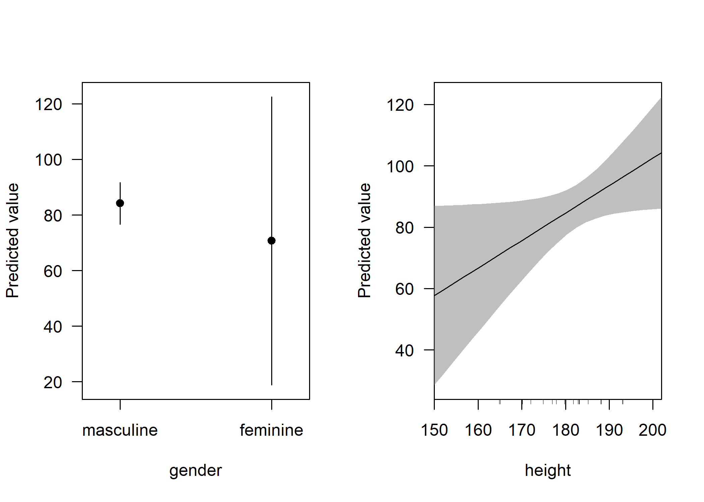
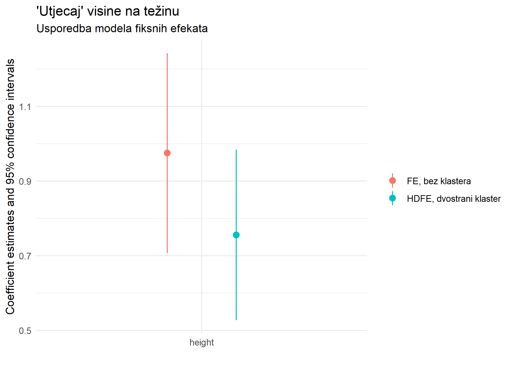
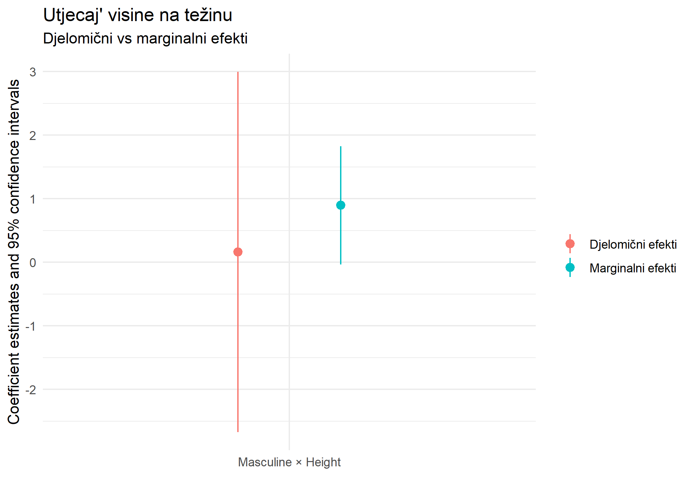
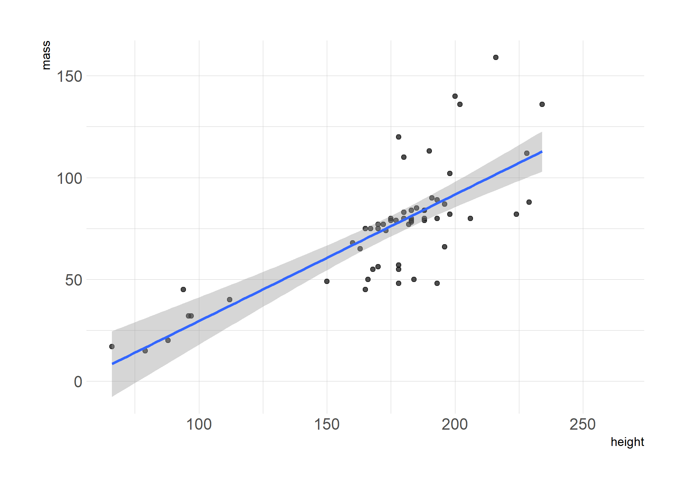
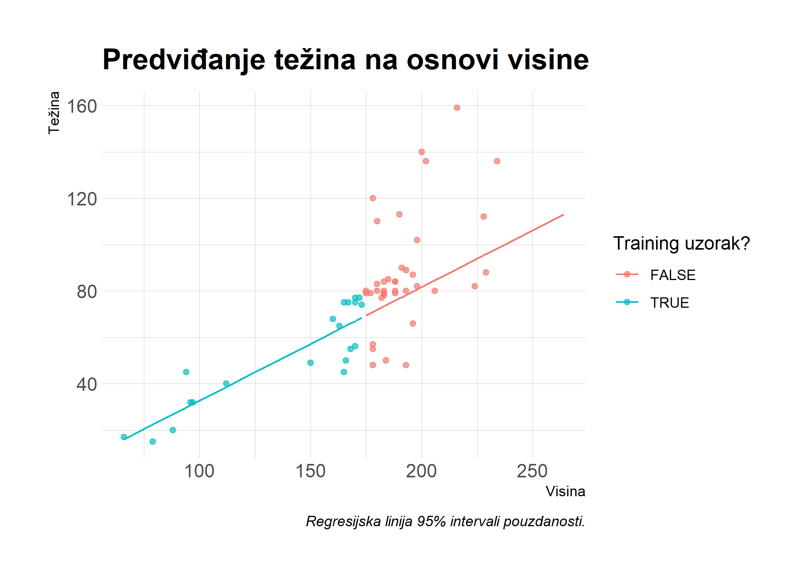

Današnje predavanje se odnosi na regresijsku analizu, najpopularniji analitički pristup u statistici i *data science-u*. Modeli koje ćemo spominjati se dominantno koriste u ekonomiji, odnosno ekonometriji no primjenjivost imaju i u drugim društvenim znanostima i analitičko-poslovnim rješenjima. Cilj predavanja je izložiti pregled najvažnijih funkcija i paketa, a ne raspravljati o kakrakteristikama i teoretskim aspektima pojedinih modela. 


## Software preduvjeti

### R paketi 

*Base R* sadržava većinu potrebnih funkcija za osnovnu regresijsku analizu no u današnjem predavanju ćemo koristiti niz dodatnih paketa. Korištenje dodatnih paketa olakšava analizu i omogućuje provođenje sofisticiranijih modela.

- Novi: **broom**, **estimatr**, **fixest**, **sandwich**, **lmtest**, **AER**, **lfe**, **mfx**, **margins**, **modelsummary**, **vtable**
- Korišteni: **tidyverse**, **hrbrthemes**, **listviewer**

Praktičan način za instalaciju i učitavanje svih paketa je izvršavanje donjeg koda. Za pakete **broom** i **modelsummary** ćemo koristiti razvojne pakete jer sadržavaju nekoliko funkcionalnosti koje nisu dostupne u trenutnim CRAN verzijama.


```r
## učitaj i instaliraj pakete
if (!require("pacman")) install.packages("pacman")
pacman::p_load(mfx, tidyverse, hrbrthemes, estimatr, fixest, sandwich, lmtest, AER, lfe, margins, vtable)
## razvojne verzije
pacman::p_install_gh("tidymodels/broom") 
pacman::p_install_gh("vincentarelbundock/modelsummary")
##  ggplot2 teme
theme_set(hrbrthemes::theme_ipsum())
```


Sada kada su potrebni paketi učitani, pogledajmo `starwars` podatke (*već korišteni u prethodnim predavanjima*) koje ćemo koristiti u svrhu demonstracije modela:


```r
starwars
```

```
## # A tibble: 87 x 14
##    name  height  mass hair_color skin_color eye_color birth_year sex   gender
##    <chr>  <int> <dbl> <chr>      <chr>      <chr>          <dbl> <chr> <chr> 
##  1 Luke~    172    77 blond      fair       blue            19   male  mascu~
##  2 C-3PO    167    75 <NA>       gold       yellow         112   none  mascu~
##  3 R2-D2     96    32 <NA>       white, bl~ red             33   none  mascu~
##  4 Dart~    202   136 none       white      yellow          41.9 male  mascu~
##  5 Leia~    150    49 brown      light      brown           19   fema~ femin~
##  6 Owen~    178   120 brown, gr~ light      blue            52   male  mascu~
##  7 Beru~    165    75 brown      light      blue            47   fema~ femin~
##  8 R5-D4     97    32 <NA>       white, red red             NA   none  mascu~
##  9 Bigg~    183    84 black      light      brown           24   male  mascu~
## 10 Obi-~    182    77 auburn, w~ fair       blue-gray       57   male  mascu~
## # ... with 77 more rows, and 5 more variables: homeworld <chr>, species <chr>,
## #   films <list>, vehicles <list>, starships <list>
```

## Osnove regresijskog modela

### `lm()` funkcija

Glavna naredba za provedbu regresijskog modela u R je `lm()` funkcija. "**lm**" je kratica za "**l**inear **m**odels", a funkcijska sintaksa je vrlo intuitivna:

```r
lm(y ~ x1 + x2 + x3 + ..., data = df)
```

`lm()` ima izvor podataka kao funkcijski argument (u ovom slučaju hipotetski data frame pod nazivom `df`). Razlog za to je mogućnost supostojanja različitih objekata u radnom prostoru R pa je potrebno eksplicitno naznačiti koji objekt želimo koristiti za regresiju. To je potrebno čak i ako je `df` jedini data frame u radnom prostoru R u trenutku izođenja regresije. Alternativna opcija je indeksiranje varijabli:

```r
lm(df$y ~ df$x1 + df$x2 + df$x3 + ...)
```

Provedimo sada jednostavnu regresiju težine (mass) na visinu (height) koristeći `starwars` podatke:


```r
ols1 = lm(mass ~ height, data = starwars)
# ols1 = lm(starwars$mass ~ starwars$height) ## alternativno
ols1
```

```
## 
## Call:
## lm(formula = mass ~ height, data = starwars)
## 
## Coefficients:
## (Intercept)       height  
##    -13.8103       0.6386
```
Ovaj regresijski ispis je vrlo jednostavan i sažet zbog toga što se većina korisnih informacija *skriva* u internoj (list) strukturi "ols1" objekta. U RStudio-u je moguće pregledati tu strukturu pomoću naredbe `View(ols1)` ili klikom na "ols1" objekt u gornjem desnom panelu. To će otvorriti interaktivni panel u kojem možete detaljnije proučiti ovaj objekt. Taj pristup ne funkcionira u (knit!) R Markdown dokumentu, pa ćemo koristiti `listviewer::jsonedit()` funkciju za interaktivni pregled:


```r
# View(ols1) ## u uobičajnoj skripti koristi
listviewer::jsonedit(ols1, mode="view") ## za R Markdown
```

<!--html_preserve--><div id="htmlwidget-bfbb22aed5189f4a53a8" style="width:100%;height:10%;" class="jsonedit html-widget"></div>
<script type="application/json" data-for="htmlwidget-bfbb22aed5189f4a53a8">{"x":{"data":{"coefficients":{"(Intercept)":-13.8103136287303,"height":0.638571004587035},"residuals":{"1":-19.0238991602397,"2":-17.8310441373046,"3":-15.4925028116251,"4":20.8189707021492,"5":-32.9753370593249,"6":20.1446748122381,"7":-16.5539021281305,"8":-16.1310738162121,"9":-19.0481802106971,"10":-25.4096092061101,"11":-22.2410352336323,"13":-19.7838754171137,"14":-21.132467196936,"15":-22.6624701648268,"16":1260.060387826,"17":-17.7467571510656,"18":8.86753280306401,"19":-11.335372674014,"20":-19.7467571510656,"21":-24.8481802106971,"22":26.0961127113233,"23":5.48182275719366,"24":-20.2167541831749,"25":-18.9396121740008,"26":-18.132467196936,"29":-22.3839347749288,"30":-20.3610471051953,"31":-20.4338902565674,"32":-18.1567482473934,"34":-45.3496032703285,"35":-47.2295913987655,"39":-17.7096388850176,"42":-17.9396121740008,"44":-44.8553251877619,"45":-1.21536080245101,"47":-25.2767601189564,"48":-22.2410352336323,"49":-30.6267452795026,"50":-24.3496032703285,"52":-53.6867512152841,"55":-26.2410352336323,"57":-19.3253222198712,"60":-23.0481802106971,"61":-38.5467571510656,"62":-42.1924731327175,"64":-29.4338902565674,"66":-24.0481802106971,"67":-38.4696151418916,"68":-10.6267452795026,"69":-44.4224464217007,"72":-21.6367957336455,"74":-61.4338902565674,"76":-42.8553251877619,"77":34.8789766379308,"78":0.384698555364138,"79":-27.2410352336323,"80":-51.8553251877619,"81":-37.7353133161989,"87":-46.5539021281305},"effects":{"(Intercept)":-747.466613505303,"height":172.783889465672,"3":-8.91507473191356,"4":21.4194000157428,"5":-29.4427951434848,"6":22.0983868653301,"7":-13.8671619244769,"8":-9.61003251731303,"9":-17.3764020616673,"10":-23.6814442762678,"11":-20.8511909886646,"12":-20.6495024046433,"13":-19.2915287054689,"14":-20.4268242076726,"15":1262.18326022153,"16":-15.3419508514742,"17":10.7084712945311,"18":-3.06634116992952,"19":-17.3419508514742,"20":-23.1764020616673,"21":26.8093155865418,"22":6.75889344053645,"23":-18.2066553492705,"24":-16.8167397784715,"25":-16.2915287054689,"26":-15.3554124487178,"27":-17.3923729974795,"28":-19.325979915662,"29":-16.936064344863,"30":-44.4108532718604,"31":-47.8696712630455,"32":-12.034399298305,"33":-15.8167397784715,"34":-42.9016131346699,"35":5.47484083888537,"36":-22.4772463536779,"37":-20.8511909886646,"38":-29.8007688426593,"39":-23.4108532718604,"40":-52.0713598470667,"41":-24.8511909886646,"42":-17.7663176324662,"43":-21.3764020616673,"44":-36.1419508514742,"45":-39.5621197098763,"46":-28.325979915662,"47":-22.3764020616673,"48":-35.9520352806753,"49":-9.80076884265929,"50":-45.3444601900428,"51":-14.1007923801226,"52":-60.325979915662,"53":-40.9016131346699,"54":34.6899910201503,"55":-0.819249117040137,"56":-25.8511909886646,"57":-49.9016131346699,"58":-37.360431125855,"59":-43.8671619244768},"rank":2,"fitted.values":{"1":96.0238991602397,"2":92.8310441373046,"3":47.4925028116251,"4":115.181029297851,"5":81.9753370593249,"6":99.8553251877619,"7":91.5539021281305,"8":48.1310738162121,"9":103.048180210697,"10":102.40960920611,"11":106.241035233632,"13":131.783875417114,"14":101.132467196936,"15":96.6624701648267,"16":97.939612174001,"17":94.7467571510657,"18":101.132467196936,"19":28.335372674014,"20":94.7467571510657,"21":103.048180210697,"22":113.903887288677,"23":107.518177242806,"24":99.2167541831749,"25":97.9396121740008,"26":101.132467196936,"29":42.3839347749288,"30":88.3610471051953,"31":109.433890256567,"32":108.156748247393,"34":111.349603270329,"35":129.229591398766,"39":57.7096388850176,"42":97.9396121740008,"44":99.8553251877619,"45":46.215360802451,"47":90.2767601189564,"48":106.241035233632,"49":112.626745279503,"50":111.349603270329,"52":103.686751215284,"55":106.241035233632,"57":104.325322219871,"60":103.048180210697,"61":94.7467571510656,"62":92.1924731327175,"64":109.433890256567,"66":103.048180210697,"67":93.4696151418916,"68":112.626745279503,"69":132.422446421701,"72":36.6367957336455,"74":109.433890256567,"76":99.8553251877619,"77":124.121023362069,"78":135.615301444636,"79":106.241035233632,"80":99.8553251877619,"81":117.735313316199,"87":91.5539021281305},"assign":[0,1],"qr":{"qr":[[-7.68114574786861,-1336.64954904012],[0.130188910980824,270.578977473948],[0.130188910980824,0.287474707506684],[0.130188910980824,-0.104277826225194],[0.130188910980824,0.0879026620206325],[0.130188910980824,-0.0155791393425051],[0.130188910980824,0.0324659827189516],[0.130188910980824,0.283778928886571],[0.130188910980824,-0.0340580324430654],[0.130188910980824,-0.0303622538229533],[0.130188910980824,-0.0525369255436257],[0.130188910980824,-0.200368070348108],[0.130188910980824,-0.0229706965827292],[0.130188910980824,0.00289975375805518],[0.130188910980824,-0.00449180348216893],[0.130188910980824,0.0139870896183913],[0.130188910980824,-0.0229706965827292],[0.130188910980824,0.398348066110045],[0.130188910980824,0.0139870896183913],[0.130188910980824,-0.0340580324430654],[0.130188910980824,-0.0968862689849704],[0.130188910980824,-0.0599284827838498],[0.130188910980824,-0.011883360722393],[0.130188910980824,-0.00449180348216893],[0.130188910980824,-0.0229706965827292],[0.130188910980824,0.31704093646758],[0.130188910980824,0.0509448758195119],[0.130188910980824,-0.0710158186441859],[0.130188910980824,-0.0636242614039618],[0.130188910980824,-0.0821031545045221],[0.130188910980824,-0.18558495586766],[0.130188910980824,0.228342249584891],[0.130188910980824,-0.00449180348216893],[0.130188910980824,-0.0155791393425051],[0.130188910980824,0.294866264746908],[0.130188910980824,0.0398575399591757],[0.130188910980824,-0.0525369255436257],[0.130188910980824,-0.0894947117447462],[0.130188910980824,-0.0821031545045221],[0.130188910980824,-0.0377538110631774],[0.130188910980824,-0.0525369255436257],[0.130188910980824,-0.0414495896832895],[0.130188910980824,-0.0340580324430654],[0.130188910980824,0.0139870896183913],[0.130188910980824,0.0287702040988396],[0.130188910980824,-0.0710158186441859],[0.130188910980824,-0.0340580324430654],[0.130188910980824,0.0213786468586155],[0.130188910980824,-0.0894947117447462],[0.130188910980824,-0.20406384896822],[0.130188910980824,0.350302944048588],[0.130188910980824,-0.0710158186441859],[0.130188910980824,-0.0155791393425051],[0.130188910980824,-0.156018726906763],[0.130188910980824,-0.22254274206878],[0.130188910980824,-0.0525369255436257],[0.130188910980824,-0.0155791393425051],[0.130188910980824,-0.119060940705643],[0.130188910980824,0.0324659827189516]],"qraux":[1.13018891098082,1.02507442547873],"pivot":[1,2],"tol":1e-07,"rank":2},"df.residual":57,"na.action":{},"xlevels":{},"call":{},"terms":{},"model":{"mass":[77,75,32,136,49,120,75,32,84,77,84,112,80,74,1358,77,110,17,75,78.2,140,113,79,79,83,20,68,89,90,66,82,40,80,55,45,65,84,82,87,50,80,85,80,56.2,50,80,79,55,102,88,15,48,57,159,136,79,48,80,45],"height":[172,167,96,202,150,178,165,97,183,182,188,228,180,173,175,170,180,66,170,183,200,190,177,175,180,88,160,193,191,196,224,112,175,178,94,163,188,198,196,184,188,185,183,170,166,193,183,168,198,229,79,193,178,216,234,188,178,206,165]}},"options":{"mode":"view","modes":["code","form","text","tree","view"]}},"evals":[],"jsHooks":[]}</script><!--/html_preserve-->

Kao što je vidljivo `ols1` objekt sadržava mnoštvo slotova... koji sadržavaju regresijske koeficijente, vektor rezidualnih i *fitted* (i.e. predicted) vrijednosti, rangove matrice dizajna, imput podatke...itd. Za deskriptivni pregled najvažnijih vrijednosti se uobičajno koristi generička `summary()` funkcija: 


```r
summary(ols1) # (slično kao u Stata-i)
```

```
## 
## Call:
## lm(formula = mass ~ height, data = starwars)
## 
## Residuals:
##     Min      1Q  Median      3Q     Max 
##  -61.43  -30.03  -21.13  -17.73 1260.06 
## 
## Coefficients:
##             Estimate Std. Error t value Pr(>|t|)
## (Intercept) -13.8103   111.1545  -0.124    0.902
## height        0.6386     0.6261   1.020    0.312
## 
## Residual standard error: 169.4 on 57 degrees of freedom
##   (28 observations deleted due to missingness)
## Multiple R-squared:  0.01792,	Adjusted R-squared:  0.0006956 
## F-statistic:  1.04 on 1 and 57 DF,  p-value: 0.312
```

Izvucimo sada regresijske koeficijente:


```r
summary(ols1)$coefficients
```

```
##               Estimate  Std. Error    t value  Pr(>|t|)
## (Intercept) -13.810314 111.1545260 -0.1242443 0.9015590
## height        0.638571   0.6260583  1.0199865 0.3120447
```


### Korištenje "tidy" regresijskih koeficijenata iz `broom` paketa

Iako je najjednostavniji način *vađenja* koeficijenata `summary()` funkcija, u praksi je **broom** ([paket](https://broom.tidyverse.org/)) bolji način. **broom** ima niz korisnih funkcioinalnosti koji regresijske (i druge statističke) objekte pretvaraju u "tidy" data frame-ove. To je praktično jer se regresijski output često koristi kao input u nekoj drugoj proceduri, npr. za vizualizaciju marginalnih efekata. Sada ćemo pogledati kako pomoću funkcije `broom::tidy(..., conf.int = TRUE)` možemo prebaciti `ols1` regresijski objekt u *tidy data frame* koeficijenata i drugih statistika:


```r
# library(broom) ## učitano
tidy(ols1, conf.int = TRUE)
```

```
## # A tibble: 2 x 7
##   term        estimate std.error statistic p.value conf.low conf.high
##   <chr>          <dbl>     <dbl>     <dbl>   <dbl>    <dbl>     <dbl>
## 1 (Intercept)  -13.8     111.       -0.124   0.902 -236.       209.  
## 2 height         0.639     0.626     1.02    0.312   -0.615      1.89
```

Ove "očišćene" (tidy) koeficijente bismo sada mogli iskoristiti za **ggplot2** vizualizaciju, primjerice koristeći `geom_pointrange()` za prikaz *error bar*-ova.

**broom** ima još nekoliko korisnih funkcionalnosti. Npr. `broom::glance()` daje prikaz modelskih meta podataka (R<sup>2</sup>, AIC, etc.) u data frame-u:


```r
glance(ols1)
```

```
## # A tibble: 1 x 12
##   r.squared adj.r.squared sigma statistic p.value    df logLik   AIC   BIC
##       <dbl>         <dbl> <dbl>     <dbl>   <dbl> <dbl>  <dbl> <dbl> <dbl>
## 1    0.0179      0.000696  169.      1.04   0.312     1  -386.  777.  783.
## # ... with 3 more variables: deviance <dbl>, df.residual <int>, nobs <int>
```

Tehnike izvoza podataka u druge formate (npr. LaTeX tablice) ćemo spomenuti pred kraj predavanja.


### Regresija na dijelu podataka

Prethodno procijenjeni regresijski model i nije baš nešto... R<sup>2</sup> je 0.018. Nizak R<sup>2</sup> baca sumnju na ekstremne vrijednosti u podatcima...

<!-- -->

Čini se da bi imalo smisla maknuti ekstremnu vrijednost iz regresijskog modela!? To je moguće napraviti na dva načina: 1) napravi novi data frame i provedi regresiju i 2) *subset-aj* podatke (direktno) unutar `lm()` funkcije.


#### 1) Napravi novi data frame

R dozvoljava mnoštvo objekata u radnom prostoru pa je moguće napraviti novi data frame objekt koji isključuje ekstremnu vrijednost *Jabba*. Za to je moguće koroistiti **dplyr** ([predavanje](https://raw.githack.com/BrbanMiro/Obrada-podataka/main/Predavanja/05_MANIPULACIJA_tidy.html#1)) ili  **data.table** ([predavanje](https://raw.githack.com/BrbanMiro/Obrada-podataka/main/Predavanja/05_MANIPULACIJA_dt.html#1)). U ovom slučaju ćemo koristiti **dplyr** jer je to trenutno kompatiblno sa `starwars` podatcima:


```r
starwars2 =
  starwars %>% 
  filter(name != "Jabba Desilijic Tiure")
  # filter(!(grepl("Jabba", name))) ## Regex također funkcionira
ols2 = lm(mass ~ height, data = starwars2)
summary(ols2)
```

```
## 
## Call:
## lm(formula = mass ~ height, data = starwars2)
## 
## Residuals:
##     Min      1Q  Median      3Q     Max 
## -39.382  -8.212   0.211   3.846  57.327 
## 
## Coefficients:
##              Estimate Std. Error t value Pr(>|t|)    
## (Intercept) -32.54076   12.56053  -2.591   0.0122 *  
## height        0.62136    0.07073   8.785 4.02e-12 ***
## ---
## Signif. codes:  0 '***' 0.001 '**' 0.01 '*' 0.05 '.' 0.1 ' ' 1
## 
## Residual standard error: 19.14 on 56 degrees of freedom
##   (28 observations deleted due to missingness)
## Multiple R-squared:  0.5795,	Adjusted R-squared:  0.572 
## F-statistic: 77.18 on 1 and 56 DF,  p-value: 4.018e-12
```

#### 2) Subset unutar `lm()` funkcije

Provedi regresiju i *subset-aj* direktno u funkcijskom pozivu.


```r
ols2a = lm(mass ~ height, data = starwars %>% filter(!(grepl("Jabba", name))))
summary(ols2a)
```

```
## 
## Call:
## lm(formula = mass ~ height, data = starwars %>% filter(!(grepl("Jabba", 
##     name))))
## 
## Residuals:
##     Min      1Q  Median      3Q     Max 
## -39.382  -8.212   0.211   3.846  57.327 
## 
## Coefficients:
##              Estimate Std. Error t value Pr(>|t|)    
## (Intercept) -32.54076   12.56053  -2.591   0.0122 *  
## height        0.62136    0.07073   8.785 4.02e-12 ***
## ---
## Signif. codes:  0 '***' 0.001 '**' 0.01 '*' 0.05 '.' 0.1 ' ' 1
## 
## Residual standard error: 19.14 on 56 degrees of freedom
##   (28 observations deleted due to missingness)
## Multiple R-squared:  0.5795,	Adjusted R-squared:  0.572 
## F-statistic: 77.18 on 1 and 56 DF,  p-value: 4.018e-12
```

Kvaliteta modela je sada znatno unaprijeđena jer su podaci očišćeni od outliera pa je  R<sup>2</sup> porastao na 0.58. To ne znači da možemo olako izbacivati podatke...ponekad je moguće ekstremne vrijednosti *uzeti u obzir* kroz statistički model...primjerice kroz nestandardnu rezidualnu strukturu!

## Nestandardna rezidualna struktura

Statističke neregularnosti (heteroskedastičnost, klasteri  itd) su regularna stvar u statistici. Dobra stvar je da postoji mnoštvo načina za uvažavanje nestandardne rezudualne strukture u R, npr. **sandwich**  ([paket](https://cran.r-project.org/web/packages/sandwich/index.html)). Nešto "moderniji" pristup je **estimatr** ([paket](https://declaredesign.org/r/estimatr/articles/getting-started.html)) koji daje na brzi i praktičnosti. Slijedi nekoliko oglednih primjera... 

### Robusne standardne pogreške

Heteroskedstične (HC) "robusne" standardne pogreške modela možemo uvažiti korištenjem `estimatr::lm_robust()` funkcije. Prikažimo to na primjeru `ols1` regresijskog objekta koji smo već koristili. **estimatr** će prikaz dati u "tidy" formatu, no valja imati na umu da je objekt moguće "ugnijezditi" i u  `tidy()` funkciju!


```r
# library(estimatr) ## učitano
ols1_robust = lm_robust(mass ~ height, data = starwars)
# tidy(ols1_robust, conf.int = TRUE) ## tidy() alternativa
ols1_robust
```

```
##               Estimate  Std. Error    t value     Pr(>|t|)    CI Lower
## (Intercept) -13.810314 23.45557632 -0.5887859 5.583311e-01 -60.7792950
## height        0.638571  0.08791977  7.2631109 1.159161e-09   0.4625147
##               CI Upper DF
## (Intercept) 33.1586678 57
## height       0.8146273 57
```

Ovaj paket koristi *Eicker-Huber-White* robusnu rezidualnu strukturu kao default, odnosno *"HC2" standard errors*. Default varijantu je moguće promijeniti sa `se_type = ` argumentom. ^[[Pogledaj za detalje!](https://declaredesign.org/r/estimatr/articles/mathematical-notes.html#lm_robust-notes)]. To je korisno ako dolazite iz Stata-e i želite replicirati rezultate. Replikacija rezultata nije uvijek elegantna stvar, a za raspravu na temu replikacije između Stata-e, R i Python-a pogledajte [ovdje](https://declaredesign.org/r/estimatr/articles/stata-wls-hat.html). 


```r
lm_robust(mass ~ height, data = starwars, se_type = "stata")
```

```
##               Estimate  Std. Error    t value     Pr(>|t|)    CI Lower
## (Intercept) -13.810314 23.36219608 -0.5911394 5.567641e-01 -60.5923043
## height        0.638571  0.08616105  7.4113649 6.561046e-10   0.4660365
##               CI Upper DF
## (Intercept) 32.9716771 57
## height       0.8111055 57
```

**estimatr** podržava i robusnu regresiju u modelu instrumentalnih varijabli (IV), no to ćemo detaljnije objasniti kasnije...

#### Usputni komentar o HAC (Newey-West) rezidualnoj strukturi

**estimatr** nema podršku za HAC (i.e. heteroskedasticity *and* autocorrelation consistent) rezidualnu strukturu *a la* [Newey-West](https://en.wikipedia.org/wiki/Newey%E2%80%93West_estimator). [Inicijativa](https://github.com/DeclareDesign/estimatr/issues/272) za dodavanje ove funkcionalnosti postoji na GitHub-u, no za sada je HAC omogućen kroz **sandwich** paket. Npr. korištenje `sandwich::NeweyWest()`funkcije na `ols1` objektu:


```r
# library(sandwich) ## učitano
# NeweyWest(ols1) ## HAC VCOV
sqrt(diag(NeweyWest(ols1))) ## prikaži HAC SEs
```

```
## (Intercept)      height 
##  21.2694130   0.0774265
```

Akopak želite koristiti HAC SE rezidualnu strukturu u modelu, preporuča se primjena `ols1` objekta u `lmtest::coeftest()`funkciji. Ova funkcija koristi **sandwich** paket i omogućava praktičan način testiranja hipoteza u modelu sa raznim specifikacijama. Osnovni primjer:


```r
# library(lmtest) ## već učitano
ols1_hac = lmtest::coeftest(ols1, vcov = NeweyWest)
ols1_hac
```

```
## 
## t test of coefficients:
## 
##               Estimate Std. Error t value  Pr(>|t|)    
## (Intercept) -13.810314  21.269413 -0.6493    0.5187    
## height        0.638571   0.077427  8.2474 2.672e-11 ***
## ---
## Signif. codes:  0 '***' 0.001 '**' 0.01 '*' 0.05 '.' 0.1 ' ' 1
```

Obratite pozornost i na lakoću kojom se `coeftest()` uklapa u sintaksu **broom** paketa: 


```r
tidy(ols1_hac, conf.int = TRUE)
```

```
## # A tibble: 2 x 7
##   term        estimate std.error statistic  p.value conf.low conf.high
##   <chr>          <dbl>     <dbl>     <dbl>    <dbl>    <dbl>     <dbl>
## 1 (Intercept)  -13.8     21.3       -0.649 5.19e- 1  -56.4      28.8  
## 2 height         0.639    0.0774     8.25  2.67e-11    0.484     0.794
```

### Klasteri u rezidualnoj strukturi

Klasteri u rezidualnoj strukturi se najčešće javljaju u panel podatcima. Panel podatke ćemo spomenuti kasnije no ovdje je jedan praktični primjer klastera sa `estimatr::lm_robust()` funkcijom:


```r
lm_robust(mass ~ height, data = starwars, clusters = homeworld)
```

```
##               Estimate  Std. Error    t value     Pr(>|t|)    CI Lower
## (Intercept) -9.3014938 28.84436408 -0.3224718 0.7559158751 -76.6200628
## height       0.6134058  0.09911832  6.1886211 0.0002378887   0.3857824
##               CI Upper       DF
## (Intercept) 58.0170751 7.486034
## height       0.8410291 8.195141
```


## *Dummie* varijable i interakcije varijabli

Za demonstraciju principa u ovom poglavlju je potrebno *subset-ati* `starwars` podatke tako da uključuju samo ljudsku vrstu. Zbog toga ćemo napraviti novi podatkovni skup, a dodatno i novu (faktorsku) varijablu "spol" ("gender") jer je važno pokazati kako R tretira faktorske varijable:


```r
humans = 
  starwars %>% 
  filter(species=="Human") %>%
  mutate(gender_factored = as.factor(gender)) %>% ## faktorska verzija varijable "gender"
  select(contains("gender"), everything())
humans
```

```
## # A tibble: 35 x 15
##    gender gender_factored name  height  mass hair_color skin_color eye_color
##    <chr>  <fct>           <chr>  <int> <dbl> <chr>      <chr>      <chr>    
##  1 mascu~ masculine       Luke~    172    77 blond      fair       blue     
##  2 mascu~ masculine       Dart~    202   136 none       white      yellow   
##  3 femin~ feminine        Leia~    150    49 brown      light      brown    
##  4 mascu~ masculine       Owen~    178   120 brown, gr~ light      blue     
##  5 femin~ feminine        Beru~    165    75 brown      light      blue     
##  6 mascu~ masculine       Bigg~    183    84 black      light      brown    
##  7 mascu~ masculine       Obi-~    182    77 auburn, w~ fair       blue-gray
##  8 mascu~ masculine       Anak~    188    84 blond      fair       blue     
##  9 mascu~ masculine       Wilh~    180    NA auburn, g~ fair       blue     
## 10 mascu~ masculine       Han ~    180    80 brown      fair       brown    
## # ... with 25 more rows, and 7 more variables: birth_year <dbl>, sex <chr>,
## #   homeworld <chr>, species <chr>, films <list>, vehicles <list>,
## #   starships <list>
```

### *Dummie* varijable kao faktori


*Dummie* varijable su ključna komponenta velikog broja regresijskih modela, a podrška za rukovanje tim varijablama je dosta loša u nekim (i.e. većini) statističkim programima (npr. potrebna je tabulacija nove matrice binarnih varijabli nakon čega slijedi pripisivanje orginalnim podtacima...). R ima dobar pristup za stvaranje i evaluacijju *dummie* varijabli: jednostavno specificirajte varijablu kao  [faktor](https://r4ds.had.co.nz/factors.html).^[Faktori su varijable sa jedinstvenim kvalitativnim razinama, npr. "muški", "ženski", "trans", itd.]

Ovdje je primjer regresije sa "gendered_factored" varijablom koju smo maločas stvorili:


```r
summary(lm(mass ~ height + gender_factored, data = humans))
```

```
## 
## Call:
## lm(formula = mass ~ height + gender_factored, data = humans)
## 
## Residuals:
##     Min      1Q  Median      3Q     Max 
## -16.068  -8.130  -3.660   0.702  37.112 
## 
## Coefficients:
##                          Estimate Std. Error t value Pr(>|t|)  
## (Intercept)              -84.2520    65.7856  -1.281   0.2157  
## height                     0.8787     0.4075   2.156   0.0441 *
## gender_factoredmasculine  10.7391    13.1968   0.814   0.4259  
## ---
## Signif. codes:  0 '***' 0.001 '**' 0.01 '*' 0.05 '.' 0.1 ' ' 1
## 
## Residual standard error: 15.19 on 19 degrees of freedom
##   (13 observations deleted due to missingness)
## Multiple R-squared:  0.444,	Adjusted R-squared:  0.3855 
## F-statistic: 7.587 on 2 and 19 DF,  p-value: 0.003784
```

Cijela stvar sa prebacivanjem string (i.e. character) varijable u faktorsku nije bila nužna u regresijskom pozivu jer će R to učiniti automatski...no dobro je znati što se događa u pozadini. Pogledajte: 


```r
## ne faktorska verzija "gender" varijable; R zna!!!
summary(lm(mass ~ height + gender, data = humans))
```

```
## 
## Call:
## lm(formula = mass ~ height + gender, data = humans)
## 
## Residuals:
##     Min      1Q  Median      3Q     Max 
## -16.068  -8.130  -3.660   0.702  37.112 
## 
## Coefficients:
##                 Estimate Std. Error t value Pr(>|t|)  
## (Intercept)     -84.2520    65.7856  -1.281   0.2157  
## height            0.8787     0.4075   2.156   0.0441 *
## gendermasculine  10.7391    13.1968   0.814   0.4259  
## ---
## Signif. codes:  0 '***' 0.001 '**' 0.01 '*' 0.05 '.' 0.1 ' ' 1
## 
## Residual standard error: 15.19 on 19 degrees of freedom
##   (13 observations deleted due to missingness)
## Multiple R-squared:  0.444,	Adjusted R-squared:  0.3855 
## F-statistic: 7.587 on 2 and 19 DF,  p-value: 0.003784
```


### Interakcijski efekti

Kao i kod *dummie* varijabli, R ima praktičnu sintaksu za specifikaciju interakcijskih varijabli direktno u regresijskom modelu.^[Iako postoji mnoštvo razloga da to napravite u zasebnom koraku (npr. standardizacija).] Ovo je standardna sintaksa:

- `x1:x2` "križanje" varijabli (ekvivalentno uključivanju x1 × x2 interakcije)
- `x1/x2` "ugnježđivanje" druge varijable u prvu (ekvivalentno `x1 + x1:x2`)
- `x1*x2`uključuje sve glavne i interakcijske varijable (eekvivalentno `x1 + x2 + x1:x2`) 

Općenito je prporučljivo uključiti sve glavne (*parent*) odnose uz njihove interakcije pa je `*` default opcija. 

Primjerice, može nas zanimati da li je odnos između težine i visine posredovan spolom osobe!? Tada bismo proveli regresiju u ovakvom obliku:

$$Mass = \beta_0 + \beta_1 D_{Male} + \beta_2 Height + \beta_3 D_{Male} \times Height$$

Za implementaciju u R:


```r
ols_ie = lm(mass ~ gender * height, data = humans)
summary(ols_ie)
```

```
## 
## Call:
## lm(formula = mass ~ gender * height, data = humans)
## 
## Residuals:
##     Min      1Q  Median      3Q     Max 
## -16.250  -8.158  -3.684  -0.107  37.193 
## 
## Coefficients:
##                        Estimate Std. Error t value Pr(>|t|)
## (Intercept)            -61.0000   204.0565  -0.299    0.768
## gendermasculine        -15.7224   219.5440  -0.072    0.944
## height                   0.7333     1.2741   0.576    0.572
## gendermasculine:height   0.1629     1.3489   0.121    0.905
## 
## Residual standard error: 15.6 on 18 degrees of freedom
##   (13 observations deleted due to missingness)
## Multiple R-squared:  0.4445,	Adjusted R-squared:  0.3519 
## F-statistic: 4.801 on 3 and 18 DF,  p-value: 0.01254
```


## Analiza panel podataka

### Fiksni efekti sa **fixest** paketom

Najjednostavniji način za uključivanje fiksnih efekata u regresijski model je korištenje *dummie* varijabli, no to je vrlo neučinkovito...Uostalom koji je smisao svih [teoretskih](https://en.wikipedia.org/wiki/Frisch%E2%80%93Waugh%E2%80%93Lovell_theorem) aspekata *within-group* transformacija ako ih ne možemo praktično primijeniti u statističkom programu?! U R-u postoji više opcija za analizu fiksnih efekata: **lfe** ([paket](https://cran.r-project.org/web/packages/lfe/index.html)) koji je dosta sličan Stata-inom **reghdfe** ([pristupu](http://scorreia.com/software/reghdfe/)) i **fixest**  ([paket](https://github.com/lrberge/fixest)) koji ćemo koristiti u ovom predavanju.

**fixest** je relativno novi paket koji ima podršku za analizu nelinearnih modela, visko-dimenzionalnih fiksnih efekata, višestrukih klastera itd., a procedure u paketu su jako brze! ([Pogledaj ](https://github.com/lrberge/fixest#benchmarking) za više o odnosu na  **lfe** i **reghdfe** pakete.) Ovdje ćemo razmotriti samo najosnovnije principe rada sa **fixest** paketom, a za detalje [pogledajte](https://cran.r-project.org/web/packages/fixest/vignettes/fixest_walkthrough.html).

#### Jednostavni FE model

Glavna funkcija u ovom paketu je `fixest::feols()` i koristi se za procjenu fiksnih efekata u linearnim modelima. Sintaksa zahtjeva da se prvo specificira "normalni" regresijski model, a nakon `|` lista fiksnih efekata. Pogledajmo jedan primjer regresije težine (mass) na visinu (height) pri čemu ćemo kontrolirati za fiksne efekte na razini vrste^[Pošto smo specificirali "species" u slotu za fiksne efekte, `feols()` funkcija će automatski pretvoriti potrebne varijable u faktorske.] ( koristimo `starwars` podatke!): 


```r
# library(fixest) ## učitano
ols_fe = feols(mass ~ height | species, data = starwars) ## fiksni efekti nakon "|"
ols_fe
```

```
## OLS estimation, Dep. Var.: mass
## Observations: 58 
## Fixed-effects: species: 31
## Standard-errors: Clustered (species) 
##        Estimate Std. Error t value  Pr(>|t|)    
## height 0.974876   0.044291   22.01 < 2.2e-16 ***
## ---
## Signif. codes:  0 '***' 0.001 '**' 0.01 '*' 0.05 '.' 0.1 ' ' 1
## Log-likelihood: -214.02   Adj. R2: 0.99282 
##                         R2-Within: 0.66249
```

Modelski objekt je automatski klasterirao standardne pogreške po varijabli fiksnih efekata (i.e. species). Za obične (*vanilla*) reziduale je potrebno specificirati `se` argument u `summary.fixest()` funkciji na sljedeći način:


```r
summary(ols_fe, se = 'standard')
```

```
## OLS estimation, Dep. Var.: mass
## Observations: 58 
## Fixed-effects: species: 31
## Standard-errors: Standard 
##        Estimate Std. Error t value Pr(>|t|)    
## height 0.974876   0.136463  7.1439 1.38e-07 ***
## ---
## Signif. codes:  0 '***' 0.001 '**' 0.01 '*' 0.05 '.' 0.1 ' ' 1
## Log-likelihood: -214.02   Adj. R2: 0.99282 
##                         R2-Within: 0.66249
```

Podatkovni skup sa koeficijentima ćemo pospremiti u zasebni objekt jer će nam trebati kasnije, a pri  tome koristimo *vanilla* reziduale. Usput primjetite na koji način`broom::tidy()` metoda za `fixest` objekte prihvaća `se` argument. Ova procedura je ujedno i jako praktična za provjeru više različitih modela:


```r
# coefs_fe = tidy(summary(ols_fe, se = 'standard'), conf.int = TRUE) ## isto kao dolje
coefs_fe = tidy(ols_fe, se = 'standard', conf.int = TRUE)
```

#### Visko-dimenzionalni FE i višetruki klasteri

Kako što smo već naveli, **fixest** omogućava proizvoljan broj varijabli za fiksne efekte i višestruke klastere (do 4). Pogledajmo kako to izgleda u praksi (uz dodavanje "homeworld" varijable fiksnim efektima):


```r
## Wdvostruki fiksni efekti: species i homeworld
ols_hdfe = feols(mass ~ height |  species + homeworld, data = starwars)
ols_hdfe
```

```
## OLS estimation, Dep. Var.: mass
## Observations: 55 
## Fixed-effects: species: 30,  homeworld: 38
## Standard-errors: Clustered (species) 
##        Estimate Std. Error t value Pr(>|t|)    
## height 0.755844   0.332888  2.2706  0.03078 *  
## ---
## Signif. codes:  0 '***' 0.001 '**' 0.01 '*' 0.05 '.' 0.1 ' ' 1
## Log-likelihood: -188.55   Adj. R2: 1.00768 
##                         R2-Within: 0.48723
```

Rezidualna struktura prethodnog modela je automatski klasterirana po vrsti (species), odnosno prvoj varijabli iza `|`. Ukoliko želimo klaster po "species" i "homeworld" varijablama^[Ovo je samo demonstrativni primjer.] možemo koristiti funkcijske argumente `se` ili `cluster` u `summary.fixest()` funkciji. Pripisati ćemo model `ols_hdfe` objektu:


```r
## klaster po species i homeworld
# ols_hdfe = summary(ols_hdfe, se = 'twoway') ## Isto kao niže
ols_hdfe = summary(ols_hdfe, cluster = c('species', 'homeworld'))
ols_hdfe
```

```
## OLS estimation, Dep. Var.: mass
## Observations: 55 
## Fixed-effects: species: 30,  homeworld: 38
## Standard-errors: Two-way (species & homeworld) 
##        Estimate Std. Error t value Pr(>|t|)    
## height 0.755844   0.116416  6.4926 4.16e-07 ***
## ---
## Signif. codes:  0 '***' 0.001 '**' 0.01 '*' 0.05 '.' 0.1 ' ' 1
## Log-likelihood: -188.55   Adj. R2: 1.00768 
##                         R2-Within: 0.48723
```

#### Usporedba modelskih koeficijenata

**fixest** ima ugrađenu `coefplot()` funkciju za prikaz rezulatata procjene. Ovo je korisno za pregled efekata kroz vrijeme iako ([pogledaj!](https://cran.r-project.org/web/packages/fixest/vignettes/fixest_walkthrough.html#23_adding_interactions:_yearly_treatment_effect)) se procjena koeficijenata za različite modele se najčešće radi sa **ggplot2** paketom. Sljedeći primjer se zasniva na funkcionalnosti koju omogućjea spremanje objekta kao data frame-a pomoću`broom::tidy()` funkcije. Upravo to olakšava vizualizaciju u ovom slučaju:


```r
# library(ggplot2) ## učitano
## "tidy" output od ols_hdfe objekta
coefs_hdfe = tidy(ols_hdfe, conf.int = TRUE)
bind_rows(
  coefs_fe %>% mutate(reg = "Model 1\nFE bez klastera"),
  coefs_hdfe %>% mutate(reg = "Model 2\nHDFE dvostrani klaster")
  ) %>%
  ggplot(aes(x=reg, y=estimate, ymin=conf.low, ymax=conf.high)) +
  geom_pointrange() +
  labs(Title = "Marginalni efekt visine na težinu") +
  geom_hline(yintercept = 0, col = "orange") +
  ylim(-0.5, NA) + ## Added a bit more bottom space to emphasize the zero line
  labs(
    title = "'Utjecaj' visine na težinu",
    caption = "Podatci: Likovi iz Star Wars univerzuma"
    ) +
  theme(axis.title.x = element_blank())
```

<!-- -->

Normalno bismo očekivali veće standardne pogreške sa klasterskom rezidualnom strukturom, no ovdje je taj efekt poništen kroz povećanu preciznost koju daju fiksni efekti. Ipak ne treba zboraviti da je cjelokupni primjer zasnovan na imaginarnim podatcima pa nema smisla previše razmišljati o substantivnim implikacijama ovih rezultata. Bitna je sintaksa!

#### Komentar o standardnim pogreškama


Upravo smo vidjeli koje opcije ima **fixest** pri specifikaciji različitih rezidualnih struktura. Ukratko provedite model sa `se` ili `cluster` argumentima u  `summary.fixest()` (ili `broom::tidy()`) ako niste zaovoljni sa *default* varijantama. Tu postoje još dvije stvari na koje valja skrenutu pozornost!

Prvo, ako dolazite iz drugog statističkog jezika (Stata!?), prilagodba rezidualne strukture nakon što je proveden model može izgledati neobično...no taj način ima znatne prednosti. Primjerice, on nam omogućava analizu različitih specifikacija po *on-the-fly* principu bez da ponovno provodimo model. **fixest** je uistinu brz no vremenski gubitci zbog ponovnog provođenja modela kod većih modela mogu biti znatni.

Drugo, usporedba standardnih pogrešaka u različitim programima je komplicirana stvar. Osim mnoštva nerješenih teoretskih aspekata (posebno kod višestrukih klastera) tu je i problem specifičnosti svakog pojedinog statističkog paketa ([Pogledaj za diskusiju!](https://github.com/sgaure/lfe/issues/1#issuecomment-530643808)) Usporedba u slučaju **fixest** paketa je je detaljno opisana u [vignette](https://cran.r-project.org/web/packages/fixest/vignettes/standard_errors.html) o replikaciji rezidualne strukture kod drugih paketa. ^[ Za detalje vrijedi [pročitati](https://cran.r-project.org/web/packages/sandwich/vignettes/sandwich-CL.pdf)!]

### Slučajni (random) i mješoviti (mixed) efekti

Fiksni efekti se znatno češće sreću u praktičnim ekonometrijskim analizama nego što je to slučaj sa *random* ili *mixed* efektima. Ovdje isto valja spomenuti [bayesijanske hijerarhisje modele](http://www.stat.columbia.edu/~gelman/arm/) koji se znatno rijeđe pojavljuju u udžbenicima, a vrlo su zanimljivi. U svakom slučaju, R ima podršku za analizu slučajnih efekata kroz **plm** ([paket](https://cran.r-project.org/web/packages/plm/)) i **nlme** ([paket](https://cran.r-project.org/web/packages/nlme/index.html)). ^[**plm** paket također podržava FE (i pooling) modele. Ipak, čini mi se da su **fixest** i **lfe** praktičniji.] 


## Instrumentalne varijable

Kao i kod drugih modela, R pruža više mogućnosti za provedbu IV regresijske analize. Ovdje ćemo razmotriti `AER::ivreg()`, `estimatr::iv_robust()`, i `lfe::felm()` funkcije. Sve ove funkcije imaju sličnu sintaksu, pri čemu je prvi regresijski stupanj specificiran nakon **`|`** , a poslije primarnog regresijskog modela. Postoje tu i neke druge suptilne razlike pa odlučite sami koji pristup vam više odgovara. Za demonstraciju ćemo koristiti  panel podatke o pušenju po SAD federalnim zemljama iz **AER** [paketa](https://cran.r-project.org/web/packages/AER/vignettes/AER.pdf). Prvo ćemo učitati podatke, potom napraviti neke potrebne varijable i onda kratko pogledati kako ti podatci izgledaju. Primjer je ograničen na 1995. godinu jer je cilj razumjeti IV sintaksu, a ne nužno kako ova metodologija funkcionira u kontekstu panel podataka.


```r
## učitaj podatke
data("CigarettesSW", package = "AER")
## stvori novi df sa modificiranim varijablama
cigs =
  CigarettesSW %>%
  mutate(
    rprice = price/cpi,
    rincome = income/population/cpi,
    rtax = tax/cpi,
    tdiff = (taxs - tax)/cpi
    ) %>%
  as_tibble()
## napravi podskup podataka za 1995
cigs95 = cigs %>% filter(year==1995)
cigs95
```

```
## # A tibble: 48 x 13
##    state year    cpi population packs income   tax price  taxs rprice rincome
##    <fct> <fct> <dbl>      <dbl> <dbl>  <dbl> <dbl> <dbl> <dbl>  <dbl>   <dbl>
##  1 AL    1995   1.52    4262731 101.  8.39e7  40.5  158.  41.9   104.    12.9
##  2 AR    1995   1.52    2480121 111.  4.60e7  55.5  176.  63.9   115.    12.2
##  3 AZ    1995   1.52    4306908  72.0 8.89e7  65.3  199.  74.8   130.    13.5
##  4 CA    1995   1.52   31493524  56.9 7.71e8  61    211.  74.8   138.    16.1
##  5 CO    1995   1.52    3738061  82.6 9.29e7  44    167.  44     110.    16.3
##  6 CT    1995   1.52    3265293  79.5 1.04e8  74    218.  86.4   143.    21.0
##  7 DE    1995   1.52     718265 124.  1.82e7  48    166.  48     109.    16.7
##  8 FL    1995   1.52   14185403  93.1 3.34e8  57.9  188.  68.5   123.    15.4
##  9 GA    1995   1.52    7188538  97.5 1.60e8  36    157.  37.4   103.    14.6
## 10 IA    1995   1.52    2840860  92.4 6.02e7  60    191.  69.1   125.    13.9
## # ... with 38 more rows, and 2 more variables: rtax <dbl>, tdiff <dbl>
```

Pretpostavimo da nas zanima regresijski odnos broja (paketa) cigareta kozumiranih po glavi stanovnika i njihove cijene te osobnog dohotka. Empirijski problem se odnosi na to da je broj konzumiranih paketa endogen, odnosno simultano određen na srani ponude i potražnje. Zbog toga valja koristiti instrumentalnu varijablu koja se u ovom slučaju odnosi na porezne varijable. Ovo je regresijski model koji nas zanima:

$$price_i = \pi_0 + \pi_1 tdiff_i + + \pi_2 rtax_i + v_i  \hspace{1cm} \text{(Prva razina)}$$
$$packs_i = \beta_0 + \beta_2\widehat{price_i} + \beta_1 rincome_i + u_i \hspace{1cm} \text{(Druga razina)}$$

### Opcija 1: `AER::ivreg()`

Započnimo sa `AER::ivreg()`  funkcijom jer i podatci dolaze iz tog paketa. Prva regresijska razina je specificirana nakon **`|`** i uključuje *sve* egzogene varijable.


```r
# library(AER) ## učitano
## IV regresija 
iv_reg = 
  ivreg(
    log(packs) ~ log(rprice) + log(rincome) | ## glavna regresija; "rprice" je endogena
      log(rincome) + tdiff + rtax, ## lista svih *egzogenih* varijabli uključujući i  "rincome"
    data = cigs95
    )
summary(iv_reg, diagnostics = TRUE)
```

```
## 
## Call:
## ivreg(formula = log(packs) ~ log(rprice) + log(rincome) | log(rincome) + 
##     tdiff + rtax, data = cigs95)
## 
## Residuals:
##        Min         1Q     Median         3Q        Max 
## -0.6006931 -0.0862222 -0.0009999  0.1164699  0.3734227 
## 
## Coefficients:
##              Estimate Std. Error t value Pr(>|t|)    
## (Intercept)    9.8950     1.0586   9.348 4.12e-12 ***
## log(rprice)   -1.2774     0.2632  -4.853 1.50e-05 ***
## log(rincome)   0.2804     0.2386   1.175    0.246    
## 
## Diagnostic tests:
##                  df1 df2 statistic p-value    
## Weak instruments   2  44   244.734  <2e-16 ***
## Wu-Hausman         1  44     3.068  0.0868 .  
## Sargan             1  NA     0.333  0.5641    
## ---
## Signif. codes:  0 '***' 0.001 '**' 0.01 '*' 0.05 '.' 0.1 ' ' 1
## 
## Residual standard error: 0.1879 on 45 degrees of freedom
## Multiple R-Squared: 0.4294,	Adjusted R-squared: 0.4041 
## Wald test: 13.28 on 2 and 45 DF,  p-value: 2.931e-05
```


Za ekonomiste naviknute na Stata-u će ovo biti u najboljem slučaju neintuitivno.^[Uz pretpostavku da ste veće napravili logaritamske varijable i subset-irali podatke, naredba u Stata-i bi izgledala otprilike ovako: `ivreg log_packs = log_rincome (log_rprice = tdiff rtax)`.] U ovom slučaju nismo specificirali endogene varijable (i.e. "rplice") direktno nego smo rekli R-u koje su *egzogene* varijable. R je nakon toga *zaključio* gdje endogene varijable trebaju biti instrumentalizirane i proveo prvu regresijsku razinu u pozadini. Ovaj modelski set-up dobiva još smisla ako promislite o teoretskim osnovama IV pristupa!  

`AER::ivreg()` također omogućava alternativni način specifikacije prve regresijske razine. Sada ćemo označiti endogenu "rprice" varijablu sa`. -price` i uključiti samo instrumentalne varijable nakon `|`. Output je jednak kao i u prethodnom slučaju:


```r
## eksplicitna specifikacija instrumenata
ivreg(
  log(packs) ~ log(rprice) + log(rincome) | 
    . -log(rprice) + tdiff + rtax, ## alternativni način specifikacije prve regresijske razine
  data = cigs95
  )
```


### Opcija 2: `estimatr::iv_robust()`

Drugi način se ondosi na **estimatr** koji smo prethodno spomenuli. *Default* postavka u ovom pristupu je HC2 rezidualna struktura, a naravno da su dopuštene i druge opcije (i klasteri također). Sintaksa je skoro ista kao u prethodnom primjeru, a sve što treba promijeniti je funkcijski poziv iz `AER::ivreg()` u `estimatr::iv_robust()`.


```r
# library(estimatr) ## učitano
## IV regresija sa robusnim SE
iv_reg_robust = 
  iv_robust( ## sve je isto osim funkcijskog poziva
    log(packs) ~ log(rprice) + log(rincome) | 
      log(rincome) + tdiff + rtax,
    data = cigs95
    )
summary(iv_reg_robust, diagnostics = TRUE)
```

```
## 
## Call:
## iv_robust(formula = log(packs) ~ log(rprice) + log(rincome) | 
##     log(rincome) + tdiff + rtax, data = cigs95)
## 
## Standard error type:  HC2 
## 
## Coefficients:
##              Estimate Std. Error t value  Pr(>|t|) CI Lower CI Upper DF
## (Intercept)    9.8950     0.9777  10.120 3.569e-13   7.9257  11.8642 45
## log(rprice)   -1.2774     0.2547  -5.015 8.739e-06  -1.7904  -0.7644 45
## log(rincome)   0.2804     0.2547   1.101 2.768e-01  -0.2326   0.7934 45
## 
## Multiple R-squared:  0.4294 ,	Adjusted R-squared:  0.4041 
## F-statistic:  15.5 on 2 and 45 DF,  p-value: 7.55e-06
```

### Opcija 3: `felm::lfe()`

`felm()` funkcija iz **lfe** paketa je vjerojatno najelegantnija opcija u usporedbi sa pretthodne dvije jer ima najintuitivniju sintaksu.^[ **fixest** paket koji smo razmatrali maločas ne podržava IV regresiju. Sa druge strane, `lfe::felm()`funkcija ima skore svu funkcinalnost tog paketa, jednio što je malo sporija.] Njena sintaksa je jako slična statinom načinu specifikacije prve regresijske razine, gdje se navode samo endogene varijable i instrumenti. 


```r
# library(lfe) ## učitano
iv_felm = 
  felm(
    log(packs) ~ log(rincome) |
      0 | ## bez fiksnih efekata 
      (log(rprice) ~ tdiff + rtax), ## prva razina; obrati pažnju na zagrade
    data = cigs95
  )
summary(iv_felm)
```

```
## 
## Call:
##    felm(formula = log(packs) ~ log(rincome) | 0 | (log(rprice) ~      tdiff + rtax), data = cigs95) 
## 
## Residuals:
##      Min       1Q   Median       3Q      Max 
## -0.60069 -0.08622 -0.00100  0.11647  0.37342 
## 
## Coefficients:
##                    Estimate Std. Error t value Pr(>|t|)    
## (Intercept)          9.8950     1.0586   9.348 4.12e-12 ***
## log(rincome)         0.2804     0.2386   1.175    0.246    
## `log(rprice)(fit)`  -1.2774     0.2632  -4.853 1.50e-05 ***
## ---
## Signif. codes:  0 '***' 0.001 '**' 0.01 '*' 0.05 '.' 0.1 ' ' 1
## 
## Residual standard error: 0.1879 on 45 degrees of freedom
## Multiple R-squared(full model): 0.4294   Adjusted R-squared: 0.4041 
## Multiple R-squared(proj model): 0.4294   Adjusted R-squared: 0.4041 
## F-statistic(full model):13.28 on 2 and 45 DF, p-value: 2.931e-05 
## F-statistic(proj model): 13.28 on 2 and 45 DF, p-value: 2.931e-05 
## F-statistic(endog. vars):23.56 on 1 and 45 DF, p-value: 1.496e-05
```

U gornjem primjeru smo unieli "0" na mjesto fiksnih efekata jer koristimo samo *subset* podataka. Sljedeći primjer se odnosi na IV regresiju sa `felm()`funkcijom pri čemu su uključeni svi podatci (i.e. puni panel) te "year" and "state" fiksni efekti za kontrolu panel strukture.


```r
iv_felm_all = 
  felm(
    log(packs) ~ log(rincome) |
      year + state | ## uključi fiksne efekte
      (log(rprice) ~ tdiff + rtax), 
    data = cigs ## puni panel
  )
summary(iv_felm_all)
```

```
## 
## Call:
##    felm(formula = log(packs) ~ log(rincome) | year + state | (log(rprice) ~      tdiff + rtax), data = cigs) 
## 
## Residuals:
##      Min       1Q   Median       3Q      Max 
## -0.08393 -0.03851  0.00000  0.03851  0.08393 
## 
## Coefficients:
##                    Estimate Std. Error t value Pr(>|t|)    
## log(rincome)         0.4620     0.3081   1.500    0.141    
## `log(rprice)(fit)`  -1.2024     0.1712  -7.024  9.4e-09 ***
## ---
## Signif. codes:  0 '***' 0.001 '**' 0.01 '*' 0.05 '.' 0.1 ' ' 1
## 
## Residual standard error: 0.06453 on 45 degrees of freedom
## Multiple R-squared(full model): 0.9668   Adjusted R-squared: 0.9299 
## Multiple R-squared(proj model): 0.5466   Adjusted R-squared: 0.04281 
## F-statistic(full model):26.21 on 50 and 45 DF, p-value: < 2.2e-16 
## F-statistic(proj model): 27.71 on 2 and 45 DF, p-value: 1.436e-08 
## F-statistic(endog. vars):49.33 on 1 and 45 DF, p-value: 9.399e-09
```


## Drugi modeli

### Generalizirani linearni modeli (logit, etc.)

Za provedbu generaliziranih linearnih modela (GLM) R ima *ugrađenu* (base) `glm()` funkciju u kojoj je potrebno specificirati [neku od ](https://stat.ethz.ch/R-manual/R-devel/library/stats/html/family.html) opcija koje opisuju rezidualnu strukturu i željeni model. Ovo je primjer za logit model:


```r
glm_logit = glm(am ~ cyl + hp + wt, data = mtcars, family = binomial)
tidy(glm_logit, conf.int = TRUE)
```

```
## # A tibble: 4 x 7
##   term        estimate std.error statistic p.value  conf.low conf.high
##   <chr>          <dbl>     <dbl>     <dbl>   <dbl>     <dbl>     <dbl>
## 1 (Intercept)  19.7       8.12       2.43   0.0152   8.56      44.3   
## 2 cyl           0.488     1.07       0.455  0.649   -1.53       3.12  
## 3 hp            0.0326    0.0189     1.73   0.0840   0.00332    0.0884
## 4 wt           -9.15      4.15      -2.20   0.0276 -21.4       -3.48
```

Prije nego što pogledamo kako *izvaditi* [marginalne efekte](#marginal-effects) fiz nelinearnih modela...obratite pozornost na **mfx** [paket](https://cran.r-project.org/web/packages/mfx/vignettes/mfxarticle.pdf) pomoću kojeg je moguće dobiti marginalne efekte iz niza GLM modela. Npr.:


```r
# library(mfx) ## učitano
## Oprez: mfx učitava MASS paket pa se javlja "namespace conflict"
## sa dplyr-ovom select() funkcijom. Eksplicitno definirajte što želite koristiti:
## e.g. `select = dplyr::select`
## uzmi marginalne efekte
glm_logitmfx = logitmfx(glm_logit, atmean = TRUE, data = mtcars)
## moguć je i unos u funkciju direktno
# glm_logitmfx = logitmfx(am ~ cyl + hp + wt, atmean = TRUE, data = mtcars)
tidy(glm_logitmfx, conf.int = TRUE)
```

```
## # A tibble: 3 x 8
##   term  atmean estimate std.error statistic p.value conf.low conf.high
##   <chr> <lgl>     <dbl>     <dbl>     <dbl>   <dbl>    <dbl>     <dbl>
## 1 cyl   TRUE    0.0538    0.113       0.475   0.635 -0.178     0.286  
## 2 hp    TRUE    0.00359   0.00290     1.24    0.216 -0.00236   0.00954
## 3 wt    TRUE   -1.01      0.668      -1.51    0.131 -2.38      0.359
```

### Bayes-ova regresija

Bayes-ijanski pristup statistici je vrlo opširna tema,a ovo je jako kratki prikaz mogućnosti za provedu te vrste analize u R. Sučelja za provedbu bayes-ijanskih modela su implementirana kroz MCMC i Bayesian *software engines*: [Stan](https://mc-stan.org/users/interfaces/rstan), [JAGS](http://mcmc-jags.sourceforge.net/), TensorFlow (via [Greta](https://greta-stats.org/)), itd. Ovo je samo jedan jednostavni primjer bayes-ijanske analize sa **rstanarm** [paketom](http://mc-stan.org/rstanarm/). Primijetite da ovaj paket nismo instalirali na početku jer instalacija često zna izazvati svakakve probleme.^[Primjerice na ovom računalu je bilo potrebno instalirati `stan` i `rstanarm` pri čemu je R stalno *ispadao* kroz instalacijski proces koji je trebalo ponavljati više puta.]


```r
# install.packages("rstanarm") ## izvršite ovo za početak
library(rstanarm)
bayes_reg = 
  stan_glm(
    mass ~ gender * height,
    data = humans, 
    family = gaussian(), prior = cauchy(), prior_intercept = cauchy()
    )
```


```r
summary(bayes_reg)
```

```
## 
## Model Info:
##  function:     stan_glm
##  family:       gaussian [identity]
##  formula:      mass ~ gender * height
##  algorithm:    sampling
##  sample:       4000 (posterior sample size)
##  priors:       see help('prior_summary')
##  observations: 22
##  predictors:   4
## 
## Estimates:
##                          mean   sd     10%    50%    90% 
## (Intercept)             -67.6   75.2 -162.1  -66.9   26.4
## gendermasculine          -0.2    9.0   -7.0    0.0    7.1
## height                    0.8    0.5    0.2    0.8    1.4
## gendermasculine:height    0.1    0.1   -0.1    0.1    0.2
## sigma                    15.8    2.7   12.8   15.5   19.3
## 
## Fit Diagnostics:
##            mean   sd   10%   50%   90%
## mean_PPD 82.7    4.8 76.7  82.6  88.6 
## 
## The mean_ppd is the sample average posterior predictive distribution of the outcome variable (for details see help('summary.stanreg')).
## 
## MCMC diagnostics
##                        mcse Rhat n_eff
## (Intercept)            1.6  1.0  2304 
## gendermasculine        0.3  1.0   827 
## height                 0.0  1.0  2125 
## gendermasculine:height 0.0  1.0  1250 
## sigma                  0.1  1.0  1729 
## mean_PPD               0.1  1.0  3083 
## log-posterior          0.0  1.0  1411 
## 
## For each parameter, mcse is Monte Carlo standard error, n_eff is a crude measure of effective sample size, and Rhat is the potential scale reduction factor on split chains (at convergence Rhat=1).
```

### Još neki modeli

Postoji previše modela i empirijskih procedura da bismo ih sve pokrili u jednom predavanju. Veliki dio tih modela dolazi po *default-u* u osnovnoj R instalaciji. Ovdje su istaknuti neki novi paketi za specifične modele:

- Difference-in-differences (sa varijabilnim T (vremenska dimenzija) itd): **did** ([link](https://github.com/bcallaway11/did)) i **DRDID** ([link](https://pedrohcgs.github.io/DRDID/))
- Sintetička kontrola: **gsynth** ([link](https://yiqingxu.org/software/gsynth/gsynth_examples.html)) i **scul** ([link](https://hollina.github.io/scul/))
- *Count* modeli (hurdle modeli, itd.): **pscl** ([link](https://cran.r-project.org/web/packages/pscl/vignettes/countreg.pdf))
- Lasso: **biglasso** ([link](https://github.com/YaohuiZeng/biglasso))
- Causal forests: **grf** ([link](https://grf-labs.github.io/grf/))
- itd


Na poslijetku vrijedi pogledati i neke korisne resurse (knjige i tutoriale) i linkove za ekonometriju na kraju ovog predavanja. 

## Marginalni efekti

Izračun marginalnih efekata u regresiji je jednostavan u slučaju kada nema nelinaernosti u modelu...dovoljno je pogledati vrijednosti koeficijenata u regresijskom ispisu. Za nelinearne modele poput logit, probit i sl., marginalne efekte je potrebno izračunati...a za to postoje funkcije u R. Već smo spominjali **mfx** paket za izračun marginalnih efekata u GLM modelima no ovdje ćemo istaknuti dvije metode za izračun marginalnih efekata kod više različitih vrsta modela: 1) **margins** paket 2) pristup za analizu svih modela sa interakcijskim varijablama.


### **margins** paket

 **margins** ([paket](https://cran.r-project.org/web/packages/margins)) je izvrstan način za rad sa marginalnim efektima u različitim modelima.^[Ovaj pristup ipak [ne podržava](https://github.com/leeper/margins/issues/128) **fixest** (niti **lfe**) modele. Neka alternativna [rješenja](https://github.com/leeper/margins/issues/128#issuecomment-636372023) ipak postoje.] Za detalje vrijedi pročitati  [vignette](https://cran.r-project.org/web/packages/margins/vignettes/Introduction.html), a sada ćemo prikazati ogledni primjer. 

U prethodnom regresijskom primjeru smo razmatrali odnos težine vs. visine i spola ljudi...Da bismo vidjeli prosječne marginalne efekte (*average marginal effect (AME)*) ovih zavisnih varijabli, moguće je koristiti `margins::margins()` funkciju:


```r
# library(margins) ## učitano
ols_ie_marg = margins(ols_ie)
```

Kao i kod *običnog* regresijskog modela, prikaz procjene je moguće pregledati na sljedeći način:


```r
# summary(ols_ie_marg) ## Same effect
tidy(ols_ie_marg, conf.int = TRUE)
```

Za usporedbu marginalnih efekata na specifičnim vrijednostima (npr. odnos AME visine i težine po spolu) možemo napraviti sljedeće:


```r
ols_ie %>% 
  margins(
    variables = "height", ## glavna varijabla od interesa
    at = list(gender = c("masculine", "feminine")) ## na kojim specifičnim vrijednostima
    ) #%>% 
```

```
## Average marginal effects at specified values
```

```
## lm(formula = mass ~ gender * height, data = humans)
```

```
##  at(gender) height
##   masculine 0.8962
##    feminine 0.7333
```

```r
#  tidy(conf.int = TRUE) ## očisti
```

Za vizualizaciju je moguće koristiti `margins::cplot()` funkciju koja omogućava prikaz uvjetnih marginalnih efekata:


```r
cplot(ols_ie, x = "gender", dx = "height", what = "effect")
```

<!-- -->

Ovo je samo demonstrativni prikaz bez puno substantivnog sadržaja!

`cplot()` funkciju je moguće koristiti za prikaz predviđenih (i.e. predicted) vrijednosti zavisne varijable (ovdje: "mass") uvjetno po nekoj od nezavisnih varijabli:


```r
par(mfrow=c(1, 2)) ## definiraj grid za prikaz grafika
cplot(ols_ie, x = "gender", what = "prediction")
```

```
##       xvals    yvals     upper    lower
## 1 masculine 84.19201  91.70295 76.68107
## 2  feminine 70.66667 122.57168 18.76166
```

```r
cplot(ols_ie, x = "height", what = "prediction")
```

```
##       xvals    yvals     upper    lower
## 1  150.0000 57.71242  86.90520 28.51964
## 2  152.1667 59.65426  87.02441 32.28411
## 3  154.3333 61.59610  87.15216 36.04003
## 4  156.5000 63.53793  87.29040 39.78546
## 5  158.6667 65.47977  87.44173 43.51781
## 6  160.8333 67.42161  87.60961 47.23361
## 7  163.0000 69.36344  87.79883 50.92806
## 8  165.1667 71.30528  88.01610 54.59446
## 9  167.3333 73.24711  88.27110 58.22313
## 10 169.5000 75.18895  88.57808 61.79983
## 11 171.6667 77.13079  88.95862 65.30296
## 12 173.8333 79.07262  89.44599 68.69926
## 13 176.0000 81.01446  90.09168 71.93724
## 14 178.1667 82.95630  90.97287 74.93972
## 15 180.3333 84.89813  92.19300 77.60326
## 16 182.5000 86.83997  93.85745 79.82249
## 17 184.6667 88.78181  96.01749 81.54612
## 18 186.8333 90.72364  98.63222 82.81507
## 19 189.0000 92.66548 101.59946 83.73149
## 20 191.1667 94.60732 104.81353 84.40110
```

<!-- -->

```r
par(mfrow=c(1, 1)) ## resetiraj grid
```

`cplot()` koristi base R sustav za izradu grafikona pa zbog toga je potrebno definirati grid za grafikone pomoću par() funkcije. **ggplot2** podrška za **marginsplot** paket je opisana [ovdje](https://github.com/vincentarelbundock/marginsplot).

Valja još spomenti i **emmeans** [paket](https://cran.r-project.org/web/packages/emmeans/index.html),koji je dosta sličan **margins** paketu. 

### Specijalni slučaj: `/` kratica za interakcije među varijablama 

Korištenjem `/` operatora je moguće specificirati puni skup marginalnih efekata za interakcijske varijable. Princip je da standardnu interakcijsku specifikaciju `f1 * x2` možemo zamijeniti sa `f1 / x2` i automatski ćemo dobiti puni skup marginalnih efekata. Formalnije rečeno, varijable u modelu su ugniježdene (*engl. nested*).

Ovo je jedan brzi primjer opisanog principa:.


```r
# ols_ie = lm(mass ~ gender * height, data = humans) ## originalni model
ols_ie_marg2 = lm(mass ~ gender / height, data = humans)
tidy(ols_ie_marg2, conf.int = TRUE)
```

```
## # A tibble: 4 x 7
##   term                   estimate std.error statistic p.value conf.low conf.high
##   <chr>                     <dbl>     <dbl>     <dbl>   <dbl>    <dbl>     <dbl>
## 1 (Intercept)             -61.      204.      -0.299   0.768  -4.90e+2    368.  
## 2 gendermasculine         -15.7     220.      -0.0716  0.944  -4.77e+2    446.  
## 3 genderfeminine:height     0.733     1.27     0.576   0.572  -1.94e+0      3.41
## 4 gendermasculine:height    0.896     0.443    2.02    0.0582 -3.46e-2      1.83
```

Mrginalni efekti gender × height interakcija (i.e. 0.733 i 0.896) su isti kao kada smo koristili `margins::margins()` funbkciju u prethodnom slučaju. 

Ovaj je pristup posebno koristan kod velilkih modela sa puno vraijabli. **margins** paket koristi numeričke (delta) metode koje su memorijski zahtjevne, a korištenje `/` ne opterećuje dodatno memoriju.


## Prezentacija rezultata

### Tablice

#### Regresijske tablice

U R postoji uistinu mnogo [različitih opcija](https://hughjonesd.github.io/huxtable/design-principles.html) za izradu regresijskih tablica.^[ **fixest** paket ima `etable()` funkciju. Ovo je optimizirana funkcija za proizvodnju sjajnih tablica uz minimalni trud no ograničena je na objekte koje proizvodi`fixest` funkcija.  Za detalje pogledajte  [ovdje](https://cran.r-project.org/web/packages/fixest/vignettes/fixest_walkthrough.html#14_viewing_the_results_in_r) i [ovdje](https://cran.r-project.org/web/packages/fixest/vignettes/exporting_tables.html).] Izvrsna opcija za tablice je **modelsummary**  [paket](https://vincentarelbundock.github.io/modelsummary) za izradu i izvoz regresijskih tablica. Ovaj paket je fleksibilan i podražva čitav niz modelskih outputa. **modelsummary** također podržava vizualizaciju koeficijenata i deskriptivnu statistiku podataka. [Dokumentacija](https://vincentarelbundock.github.io/modelsummary/articles/modelsummary.html) za paket je također izvrsna!


```r
# library(modelsummary) ## Učitano
## Hint: msummary() je kratica za modelsummary()
msummary(list(ols1, ols_ie, ols_fe, ols_hdfe))
```

<table class="table" style="width: auto !important; margin-left: auto; margin-right: auto;">
 <thead>
  <tr>
   <th style="text-align:left;">   </th>
   <th style="text-align:center;"> Model 1 </th>
   <th style="text-align:center;"> Model 2 </th>
   <th style="text-align:center;"> Model 3 </th>
   <th style="text-align:center;"> Model 4 </th>
  </tr>
 </thead>
<tbody>
  <tr>
   <td style="text-align:left;"> (Intercept) </td>
   <td style="text-align:center;"> -13.810 </td>
   <td style="text-align:center;"> -61.000 </td>
   <td style="text-align:center;">  </td>
   <td style="text-align:center;">  </td>
  </tr>
  <tr>
   <td style="text-align:left;">  </td>
   <td style="text-align:center;"> (111.155) </td>
   <td style="text-align:center;"> (204.057) </td>
   <td style="text-align:center;">  </td>
   <td style="text-align:center;">  </td>
  </tr>
  <tr>
   <td style="text-align:left;"> height </td>
   <td style="text-align:center;"> 0.639 </td>
   <td style="text-align:center;"> 0.733 </td>
   <td style="text-align:center;"> 0.975 </td>
   <td style="text-align:center;"> 0.756 </td>
  </tr>
  <tr>
   <td style="text-align:left;">  </td>
   <td style="text-align:center;"> (0.626) </td>
   <td style="text-align:center;"> (1.274) </td>
   <td style="text-align:center;"> (0.044) </td>
   <td style="text-align:center;"> (0.116) </td>
  </tr>
  <tr>
   <td style="text-align:left;"> gendermasculine </td>
   <td style="text-align:center;">  </td>
   <td style="text-align:center;"> -15.722 </td>
   <td style="text-align:center;">  </td>
   <td style="text-align:center;">  </td>
  </tr>
  <tr>
   <td style="text-align:left;">  </td>
   <td style="text-align:center;">  </td>
   <td style="text-align:center;"> (219.544) </td>
   <td style="text-align:center;">  </td>
   <td style="text-align:center;">  </td>
  </tr>
  <tr>
   <td style="text-align:left;"> gendermasculine × height </td>
   <td style="text-align:center;">  </td>
   <td style="text-align:center;"> 0.163 </td>
   <td style="text-align:center;">  </td>
   <td style="text-align:center;">  </td>
  </tr>
  <tr>
   <td style="text-align:left;">  </td>
   <td style="text-align:center;">  </td>
   <td style="text-align:center;"> (1.349) </td>
   <td style="text-align:center;">  </td>
   <td style="text-align:center;">  </td>
  </tr>
  <tr>
   <td style="text-align:left;"> Num.Obs. </td>
   <td style="text-align:center;"> 59 </td>
   <td style="text-align:center;"> 22 </td>
   <td style="text-align:center;"> 58 </td>
   <td style="text-align:center;"> 55 </td>
  </tr>
  <tr>
   <td style="text-align:left;"> R2 </td>
   <td style="text-align:center;"> 0.018 </td>
   <td style="text-align:center;"> 0.444 </td>
   <td style="text-align:center;"> 0.997 </td>
   <td style="text-align:center;"> 0.998 </td>
  </tr>
  <tr>
   <td style="text-align:left;"> R2 Adj. </td>
   <td style="text-align:center;"> 0.001 </td>
   <td style="text-align:center;"> 0.352 </td>
   <td style="text-align:center;"> 0.993 </td>
   <td style="text-align:center;"> 1.008 </td>
  </tr>
  <tr>
   <td style="text-align:left;"> R2 Pseudo </td>
   <td style="text-align:center;">  </td>
   <td style="text-align:center;">  </td>
   <td style="text-align:center;">  </td>
   <td style="text-align:center;">  </td>
  </tr>
  <tr>
   <td style="text-align:left;"> R2 Within </td>
   <td style="text-align:center;">  </td>
   <td style="text-align:center;">  </td>
   <td style="text-align:center;"> 0.662 </td>
   <td style="text-align:center;"> 0.487 </td>
  </tr>
  <tr>
   <td style="text-align:left;"> AIC </td>
   <td style="text-align:center;"> 777.0 </td>
   <td style="text-align:center;"> 188.9 </td>
   <td style="text-align:center;"> 492.1 </td>
   <td style="text-align:center;"> 513.1 </td>
  </tr>
  <tr>
   <td style="text-align:left;"> BIC </td>
   <td style="text-align:center;"> 783.2 </td>
   <td style="text-align:center;"> 194.4 </td>
   <td style="text-align:center;"> 558.0 </td>
   <td style="text-align:center;"> 649.6 </td>
  </tr>
  <tr>
   <td style="text-align:left;"> Log.Lik. </td>
   <td style="text-align:center;"> -385.503 </td>
   <td style="text-align:center;"> -89.456 </td>
   <td style="text-align:center;"> -214.026 </td>
   <td style="text-align:center;"> -188.552 </td>
  </tr>
  <tr>
   <td style="text-align:left;"> F </td>
   <td style="text-align:center;"> 1.040 </td>
   <td style="text-align:center;"> 4.801 </td>
   <td style="text-align:center;">  </td>
   <td style="text-align:center;">  </td>
  </tr>
  <tr>
   <td style="text-align:left;"> FE: homeworld </td>
   <td style="text-align:center;">  </td>
   <td style="text-align:center;">  </td>
   <td style="text-align:center;">  </td>
   <td style="text-align:center;"> X </td>
  </tr>
  <tr>
   <td style="text-align:left;"> FE: species </td>
   <td style="text-align:center;">  </td>
   <td style="text-align:center;">  </td>
   <td style="text-align:center;"> X </td>
   <td style="text-align:center;"> X </td>
  </tr>
  <tr>
   <td style="text-align:left;"> Std. errors </td>
   <td style="text-align:center;">  </td>
   <td style="text-align:center;">  </td>
   <td style="text-align:center;"> Clustered (species) </td>
   <td style="text-align:center;"> Two-way (species &amp; homeworld) </td>
  </tr>
</tbody>
</table>

</br>
Još jedna sjajna stvar vezano uz **modelsummary** je kompatibilnost sa R Markdown-om. Funkcija će automatski prilagoditi tablice željenom output-u: HTML, LaTeX/PDF, RTF, itd. Vrstu ouputa je moguće i specificirati [prema potrebi](https://vincentarelbundock.github.io/modelsummary/#saving-and-viewing-output-formats) ako ne koristite R Markdown, a želite izvesti tablicu u neki specifičan format.

#### Tablice za deskriptivnu statistiku 

`modelsummary::datasummary*()` funkcija/e omogućavaju mnoštvo tablica za deskriptivnu statistiku,a za puni popis funkcionalnosti pogledajte [dokumentaciju](https://vincentarelbundock.github.io/modelsummary/articles/datasummary.html). Ovdje je jednostavan primjer na *subset-u* prethodno korištenog "humans" data frame-a.


```r
datasummary_balance(~ gender,
                    data = select(humans, gender, height, mass, birth_year, eye_color))
```

<table class="table" style="width: auto !important; margin-left: auto; margin-right: auto;">
 <thead>
<tr>
<th style="empty-cells: hide;border-bottom:hidden;" colspan="2"></th>
<th style="border-bottom:hidden;padding-bottom:0; padding-left:3px;padding-right:3px;text-align: center; " colspan="2"><div style="border-bottom: 1px solid #ddd; padding-bottom: 5px; ">feminine (N=9)</div></th>
<th style="border-bottom:hidden;padding-bottom:0; padding-left:3px;padding-right:3px;text-align: center; " colspan="2"><div style="border-bottom: 1px solid #ddd; padding-bottom: 5px; ">masculine (N=26)</div></th>
<th style="empty-cells: hide;border-bottom:hidden;" colspan="1"></th>
<th style="empty-cells: hide;border-bottom:hidden;" colspan="1"></th>
</tr>
  <tr>
   <th style="text-align:left;">   </th>
   <th style="text-align:left;">    </th>
   <th style="text-align:left;"> Mean </th>
   <th style="text-align:left;"> Std. Dev. </th>
   <th style="text-align:left;"> Mean  </th>
   <th style="text-align:left;"> Std. Dev.  </th>
   <th style="text-align:left;"> Diff. in Means </th>
   <th style="text-align:left;"> Std. Error </th>
  </tr>
 </thead>
<tbody>
  <tr>
   <td style="text-align:left;"> height </td>
   <td style="text-align:left;">  </td>
   <td style="text-align:left;"> 160.2 </td>
   <td style="text-align:left;"> 7.0 </td>
   <td style="text-align:left;"> 182.3 </td>
   <td style="text-align:left;"> 8.2 </td>
   <td style="text-align:left;"> 22.1 </td>
   <td style="text-align:left;"> 3.0 </td>
  </tr>
  <tr>
   <td style="text-align:left;"> mass </td>
   <td style="text-align:left;">  </td>
   <td style="text-align:left;"> 56.3 </td>
   <td style="text-align:left;"> 16.3 </td>
   <td style="text-align:left;"> 87.0 </td>
   <td style="text-align:left;"> 16.5 </td>
   <td style="text-align:left;"> 30.6 </td>
   <td style="text-align:left;"> 10.1 </td>
  </tr>
  <tr>
   <td style="text-align:left;"> birth_year </td>
   <td style="text-align:left;">  </td>
   <td style="text-align:left;"> 46.4 </td>
   <td style="text-align:left;"> 18.8 </td>
   <td style="text-align:left;"> 55.2 </td>
   <td style="text-align:left;"> 26.0 </td>
   <td style="text-align:left;"> 8.8 </td>
   <td style="text-align:left;"> 10.2 </td>
  </tr>
  <tr>
   <td style="text-align:left;">  </td>
   <td style="text-align:left;">  </td>
   <td style="text-align:left;"> N </td>
   <td style="text-align:left;"> % </td>
   <td style="text-align:left;"> N </td>
   <td style="text-align:left;"> % </td>
   <td style="text-align:left;">  </td>
   <td style="text-align:left;">  </td>
  </tr>
  <tr>
   <td style="text-align:left;"> eye_color </td>
   <td style="text-align:left;"> blue </td>
   <td style="text-align:left;"> 3 </td>
   <td style="text-align:left;"> 8.6 </td>
   <td style="text-align:left;"> 9 </td>
   <td style="text-align:left;"> 25.7 </td>
   <td style="text-align:left;">  </td>
   <td style="text-align:left;">  </td>
  </tr>
  <tr>
   <td style="text-align:left;">  </td>
   <td style="text-align:left;"> blue-gray </td>
   <td style="text-align:left;"> 0 </td>
   <td style="text-align:left;"> 0.0 </td>
   <td style="text-align:left;"> 1 </td>
   <td style="text-align:left;"> 2.9 </td>
   <td style="text-align:left;">  </td>
   <td style="text-align:left;">  </td>
  </tr>
  <tr>
   <td style="text-align:left;">  </td>
   <td style="text-align:left;"> brown </td>
   <td style="text-align:left;"> 5 </td>
   <td style="text-align:left;"> 14.3 </td>
   <td style="text-align:left;"> 12 </td>
   <td style="text-align:left;"> 34.3 </td>
   <td style="text-align:left;">  </td>
   <td style="text-align:left;">  </td>
  </tr>
  <tr>
   <td style="text-align:left;">  </td>
   <td style="text-align:left;"> dark </td>
   <td style="text-align:left;"> 0 </td>
   <td style="text-align:left;"> 0.0 </td>
   <td style="text-align:left;"> 1 </td>
   <td style="text-align:left;"> 2.9 </td>
   <td style="text-align:left;">  </td>
   <td style="text-align:left;">  </td>
  </tr>
  <tr>
   <td style="text-align:left;">  </td>
   <td style="text-align:left;"> hazel </td>
   <td style="text-align:left;"> 1 </td>
   <td style="text-align:left;"> 2.9 </td>
   <td style="text-align:left;"> 1 </td>
   <td style="text-align:left;"> 2.9 </td>
   <td style="text-align:left;">  </td>
   <td style="text-align:left;">  </td>
  </tr>
  <tr>
   <td style="text-align:left;">  </td>
   <td style="text-align:left;"> yellow </td>
   <td style="text-align:left;"> 0 </td>
   <td style="text-align:left;"> 0.0 </td>
   <td style="text-align:left;"> 2 </td>
   <td style="text-align:left;"> 5.7 </td>
   <td style="text-align:left;">  </td>
   <td style="text-align:left;">  </td>
  </tr>
</tbody>
</table>

</br>
Slične mogućnosti nudi i **vtable** [paket](https://nickch-k.github.io/vtable). Ovaj paket ima mnoštvo sličnosti sa Stata-om pa će biti posebno pogodan za tablice deskriptivne statsitike u ekonomiji. Ovo je ekvivalent prethodne tablice:


```r
# library(vtable) ## učitano
## st() je kratica za sumtable()
st(select(humans, gender, height, mass, birth_year, eye_color), 
   group = 'gender')
```

<table>
<caption>Summary Statistics</caption>
 <thead>
<tr>
<th style="border-bottom:hidden;padding-bottom:0; padding-left:3px;padding-right:3px;text-align: center; " colspan="1"><div style="border-bottom: 1px solid #ddd; padding-bottom: 5px; ">gender</div></th>
<th style="border-bottom:hidden;padding-bottom:0; padding-left:3px;padding-right:3px;text-align: center; " colspan="3"><div style="border-bottom: 1px solid #ddd; padding-bottom: 5px; ">feminine</div></th>
<th style="border-bottom:hidden;padding-bottom:0; padding-left:3px;padding-right:3px;text-align: center; " colspan="3"><div style="border-bottom: 1px solid #ddd; padding-bottom: 5px; ">masculine</div></th>
</tr>
  <tr>
   <th style="text-align:left;"> Variable </th>
   <th style="text-align:left;"> N </th>
   <th style="text-align:left;"> Mean </th>
   <th style="text-align:left;"> SD </th>
   <th style="text-align:left;"> N </th>
   <th style="text-align:left;"> Mean </th>
   <th style="text-align:left;"> SD </th>
  </tr>
 </thead>
<tbody>
  <tr>
   <td style="text-align:left;"> height </td>
   <td style="text-align:left;"> 8 </td>
   <td style="text-align:left;"> 160.25 </td>
   <td style="text-align:left;"> 6.985 </td>
   <td style="text-align:left;"> 23 </td>
   <td style="text-align:left;"> 182.348 </td>
   <td style="text-align:left;"> 8.189 </td>
  </tr>
  <tr>
   <td style="text-align:left;"> mass </td>
   <td style="text-align:left;"> 3 </td>
   <td style="text-align:left;"> 56.333 </td>
   <td style="text-align:left;"> 16.289 </td>
   <td style="text-align:left;"> 19 </td>
   <td style="text-align:left;"> 86.958 </td>
   <td style="text-align:left;"> 16.549 </td>
  </tr>
  <tr>
   <td style="text-align:left;"> birth_year </td>
   <td style="text-align:left;"> 5 </td>
   <td style="text-align:left;"> 46.4 </td>
   <td style="text-align:left;"> 18.77 </td>
   <td style="text-align:left;"> 20 </td>
   <td style="text-align:left;"> 55.165 </td>
   <td style="text-align:left;"> 26.02 </td>
  </tr>
  <tr>
   <td style="text-align:left;"> eye_color </td>
   <td style="text-align:left;"> 9 </td>
   <td style="text-align:left;">  </td>
   <td style="text-align:left;">  </td>
   <td style="text-align:left;"> 26 </td>
   <td style="text-align:left;">  </td>
   <td style="text-align:left;">  </td>
  </tr>
  <tr>
   <td style="text-align:left;"> ... blue </td>
   <td style="text-align:left;"> 3 </td>
   <td style="text-align:left;"> 33.3% </td>
   <td style="text-align:left;">  </td>
   <td style="text-align:left;"> 9 </td>
   <td style="text-align:left;"> 34.6% </td>
   <td style="text-align:left;">  </td>
  </tr>
  <tr>
   <td style="text-align:left;"> ... blue-gray </td>
   <td style="text-align:left;"> 0 </td>
   <td style="text-align:left;"> 0% </td>
   <td style="text-align:left;">  </td>
   <td style="text-align:left;"> 1 </td>
   <td style="text-align:left;"> 3.8% </td>
   <td style="text-align:left;">  </td>
  </tr>
  <tr>
   <td style="text-align:left;"> ... brown </td>
   <td style="text-align:left;"> 5 </td>
   <td style="text-align:left;"> 55.6% </td>
   <td style="text-align:left;">  </td>
   <td style="text-align:left;"> 12 </td>
   <td style="text-align:left;"> 46.2% </td>
   <td style="text-align:left;">  </td>
  </tr>
  <tr>
   <td style="text-align:left;"> ... dark </td>
   <td style="text-align:left;"> 0 </td>
   <td style="text-align:left;"> 0% </td>
   <td style="text-align:left;">  </td>
   <td style="text-align:left;"> 1 </td>
   <td style="text-align:left;"> 3.8% </td>
   <td style="text-align:left;">  </td>
  </tr>
  <tr>
   <td style="text-align:left;"> ... hazel </td>
   <td style="text-align:left;"> 1 </td>
   <td style="text-align:left;"> 11.1% </td>
   <td style="text-align:left;">  </td>
   <td style="text-align:left;"> 1 </td>
   <td style="text-align:left;"> 3.8% </td>
   <td style="text-align:left;">  </td>
  </tr>
  <tr>
   <td style="text-align:left;"> ... yellow </td>
   <td style="text-align:left;"> 0 </td>
   <td style="text-align:left;"> 0% </td>
   <td style="text-align:left;">  </td>
   <td style="text-align:left;"> 2 </td>
   <td style="text-align:left;"> 7.7% </td>
   <td style="text-align:left;">  </td>
  </tr>
</tbody>
</table>

</br>
`vtable::st()` funkcija je *pametna* utoliko što automatski izbire bitne varijable i izbacije nebitne (npr. faktori sa puno razina). Ovdje je primjer za "starwars" data frame koji smo već koristili:


```r
st(starwars)
```

<table>
<caption>Summary Statistics</caption>
 <thead>
  <tr>
   <th style="text-align:left;"> Variable </th>
   <th style="text-align:left;"> N </th>
   <th style="text-align:left;"> Mean </th>
   <th style="text-align:left;"> Std. Dev. </th>
   <th style="text-align:left;"> Min </th>
   <th style="text-align:left;"> Pctl. 25 </th>
   <th style="text-align:left;"> Pctl. 75 </th>
   <th style="text-align:left;"> Max </th>
  </tr>
 </thead>
<tbody>
  <tr>
   <td style="text-align:left;"> height </td>
   <td style="text-align:left;"> 81 </td>
   <td style="text-align:left;"> 174.358 </td>
   <td style="text-align:left;"> 34.77 </td>
   <td style="text-align:left;"> 66 </td>
   <td style="text-align:left;"> 167 </td>
   <td style="text-align:left;"> 191 </td>
   <td style="text-align:left;"> 264 </td>
  </tr>
  <tr>
   <td style="text-align:left;"> mass </td>
   <td style="text-align:left;"> 59 </td>
   <td style="text-align:left;"> 97.312 </td>
   <td style="text-align:left;"> 169.457 </td>
   <td style="text-align:left;"> 15 </td>
   <td style="text-align:left;"> 55.6 </td>
   <td style="text-align:left;"> 84.5 </td>
   <td style="text-align:left;"> 1358 </td>
  </tr>
  <tr>
   <td style="text-align:left;"> birth_year </td>
   <td style="text-align:left;"> 43 </td>
   <td style="text-align:left;"> 87.565 </td>
   <td style="text-align:left;"> 154.691 </td>
   <td style="text-align:left;"> 8 </td>
   <td style="text-align:left;"> 35 </td>
   <td style="text-align:left;"> 72 </td>
   <td style="text-align:left;"> 896 </td>
  </tr>
  <tr>
   <td style="text-align:left;"> sex </td>
   <td style="text-align:left;"> 83 </td>
   <td style="text-align:left;">  </td>
   <td style="text-align:left;">  </td>
   <td style="text-align:left;">  </td>
   <td style="text-align:left;">  </td>
   <td style="text-align:left;">  </td>
   <td style="text-align:left;">  </td>
  </tr>
  <tr>
   <td style="text-align:left;"> ... female </td>
   <td style="text-align:left;"> 16 </td>
   <td style="text-align:left;"> 19.3% </td>
   <td style="text-align:left;">  </td>
   <td style="text-align:left;">  </td>
   <td style="text-align:left;">  </td>
   <td style="text-align:left;">  </td>
   <td style="text-align:left;">  </td>
  </tr>
  <tr>
   <td style="text-align:left;"> ... hermaphroditic </td>
   <td style="text-align:left;"> 1 </td>
   <td style="text-align:left;"> 1.2% </td>
   <td style="text-align:left;">  </td>
   <td style="text-align:left;">  </td>
   <td style="text-align:left;">  </td>
   <td style="text-align:left;">  </td>
   <td style="text-align:left;">  </td>
  </tr>
  <tr>
   <td style="text-align:left;"> ... male </td>
   <td style="text-align:left;"> 60 </td>
   <td style="text-align:left;"> 72.3% </td>
   <td style="text-align:left;">  </td>
   <td style="text-align:left;">  </td>
   <td style="text-align:left;">  </td>
   <td style="text-align:left;">  </td>
   <td style="text-align:left;">  </td>
  </tr>
  <tr>
   <td style="text-align:left;"> ... none </td>
   <td style="text-align:left;"> 6 </td>
   <td style="text-align:left;"> 7.2% </td>
   <td style="text-align:left;">  </td>
   <td style="text-align:left;">  </td>
   <td style="text-align:left;">  </td>
   <td style="text-align:left;">  </td>
   <td style="text-align:left;">  </td>
  </tr>
  <tr>
   <td style="text-align:left;"> gender </td>
   <td style="text-align:left;"> 83 </td>
   <td style="text-align:left;">  </td>
   <td style="text-align:left;">  </td>
   <td style="text-align:left;">  </td>
   <td style="text-align:left;">  </td>
   <td style="text-align:left;">  </td>
   <td style="text-align:left;">  </td>
  </tr>
  <tr>
   <td style="text-align:left;"> ... feminine </td>
   <td style="text-align:left;"> 17 </td>
   <td style="text-align:left;"> 20.5% </td>
   <td style="text-align:left;">  </td>
   <td style="text-align:left;">  </td>
   <td style="text-align:left;">  </td>
   <td style="text-align:left;">  </td>
   <td style="text-align:left;">  </td>
  </tr>
  <tr>
   <td style="text-align:left;"> ... masculine </td>
   <td style="text-align:left;"> 66 </td>
   <td style="text-align:left;"> 79.5% </td>
   <td style="text-align:left;">  </td>
   <td style="text-align:left;">  </td>
   <td style="text-align:left;">  </td>
   <td style="text-align:left;">  </td>
   <td style="text-align:left;">  </td>
  </tr>
</tbody>
</table>


### Grafikoni

#### Prikazi koefficijenata

Već smo vidjeli kako izraditi i prikazati koeficijente procijenjenih modela. To je (u principu) izvrstan način za brzi pregled koeficijenata modela. Ovdje valja istaknuti još neke funkcionalnosti koje **modelsummary** paket pruža, primjerice [`modelplot()`](https://vincentarelbundock.github.io/modelsummary/articles/modelplot.html) funkciju. Posebno je korisno što `modelplot()` prihvaća i **ggplot2** sintaksu.


```r
# library(modelsummary) ## učitano
mods = list('FE, bez klastera' = summary(ols_fe, se = 'standard'),  # bez SE klastera 
            'HDFE, dvostrani klaster' = ols_hdfe)
modelplot(mods) +
  ## radi i sa drugim ggplot2 naredbama
  coord_flip() + 
  labs(
    title = "'Utjecaj' visine na težinu",
    subtitle = "Usporedba modela fiksnih efekata"
    )
```

<!-- -->

Ovdje je još jedan primjer za Masculine × Height koeficijente iz prethodnog interakcijskog modela sa punim marginalnim efektima:


```r
ie_mods = list('Djelomični efekti' = ols_ie, 'Marginalni efekti' = ols_ie_marg2)
modelplot(ie_mods, coef_map = c("gendermasculine:height" = "Masculine × Height")) +
  coord_flip() + 
  labs(
    title = "Utjecaj' visine na težinu",
    subtitle = "Djelomični vs marginalni efekti"
    )
```

<!-- -->


#### Predikcija i validacija modela

Najjednostavniji način za vizualnu provjeru modela (i.e. validacija i predikcija) je  **ggplot2**. Tu je posebno pogodna `geom_smooth()` funkcija koju smo već spominjali, a koja omogućuje mapiranje modela na grafikon. Na osnovi`starwars2` data frame-a, bez outlier-a, bi to izgledalo otprilike ovako :


```r
ggplot(starwars2, aes(x = height, y = mass)) + 
    geom_point(alpha = 0.7) +
    geom_smooth(method = "lm") ## ?geom_smooth za druge opcije
```

```
## `geom_smooth()` using formula 'y ~ x'
```

<!-- -->

Ovdje je važno spomenuti `predict()` funkciju iz base R. Zamislimo situaciju u kojoj procjenjujemo bivarijatni regresijski odnos visine i težine, kao u prethodim slučajevima...^[Bivarijatna regresija omogućava izradu 2D vizualizacije.] Ovaj put ćemo procijeniti model na *training* podatcima koji se satoje od 30 likova rangiranih po visini. Procedura izgleda ovako:


```r
## procijeni model na training uzorkua (30 najnižih)
ols1_train = lm(mass ~ height, data = starwars %>% filter(rank(height) <=30))
## predvidi težinu svih 30 starwars likova 
## uključi 95% intervale pouzdanosti;vidi ?predict.lm za druge intervale
##i opcije
predict(ols1_train, newdata = starwars2, interval = "prediction") %>%
  head(5) ## prvih nekoliko redova
```

```
##        fit       lwr       upr
## 1 68.00019 46.307267  89.69311
## 2 65.55178 43.966301  87.13725
## 3 30.78434  8.791601  52.77708
## 4 82.69065 60.001764 105.37954
## 5 57.22718 35.874679  78.57968
```

Prthodno korišteni data frame se može jednostavno kombinirati sa originalnim podatcima u **ggplot2** vizualizaciji. Za tu svrhu je posebno koristan **broom** paket, odnosno njegova `augment()` funkcija koja omogućava dodavanje modelskih predviđanja podatkovnom skupu. `augment()` funkcija prihvaća iste argumente kao i `predict()` funkcija, naravno, uzne neke manje izmjene.^[Ovdje dodajemo ".fitted", ".resid", ".conf.low", i ".conf.high" varijable (i.e. kolone) data frame-u. Konvencija u `augment()` funkciji je prefiksiranje dodanih varijabli sa "." kako bi se izbjegli konflikti sa postojećim varijablama.]


```r
## alternativa za predict(): koristi augment() za dodavanje .fitted i .resid, kao i za 
## .conf.low i .conf.high predikcijskih intervala podatcima.
starwars2 = augment(ols1_train, newdata = starwars2, interval = "prediction")
## prikaži nove varijable (sve imaju a "." prefiksx)
starwars2 %>% select(contains("."), everything()) %>% head()
```

```
## # A tibble: 6 x 16
##   .fitted .resid name  height  mass hair_color skin_color eye_color birth_year
##     <dbl>  <dbl> <chr>  <int> <dbl> <chr>      <chr>      <chr>          <dbl>
## 1    68.0   9.00 Luke~    172    77 blond      fair       blue            19  
## 2    65.6   9.45 C-3PO    167    75 <NA>       gold       yellow         112  
## 3    30.8   1.22 R2-D2     96    32 <NA>       white, bl~ red             33  
## 4    82.7  53.3  Dart~    202   136 none       white      yellow          41.9
## 5    57.2  -8.23 Leia~    150    49 brown      light      brown           19  
## 6    70.9  49.1  Owen~    178   120 brown, gr~ light      blue            52  
## # ... with 7 more variables: sex <chr>, gender <chr>, homeworld <chr>,
## #   species <chr>, films <list>, vehicles <list>, starships <list>
```

Sada možemo vidjeti rezulatate modela na 30 najnižih starwaars likova u usporedbi sa punim podatkovnim skupom.


```r
starwars2 %>%
  ggplot(aes(x = height, y = mass, col = rank(height)<=30, fill = rank(height)<=30)) +
  geom_point(alpha = 0.7) +
  geom_line(aes(y = .fitted)) +
  scale_color_discrete(name = "Training uzorak?", aesthetics = c("colour", "fill")) +
  labs(
    title = "Predviđanje težina na osnovi visine",
    caption = "Regresijska linija 95% intervali pouzdanosti."
    ) +
  xlab("Visina") +
  ylab("Težina")
```

<!-- -->

## Dodatni resursi (uglavnom za ekonometriju)

- Izvrsni [kolegiji](http://edrub.in/teaching.html) za ekonometriju u R. To uključuje [dodiplomski](https://github.com/edrubin/EC421S19) i [diplomski](https://github.com/edrubin/EC525S19) kolegij. 
- Nekoliko besplatnih uvodnih udžbenka [*Introduction to Econometrics with R*](https://www.econometrics-with-r.org/) (Christoph Hanck *et al.*), [*Using R for Introductory Econometrics*](http://www.urfie.net/) (Florian Heiss), i [*Modern Dive*](https://moderndive.com/) (Chester Ismay and Albert Kim).
- [Tyler Ransom](https://twitter.com/tyleransom) ima izvrstan [cheat sheet](https://github.com/tyleransom/EconometricsLabs/blob/master/tidyRcheatsheet.pdf) za regresiju i slične specifikacije.
- R ima izvrsnu podršku i za analizu [Vremenskih serija](https://cran.r-project.org/web/views/TimeSeries.html).
- Također pogledajte [*Data Visualization: A Practical Guide*](https://socviz.co/modeling.html). 


