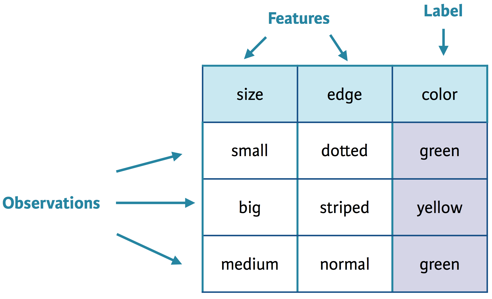
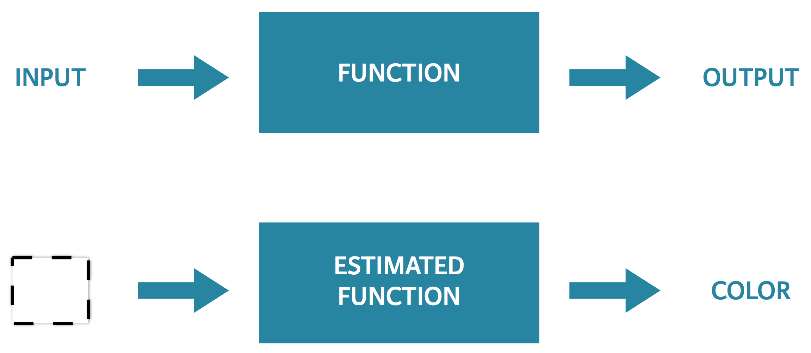
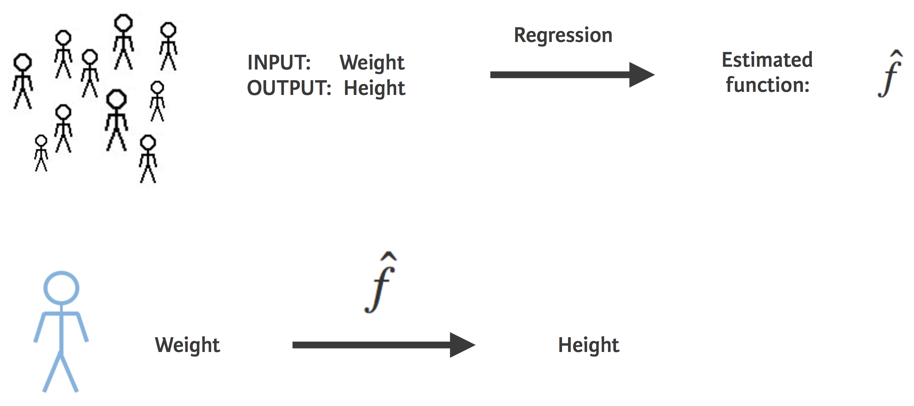
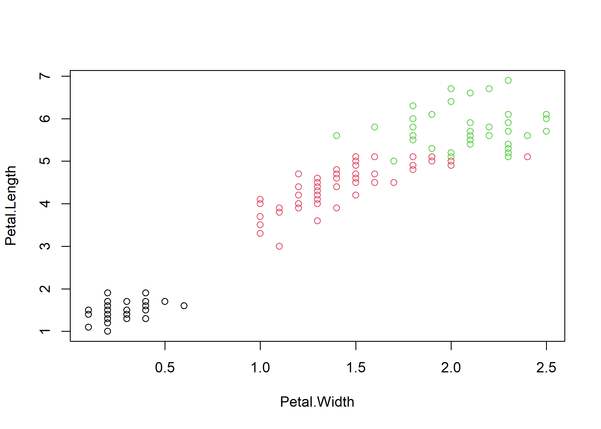
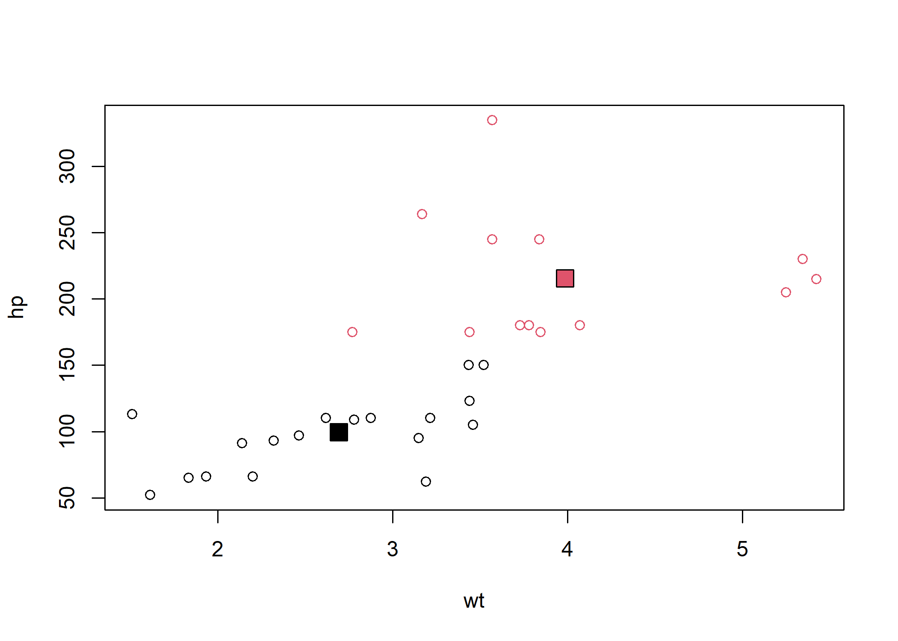
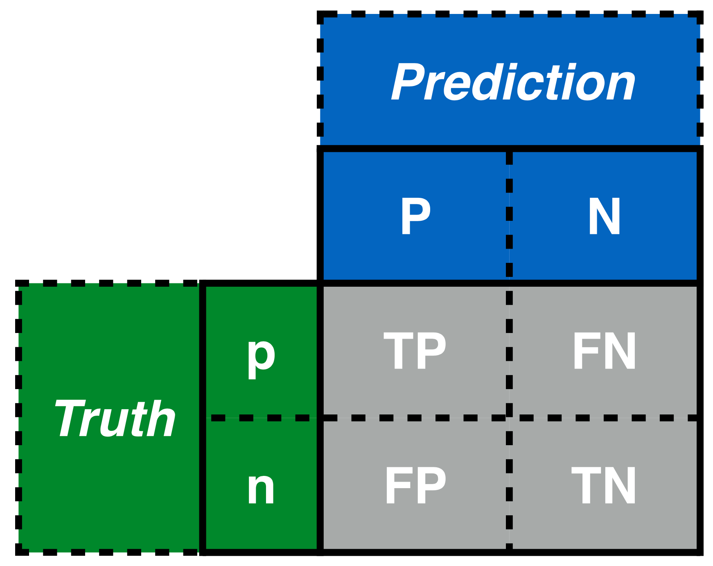
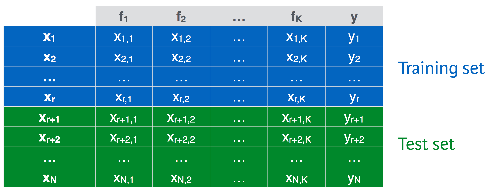
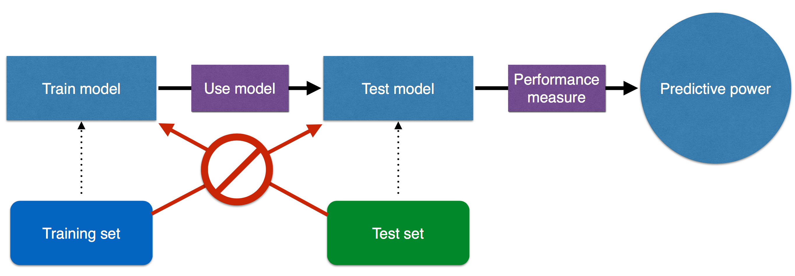
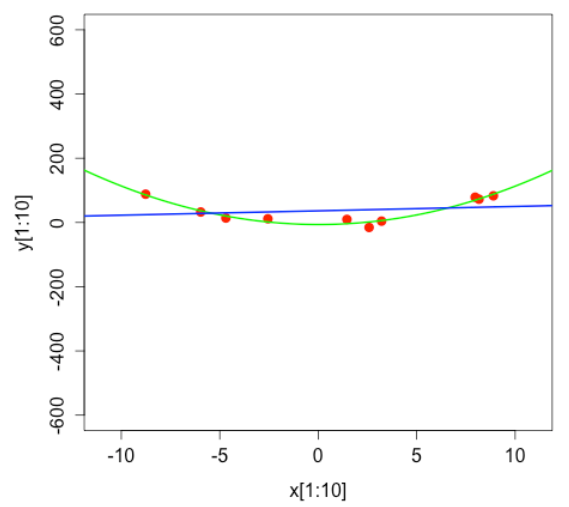
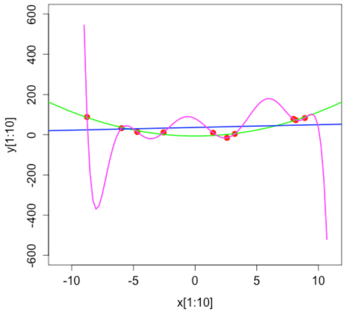

Današnje predavanje se odnosi na pregled najvažnijih principa i tehnika **strojnog učenja** (ML - machine learning). Cilj je dati sveobuhvatan pregled osnovnih (uvodnih) koncepata i smjestiti metodologiju *strojnog učenja* u širi kontekst kvantitativnih medodoloških pristupa koje već poznajemo. U predavanju ćemo objasniti što je ML, koje su najčešće korisštene metode te kako odrediti kvalitetu modela. 

## Što je strojno učenje?

Strojno učenje uključuje izradu i korištenje algoritama s ciljem učenja na osnovi podataka.  Sposobnost *stroja* (računala) da nešto nauči se odražava u **poboljšanju peformansi** pri povećanju **informacijskog inputa**. Informacijski input se zapravo odnosi na *podatke* (slično *data frame* objektima koje smo do sada stalno koristili). Jednostavnije rečeno, ukoliko računalu damo više podataka, ono će više (bolje) naučiti (model). Strojno učenje i statistika (kakvu smo do sada upoznali) se u bitnom ne razlikuju mnogo, dapače među njima ima više sličnosti nego razlika. Razlog za nerazumijevanje i nepristupačnost strojnog učenja (statističarima) često predstavlja specifičan žargon strojnog učenja. Riječ je o specifičnoj terminologiji koju koriste analitičari i inženjeri strojnog učenje, a često se pritom misli na pojmove koje već poznajemo iz statistike...varijable se u ML primjerice nazivaju **karakteristike** (feature, label), procjena je **trening** modela...



Neki praktični primjeri ML uključuju diskriminaciju spam elektroničke pošte, automatsko tagiranje Facebook slika, preporuka kupnje, identifikacija bolesti na osnovi simptoma, predviđanje tečaja... 

Strojno učenje se često dijeli na **nadgledano** i **ne-nadgledano**. U nadgledanom (supervised) ML je cilj pronaći funkciju koja pripisuje vrijednost ili klasu novim (neviđenim) opservacijama uz dani skup (*labeled* opservacija) varijabli. Ne-nadgledano ML ne zahtijeva definirane varijable (i.e. *labeld* opservacije) .

Procjena kvalitete modela kod nadgledanog ML se vrši usporedbom stvarnih *label-a* sa onima koje je generirao model. U dobroj procjeni je razlika između istih vrlo mala. Kod ne-nadgledanog ML je procjena kvalitete modela nešto složenija pošto ne postoje *label-i* za usporedbu. Vrlo često se susrećemo i sa kvazi nadgledanim ML gdje dio opservacija ima pripisane *label-e* , a dio ne. Procedura procjene kvalitete modela u ML ima određene specifičnosti i ponešto se razlikuje od procjene kvalitete modela u statistici (*model fit*). Zbog toga ćemo kasnije pogledati detaljnije o kojim procedurama se radi i kako se provode.

Za početak pogledajmo jedan općeniti primjer ML pristupa na "pravim" podatcima:


```r
squares <- data.frame(
  size = c("small", "big","medium"),
  edge = c("dotte", "stripped", "normal"),
  color = c("green", "yellow","green")
)
```

Dimenzije ovog podatkovnog skupa su:


```r
dim(squares)
```

```
## [1] 3 3
```

Struktura podatakovnog skupa:


```r
str(squares)
```

```
## 'data.frame':	3 obs. of  3 variables:
##  $ size : chr  "small" "big" "medium"
##  $ edge : chr  "dotte" "stripped" "normal"
##  $ color: chr  "green" "yellow" "green"
```
Pregled varijabli:


```r
summary(squares)
```

```
##      size               edge              color          
##  Length:3           Length:3           Length:3          
##  Class :character   Class :character   Class :character  
##  Mode  :character   Mode  :character   Mode  :character
```

Formulirajmo problem *labeling-a* nepoznatog kvadrata (square) na osnovi prethodnog znanja koje računalo (stroj) ima ukoliko mu *input-amo* `squares` podatke. Prikaz procedure bi izgledao otprilike ovako: 



Procedura strojnog učenja (ML - machine learning) rješava ovakav (*labeling*) problem na osnovi naučenog znanja koje je formirano rješavanjem sličnih problema (i.e. inputu `square` podataka). Pojednostavljeno rečeno, računalu damo podatke, ono nauči strukturu i na osnovi toga ima sposobnost dati odgovor na novim, neviđenim podatcima. Glavna svrha ML je **konstrukcija prediktivnih modela na osnovi podataka** koji su sposobni dati odgovore na slična ali nova i nepostavljena pitanja. 

Jednostavan i intuitivan primjer ML je također i korištenje regresijskog modela (koji već poznajemo) na podatcima o visini i težini ljudi kako bismo predvidjeli visinu nove osobe na osnovi njene težine:




### Osnovni predikcijski model

Za izgradnju jednostavnog predikcijskog modela ćemo koristiti `wage` podatkovni skup iz `ISLR` paketa. Modelom ćemo pokušati opisati odnos između starosti radnika i visine plaće. Očekujemo da će stariji radnici imati više iskustva pa će prema tome biti i bolje plaćeni. Prvo ćemo učitati i pregledati podatke:


```r
library(ISLR)
data(Wage)
summary(Wage)
```

```
##       year           age                     maritl           race     
##  Min.   :2003   Min.   :18.00   1. Never Married: 648   1. White:2480  
##  1st Qu.:2004   1st Qu.:33.75   2. Married      :2074   2. Black: 293  
##  Median :2006   Median :42.00   3. Widowed      :  19   3. Asian: 190  
##  Mean   :2006   Mean   :42.41   4. Divorced     : 204   4. Other:  37  
##  3rd Qu.:2008   3rd Qu.:51.00   5. Separated    :  55                  
##  Max.   :2009   Max.   :80.00                                          
##                                                                        
##               education                     region               jobclass   
##  1. < HS Grad      :268   2. Middle Atlantic   :3000   1. Industrial :1544  
##  2. HS Grad        :971   1. New England       :   0   2. Information:1456  
##  3. Some College   :650   3. East North Central:   0                        
##  4. College Grad   :685   4. West North Central:   0                        
##  5. Advanced Degree:426   5. South Atlantic    :   0                        
##                           6. East South Central:   0                        
##                           (Other)              :   0                        
##             health      health_ins      logwage           wage       
##  1. <=Good     : 858   1. Yes:2083   Min.   :3.000   Min.   : 20.09  
##  2. >=Very Good:2142   2. No : 917   1st Qu.:4.447   1st Qu.: 85.38  
##                                      Median :4.653   Median :104.92  
##                                      Mean   :4.654   Mean   :111.70  
##                                      3rd Qu.:4.857   3rd Qu.:128.68  
##                                      Max.   :5.763   Max.   :318.34  
## 
```

Potom ćemo procijeniti odnos između plaće i iskustva (starosti radnika) u linearnom regresijkom modelu:


```r
lm_wage <- lm(wage ~ age, data = Wage)
```

Za primjer ćemo pokušati predvidjeti zaradu 60 godišnjeg radnika. Za to je potrebno stvoriti novi podatkovni skup:


```r
unseen <- data.frame(age = 60)
```

Na kraju ćemo korištenjem fukcije `predict` uz kombinaciju regresijskog objekta `lm_wage` i novog podatkovnosg skupa `unseen` provesti predikcijsku proceduru:


```r
predict(lm_wage, unseen)
```

```
##        1 
## 124.1413
```
Na osnovi linearnog modela i `Wage` podataka smo predvidjeli da će 60 godišnji radnik zarađivati 124 $ na dan.


## Metode strojnog učenja

U najširem je smislu moguće izdvojiti tri vrste ML metoda (procedura):

1. Klasifikacija

2. Regresija

3. Klasteri

### Klasifikacija

Svrha klasifikacije je predviđanje kategorije novih opservacija na osnovi prethodnog znanja (podataka, informacija). ML definira klasifikator (funkciju, model) koji će odlučiti kojoj kategoriji pripada novi objekt. Klasifikacijske tehnike imaju kvalitativni output, a kategorije moraju uvijek biti unaprijed definirane. Primjeri klasifikacije su medicinska dijagoza, prepoznavanje životinja, lica... 

Pogledajmo jedan praktični primjer klasifikacijske procedure na osnovi elektronske pošte koja je prethodno klasificirana kao spam/no spam. *Feature* koji želimo predvidjeti je `avg_capital_seq`, a u klasifikatoru se referiramo na njega sa `x`. Kriterij za odluku da li je pošta spam ili nije ćemo definirati kao prosječni broj velikih tiskanih slova u svakom pojedinačnom mail-u.


```r
# Učitaj podatke
> emails <- read.table("../Podatci/emails.dat", header = T, sep = "")

# Pogledaj dimenzije podataka
> dim(emails)
[1] 13  2

# Definiraj klasifikator spam_classifier()
> spam_classifier <- function(x){
    prediction <- rep(NA, length(x)) # predikcijiski vektor
    prediction[x > 4] <- 1
    prediction[x >= 3 & x <= 4] <- 0
    prediction[x >= 2.2 & x < 3] <- 1
    prediction[x >= 1.4 & x < 2.2] <- 0
    prediction[x > 1.25 & x < 1.4] <- 1
    prediction[x <= 1.25] <- 0
    return(prediction) # predikcije je 0 ili 1
  }

# primijenji klasifikator na  avgCapitalSeq kolonu
> spamPred <- sapply(emails$avgCapitalSeq, spamClassifier)

# Usporedi predikcije sa stvarnim podatcima
> spam_pred == emails$spam
 [1] TRUE TRUE TRUE TRUE TRUE TRUE TRUE TRUE TRUE TRUE TRUE TRUE TRUE
```

U ovoj proceduri je `spam_classifier` točno filtrirao spam poštu u svih 13 slučajeva. Valja istaknuti da je ovo bio samo demonstrativni primjer te da klasifikacija na novim podatcima gotovo sigurno ne bi bila tako precizna!

### Regresija

Regresijska analiza se koristi za predviđanje kontinuirane ili kvantitativne vrijednosti na osnovi prethodnih podataka (informacija).


Regresija je slična klasifikaciji uz bitnu razliku da želimo predvidjeti **vrijednost**, a ne **klasu** kao kod klasifikacije. Tipični regresijski problemi se odnose na predviđanje kreditnog rejtinga na osnovi redovitosti plaćanja u prošlosti, analize pretplata na časops kroz vrijeme, vjerojatnost zaposlenja na osnovi ocjena... Regresijske tehnike imaju kvantitativni output i zahtijevaju input-output podatkovni skup.

Za praktični primjer (još jedan!) analizirajmo broj pogleda na LinkedIn profilu u regresijskom kontekstu. Cilj je predvidjeti broj pregleda profila u sljedeća 3 dana na osnovi podataka o pregledima u prethodna 3 tjedna. Za to je potrebno definirati vektor LinkedIn pregleda: 


```r
linkedin <- c(5,7,4,9,11,10,14,17,13,11,18,17,21,21,24,23,28,35,21,27,23)
```

Potom valja napraviti vektor dana:


```r
days <- rep(NA, length(linkedin))
days <- seq(1, 21, by = 1)
```

Sada možemo procijenjiti regresijski odnos:


```r
linkedin_lm <- lm(linkedin ~ days)
```

Za predviđanje je potrebno specificirati dane za koje želimo rezultate te potom provesti predikciju:


```r
future_days <- data.frame(days = 22:24)
linkedin_pred <- predict(linkedin_lm, future_days)
```

Na kraju pogledajmo jednu vizualizaciju predviđanja:


```r
plot(linkedin ~ days, xlim = c(1, 24))
points(22:24, linkedin_pred, col = "green")
```

<!-- -->


### Klasteri

Procedura klasteringa ima za cilj grupirati objekte u klastere na način da su klasteri međusobno različiti, a objekti unutar svakog klastera slični. Klastering je sličan klasifikaciji uz razliku da ne postoje prethodno definirane kategorije već klaster procedura sama sortira objekte prema sličnosti (ne prema kategorijama). Za klastering nije potrebno definirati kategorije (*labels*) i ne postoji točan ili netočan output...postoji mnogo mogućih klastera. 


Za primjer klastering procedure ćemo koristiti otprije poznati podatkovni skup `iris`. Pri tome je cilj grupirati iris cvijetove u 3 zasebna klastera, prema karakteristikama cvjetova koje su dane u podatcima. Pogledajmo prvo podatke:


```r
library(datasets)
data(iris)
```

Pregled podataka:


```r
str(iris)
```

```
## 'data.frame':	150 obs. of  5 variables:
##  $ Sepal.Length: num  5.1 4.9 4.7 4.6 5 5.4 4.6 5 4.4 4.9 ...
##  $ Sepal.Width : num  3.5 3 3.2 3.1 3.6 3.9 3.4 3.4 2.9 3.1 ...
##  $ Petal.Length: num  1.4 1.4 1.3 1.5 1.4 1.7 1.4 1.5 1.4 1.5 ...
##  $ Petal.Width : num  0.2 0.2 0.2 0.2 0.2 0.4 0.3 0.2 0.2 0.1 ...
##  $ Species     : Factor w/ 3 levels "setosa","versicolor",..: 1 1 1 1 1 1 1 1 1 1 ...
```
Pregled dimenzija podatkovnog skupa:


```r
dim(iris)
```

```
## [1] 150   5
```
  
Pregled opservacija:


```r
head(iris)
```

```
##   Sepal.Length Sepal.Width Petal.Length Petal.Width Species
## 1          5.1         3.5          1.4         0.2  setosa
## 2          4.9         3.0          1.4         0.2  setosa
## 3          4.7         3.2          1.3         0.2  setosa
## 4          4.6         3.1          1.5         0.2  setosa
## 5          5.0         3.6          1.4         0.2  setosa
## 6          5.4         3.9          1.7         0.4  setosa
```

Deskriptivna statistika podataka:


```r
summary(iris)
```

```
##   Sepal.Length    Sepal.Width     Petal.Length    Petal.Width   
##  Min.   :4.300   Min.   :2.000   Min.   :1.000   Min.   :0.100  
##  1st Qu.:5.100   1st Qu.:2.800   1st Qu.:1.600   1st Qu.:0.300  
##  Median :5.800   Median :3.000   Median :4.350   Median :1.300  
##  Mean   :5.843   Mean   :3.057   Mean   :3.758   Mean   :1.199  
##  3rd Qu.:6.400   3rd Qu.:3.300   3rd Qu.:5.100   3rd Qu.:1.800  
##  Max.   :7.900   Max.   :4.400   Max.   :6.900   Max.   :2.500  
##        Species  
##  setosa    :50  
##  versicolor:50  
##  virginica :50  
##                 
##                 
## 
```

Za procjenu je potebno maknuti zadnju kolonu jer sadrži string varijable i pospremiti ju u zasebni objekt:


```r
my_iris <- iris[-5]
species <- iris$Species
```

Potom ćemo provesti klastering pomoću `kmeans()` funkcije:


```r
kmeans_iris <- kmeans(my_iris, 3)
```

Usporedimo sada rezultate klastering procedure sa orginalnim podatcima pomoću `table` funkcije. Procijenjene grupe se nalaze u `cluster` dijelu objekta `kmeans_iris`:


```r
table(kmeans_iris$cluster, species)
```

```
##    species
##     setosa versicolor virginica
##   1     50          0         0
##   2      0         48        14
##   3      0          2        36
```

Rezultati imaju visok stupanj preciznosti. Za kraj je uvijek korisno i vizualno prikazati rezultate:


```r
plot(Petal.Length ~ Petal.Width,
     data = my_iris,
     col = kmeans_iris$cluster)
```

<!-- -->

## Primjeri


### Primjer 1. (Nadgledano ML)

U prethodnom primjeru smo koristili `kmeans()` funkciju za klastering na *iris* podatcima. U ovom primjeru ćemo koristiti rekurzivno particioniranje na istim podatcima (no nećemo maknuti zadnju kolonu).

Pogledajmo za početak strukturu podataka:


```r
summary(iris)
```

```
##   Sepal.Length    Sepal.Width     Petal.Length    Petal.Width   
##  Min.   :4.300   Min.   :2.000   Min.   :1.000   Min.   :0.100  
##  1st Qu.:5.100   1st Qu.:2.800   1st Qu.:1.600   1st Qu.:0.300  
##  Median :5.800   Median :3.000   Median :4.350   Median :1.300  
##  Mean   :5.843   Mean   :3.057   Mean   :3.758   Mean   :1.199  
##  3rd Qu.:6.400   3rd Qu.:3.300   3rd Qu.:5.100   3rd Qu.:1.800  
##  Max.   :7.900   Max.   :4.400   Max.   :6.900   Max.   :2.500  
##        Species  
##  setosa    :50  
##  versicolor:50  
##  virginica :50  
##                 
##                 
## 
```

U sljedećem koraku ćemo napraviti model nadgledanog strojnog učenja koristeći funkciju  `rpart()` iz istoimenog paketa. Specifikacija *decision tree* modela izgleda ovako:


```r
library(rpart)
tree <- rpart(Species ~ Sepal.Length + Sepal.Width + Petal.Length + Petal.Width,
              data = iris,
              method = "class")
```


Potom je potrebno specificirati podatke za koje želimo predviđanje:


```r
unseen <- data.frame(Sepal.Length = c(5.3, 7.2),
                       Sepal.Width = c(2.9, 3.9),
                       Petal.Length = c(1.7, 5.4),
                       Petal.Width = c(0.8, 2.3))
```


U zadnjem koraku izvršimo predviđanje pomoću `predict` funkcije:


```r
predict(tree, unseen, type = "class")
```

```
##         1         2 
##    setosa virginica 
## Levels: setosa versicolor virginica
```


### Primjer 2. (Ne-nadgledano ML)


U ovom primjeru želimo grupirati automobile na osnovi snage motora i težine. Pri tome koristimo `mtcars` podatkovni skup. Prvo ćemo učitati, izabrati i pregledati podatke:


```r
data(mtcars)
cars <- subset(mtcars, select = c(wt,hp))
head(cars)
```

```
##                      wt  hp
## Mazda RX4         2.620 110
## Mazda RX4 Wag     2.875 110
## Datsun 710        2.320  93
## Hornet 4 Drive    3.215 110
## Hornet Sportabout 3.440 175
## Valiant           3.460 105
```

Upoznajmo se dodatno s podatcima:


```r
str(cars)
```

```
## 'data.frame':	32 obs. of  2 variables:
##  $ wt: num  2.62 2.88 2.32 3.21 3.44 ...
##  $ hp: num  110 110 93 110 175 105 245 62 95 123 ...
```

Pogledajmo i deskriptivnu statistiku:


```r
summary(cars)
```

```
##        wt              hp       
##  Min.   :1.513   Min.   : 52.0  
##  1st Qu.:2.581   1st Qu.: 96.5  
##  Median :3.325   Median :123.0  
##  Mean   :3.217   Mean   :146.7  
##  3rd Qu.:3.610   3rd Qu.:180.0  
##  Max.   :5.424   Max.   :335.0
```

Za provedbu klasteringa ćemo koristiti `kmeans()` funkciju koju već poznajemo:


```r
km_cars <- kmeans(cars,2)
```

Pogledajmo rezultate:


```r
km_cars$cluster
```

```
##           Mazda RX4       Mazda RX4 Wag          Datsun 710      Hornet 4 Drive 
##                   1                   1                   1                   1 
##   Hornet Sportabout             Valiant          Duster 360           Merc 240D 
##                   2                   1                   2                   1 
##            Merc 230            Merc 280           Merc 280C          Merc 450SE 
##                   1                   1                   1                   2 
##          Merc 450SL         Merc 450SLC  Cadillac Fleetwood Lincoln Continental 
##                   2                   2                   2                   2 
##   Chrysler Imperial            Fiat 128         Honda Civic      Toyota Corolla 
##                   2                   1                   1                   1 
##       Toyota Corona    Dodge Challenger         AMC Javelin          Camaro Z28 
##                   1                   1                   1                   2 
##    Pontiac Firebird           Fiat X1-9       Porsche 914-2        Lotus Europa 
##                   2                   1                   1                   1 
##      Ford Pantera L        Ferrari Dino       Maserati Bora          Volvo 142E 
##                   2                   2                   2                   1
```
Broj ispod modela predstavlja pripadnost klasteru!


Pogledajmo sada klasterske centroide. Centroidi predstavljaju "centar" svakog klastera i mogu se dohvatiti kao `centers` element procijenjenog klasterskog objekta na sljedeći način:


```r
km_cars$centers
```

```
##         wt        hp
## 1 2.692000  99.47368
## 2 3.984923 215.69231
```


Za kraj ćemo još vizualno prikazati rezultate:


```r
plot(cars, col = km_cars$cluster)
points(km_cars$centers, pch = 22, bg = c(1, 2), cex = 2)
```

<!-- -->


## Procjena kvalitete modela

Procjena prediktivne sposobnosti ML modela uvelike ovisi o empirisjkom problemu i korištenoj metodi. Tri su najčešće korištena kriterija za procjenu kvalitete modela:

- Preciznost (*accuracy*)
- Brzina (*computation time*)
- Mogućnost interpretacije rezultata (*interpretability*)

Svaki od tri ML pristupa (klasifikacija, regresija, klaster) ima specifične kriterije za procjenu kvalitete modela.

### Klasifikacija

U klasifikacijskim procedurama su glavni kriteriji kvalitete modela preciznost *(accuracy)* i greška *(error)*. Ove mjere odažavaju broj pogrešaka i točnih klasifikacija. Definiramo ih na sljedeći način:

$$\mbox{preciznost} = \frac{točne Klasifikacije}{ukupne Klasifikacije}$$
i 
 
$$\mbox{greška} = 1 - preciznost$$
U klasifikaciji se često koristi i *confusion matrica* koja u svakoj od ćelija sadrži broj instanci koje su klasificirane na određeni način. Za primjer jednostavne binarne klasifikacije bi *confusion* matrica izgledala ovako: 



Kratice znače sljedeće: p-pozitivno, n-negativno, tp-točno pozitivno, fp-netočno pozitivno, tn-točno negativno, fn-netočno negativno. Iz elemenata *confusion matrice* se mogu izračunati mjere preciznosti poput: točnost (accuracy), preciznost (precision) i recall:

$$\mbox{točnost} = \frac{tp+tn}{tp+fp+tn+fn}$$

$$\mbox{preciznost} = \frac{tp}{tp+fp}$$

$$\mbox{recall} = \frac{tp}{tp+fn}$$
#### Praktični primjer

U ovom primjeru ćemo pokušati predvidjeti vjerojatnost preživljavanja nesreće na Titaniku s obzirom na karakteristike putnika (osobe) koje uključuju dob, spol i putničku klasu. Prvo učitavamo i izabiremo potrebne podatke:


```r
titanic = read.csv("../Dta/Titanic_train.csv", na.strings = "") # dostupno na Kaggle!
titanic_dta <- subset(titanic, !is.na(Age), select = c(Survived, Pclass, Sex, Age))
str(titanic_dta)
```

```
## 'data.frame':	714 obs. of  4 variables:
##  $ Survived: int  0 1 1 1 0 0 0 1 1 1 ...
##  $ Pclass  : int  3 1 3 1 3 1 3 3 2 3 ...
##  $ Sex     : chr  "male" "female" "female" "female" ...
##  $ Age     : num  22 38 26 35 35 54 2 27 14 4 ...
```

```r
summary(titanic_dta)
```

```
##     Survived          Pclass          Sex                 Age       
##  Min.   :0.0000   Min.   :1.000   Length:714         Min.   : 0.42  
##  1st Qu.:0.0000   1st Qu.:1.000   Class :character   1st Qu.:20.12  
##  Median :0.0000   Median :2.000   Mode  :character   Median :28.00  
##  Mean   :0.4062   Mean   :2.237                      Mean   :29.70  
##  3rd Qu.:1.0000   3rd Qu.:3.000                      3rd Qu.:38.00  
##  Max.   :1.0000   Max.   :3.000                      Max.   :80.00
```

Potom ćemo procijeniti *decision tree* model:


```r
titanic_model <- rpart(Survived ~ ., data = titanic_dta, method = "class")
```

Sada možemo procijeniti preciznost modela:


```r
pred <- predict(titanic_model, titanic_dta, type = "class")
table(titanic_dta$Survived, pred)
```

```
##    pred
##       0   1
##   0 371  53
##   1  78 212
```

*Confusion matrica* pokazuje da je model točno klasificirao 212 od 265 preživjelih i 371 od 449 preminulih.

Izračunajmo pokazatelje preciznosti procjene:


```r
cfmtx <- table(titanic_dta$Survived, pred)

TP <- cfmtx[1, 1] #
FN <- cfmtx[1, 2] # 
FP <- cfmtx[2, 1] # 
TN <- cfmtx[2, 2] # 

# Točnost: acc
acc <- (TP + TN) / (TP + FN + FP + TN)
acc
```

```
## [1] 0.8165266
```

```r
# Preciznost: prec
prec <- TP/(TP+FP)
prec
```

```
## [1] 0.8262806
```

```r
# Recall: rec
rec <- TP/(TP+FN)
rec
```

```
## [1] 0.875
```
Točnost i preciznost modela su ~82% dok je model krivo predvidio sudbinu 18% putnika na Titaniku. Nije loše, ali nije ni posebno dobro...

### Regresija

Kvaliteta regresijskog odnosa se procijenjuje kriterijem rezidualnih kvadrata odstupanja (RMSE- root mean square error) koje smo već spominjali:

$$RMSE = \sqrt{\frac{1}{n}\Sigma_{i=1}^{n}{({y_i -y\hat{}_i})^2}}$$

RMSE procjenjuje udaljenost između *stvarnih* i *predviđenih* opservacija, a cilj je postići što manji broj.


#### Praktični primjer

U ovom primjeru je cilj predvidjeti pritisak zvuka aviona (`dec`) na osnovi frekvencije vjetra (`freq`), kuta krila (`angle`) i nekih drugih varijabli (`ch_length`). Prvo ćemo učitati, preimenovati i pregledati podatke:


```r
library(dplyr)
air <- read.table("../Dta/airfoil_self_noise.dat",header = T) %>% # dostupno na UCIMLR
dplyr::rename(freq = "X800",
              angle = "X0" ,
              ch_length = "X0.3048",
              velocity = "X71.3",
              thickness = "X0.00266337",
              dec = "X126.201" )
 
str(air)
```

```
## 'data.frame':	1502 obs. of  6 variables:
##  $ freq     : int  1000 1250 1600 2000 2500 3150 4000 5000 6300 8000 ...
##  $ angle    : num  0 0 0 0 0 0 0 0 0 0 ...
##  $ ch_length: num  0.305 0.305 0.305 0.305 0.305 ...
##  $ velocity : num  71.3 71.3 71.3 71.3 71.3 71.3 71.3 71.3 71.3 71.3 ...
##  $ thickness: num  0.00266 0.00266 0.00266 0.00266 0.00266 ...
##  $ dec      : num  125 126 128 127 126 ...
```
Potom procjenjujemo model i predikciju pa računamo RMSE:


```r
fit <- lm(dec ~ freq + angle + ch_length, data = air)
predd <- predict(fit,air)
rmse <- sqrt((1/nrow(air)) * sum( (air$dec - predd) ^ 2))
rmse
```

```
## [1] 5.217465
```

Rezultat je 5.2 decibela...to nam doduše ne govori mnogo.Za procjenu kvalitete modela je treba usporediti rmse nekog drugog modela. Upravo to ćemo sada učiniti. Prvo procjenjujemo novi model koji sadrži više kontrolnih varijabli:


```r
fit2 <- lm(dec ~ freq + angle + ch_length + velocity + thickness, data = air)
predd2 <- predict(fit2,air)
rmse2 <- sqrt((1/nrow(air)) * sum( (air$dec - predd2) ^ 2))
rmse2
```

```
## [1] 4.800694
```

Novi i bogatiji model ima niži pripadajući rmse od 4.8 pa za možemo zaključiti da se radi o boljem modelu.


### Klastering


U slučaju klastringa ne postoje explicitne varijable (*labels*) pa je se kvaliteta procjene radi na osnovi mjera udaljenosti unutar i između klastera. Te se mjere odnose na sličnost unutar klastera (poželjno visoka WSS), sličnost između klastera (poželjno niska BSS) i Dunnov indeks.

#### Praktični primjer

Sljedeći primjer se koristii podatke o različitim karakteristikama sjemena no pošto ne znamo nazive vrijabli (*labels*), ali znamo da podatci sadržavaju tri vrste sjemena...koristiti ćemo klastering metodu. Prvo učitamo podatke i pregledamo strukturu:


```r
seeds <- read.table("../Dta/seeds_dataset.txt",header = T)  # dostupno na UCIMLR
str(seeds)
```

```
## 'data.frame':	209 obs. of  8 variables:
##  $ X15.26: num  14.9 14.3 13.8 16.1 14.4 ...
##  $ X14.84: num  14.6 14.1 13.9 15 14.2 ...
##  $ X0.871: num  0.881 0.905 0.895 0.903 0.895 ...
##  $ X5.763: num  5.55 5.29 5.32 5.66 5.39 ...
##  $ X3.312: num  3.33 3.34 3.38 3.56 3.31 ...
##  $ X2.221: num  1.02 2.7 2.26 1.35 2.46 ...
##  $ X5.22 : num  4.96 4.83 4.8 5.17 4.96 ...
##  $ X1    : int  1 1 1 1 1 1 1 1 1 1 ...
```

Potom provedemo kmeans klastering sa tri klastera:


```r
km_seeds <- kmeans(seeds[1:7], 3)
```

Pogledajmo i vizualizaciju rezultata:


```r
plot(seeds$X5.763 ~ seeds$X0.871, data = seeds, col = km_seeds$cluster) # duljina ~ kompaktnost
```

<!-- -->

Za kraj pogledajmo još i mjeru kvalitete klasterske procjene koja se računa kao omjer unutar- i među- klasterske sličnosti. Podatci su dostupni kao dio procijenjenog klasterskog objekta km_seeds:


```r
km_seeds$tot.withinss/km_seeds$betweenss
```

```
## [1] 0.2752817
```

Unutar- klasterska sličnost je niža od među- klsterske sličnostišto znači da su klasteri dobro odijeljeni i kompaktni. To je jasno vidljivo i na vizualnom prikazu pa možemo zaključiti da klasteri dobro predstavljaju tri vrste sjemena.


## Trening vs. test podjela

Bitna razlika između strojnog učenja i statistike je *prediktivna* vs *deskriptivna* moć modela. Modeli nadgledanog ML bi trebali imati veliku prediktivnu moć, tj. dobro predvidjeti odnos na novim, neviđenim opservacijama. Klasična statistika se bazira na kvaliteti modela s obzirom na dane (postojeće) podatke tj. model treba dobro opisati podatke (poznate opservacije).

Zbog toga procjena *prediktivnog* ML modela ne smije uključivati potpuni podatkovni skup nego samo *trening* dio podataka, a kvaliteta modela se procjenjuje na *test* dijelu podataka. Za pouzdanu procjenu je bitno napraviti ovakvu podjelu podataka i osigurati da među njima nema preklapanja. Ova podjela je važna samo kod nadgledanog ML. Kod ne-nadgledanog ML nije potrebno dijeliti podatke.

Podjela podataka izgleda ovako: 


X varijabla se odnosi na opservacije, F varijable na karakteristike (*label*), a Y varijabla na klasu opservacija. Na *training* podatcima radimo procjenu modela, a prediktivnu kvalitetu provjeravamo na *test* dijelu podataka.

Postupak prati sljedeći hodogram:



Podjela podataka na *training* i *test* podatke je proizvoljna no postoji nekoliko standardnih i okvirnih pravila. Najčešće se podatci dijele u omjeru 3/1 imajući na umu da će model dati bolju procjenu ako je "treniran" na više podaka. Također je važno postići distribucijsku sličnost u podjeli podataka za klasifikacijsku analizu te "promiješati" (randomizirati) podatke u regresijskoj analizi. Ovdje valja spomenuti i *cross-validation* proceduru kojom se dodatno pospješuje efekt podjele podatka.


### Praktični primjer

Prethodni primjer na *titanic* podatkovnom skupu nije uključivao podjelu podatka. To ćemo sada ispraviti s ciljem poboljšanja kvalitete procjene. Podatke ćemo podijeliti u omjeru 70/30. Podjelu radimo na sljedeći način:


```r
# promješaj podatke
n <- nrow(titanic_dta)
shuffled <- titanic_dta[sample(n),]

# podijeli na train i test
train_indices <- 1:round(0.7 * n)
train <- shuffled[train_indices, ]
test_indices <- (round(0.7 * n) + 1):n
test <- shuffled[test_indices, ]

# pregledaj podatke
str(train)
```

```
## 'data.frame':	500 obs. of  4 variables:
##  $ Survived: int  1 0 0 0 0 1 0 0 1 1 ...
##  $ Pclass  : int  2 3 1 3 2 2 2 3 2 1 ...
##  $ Sex     : chr  "female" "male" "male" "male" ...
##  $ Age     : num  18 40.5 62 35 31 33 23 29 28 40 ...
```

```r
str(test)
```

```
## 'data.frame':	214 obs. of  4 variables:
##  $ Survived: int  0 0 0 1 1 0 1 1 0 1 ...
##  $ Pclass  : int  2 3 2 3 2 2 2 3 3 3 ...
##  $ Sex     : chr  "male" "male" "male" "female" ...
##  $ Age     : num  66 30 25 22 19 43 24 13 26 4 ...
```

Razmotrimo ponovno otprije korišteni model na novim, podijeljenim *titanic* podatcima:


```r
# procjeni model
tree_split <- rpart(Survived ~ ., train, method = "class")
# predviđanje modela
preddd <- predict(tree_split, test, type="class")
# izračunaj confusion matricu
conf <- table(test$Survived, preddd)
conf
```

```
##    preddd
##       0   1
##   0 117  10
##   1  40  47
```
Kvalitetu modela izračunamo na isti način kao u prethodnom slučaju:


```r
TP <- conf[1, 1] #
FN <- conf[1, 2] # 
FP <- conf[2, 1] # 
TN <- conf[2, 2] # 

# Točnost: acc
acc <- (TP + TN) / (TP + FN + FP + TN)
acc
```

```
## [1] 0.7663551
```

```r
# Preciznost: prec
prec <- TP/(TP+FP)
prec
```

```
## [1] 0.7452229
```

```r
# Recall: rec
rec <- TP/(TP+FN)
rec
```

```
## [1] 0.9212598
```
Rezultati ukazuju na nešto manju točnost i preciznost modela, ~76% i ~78% u odnosu na ~82% koju smo imali u prvom slučaju. Ovi rezultati predstavljaju realniju procjenu prediktivne moći modela.


## Pristranost i varijanca

Predikcijska pogreška modela se može podijeliti u dvije komponente: 
1. *fiksna pogreška* (i.e. irreducible error) koja predstavlja nepravilnosti u podatcima
2. *varijabilna pogreška* (i.e. reducible error) se odnosi na "fit" modela. Cilj ML modela je minimizacija ove pogreške. Može biti vezana uz **pristranost** ili **varijancu**.
 
### Greška na osnovi pristranosti

Ova vrsta greške nastaje zbog pretpostavki koje unosimo u ML algoritam i predstavlja razliku između predviđanja modela i pravih vrijednosti. Greška na osnovi pristranosti nastaje zbog prevelikih restrikcija koje unosimo u model, primjerice ukoliko podatke koje karakterizira kvadratni odnos opišemo s linearnom funkcijom. Primjer je na sljedećem grafikonu:




### Greška na osnovi varijance

Ova greška nastaje kada model "predobro" opisuje podatke. Na istim podatcima kao u prethodnom slučaju, podatke možemo umjesto s kvadratnom funkcijom, modelirati i polinomijalnom funkcijom...to bi izgledalo otprilike ovako:




Slika prikazije polinomijalnu funkkciju koja vrlo točno modelira svaku opservaciju pa je vrlo vjerojatno da novi podatci neće biti dobro predstavljeni takvim modelom. Drugačje rečeno, model će dobro opisati podatke na trening uzorku, ali i proizvesti dosta reziduala na training uzorku. Dakle, ovakav model će loše generalizirati (nove podatke).


### Pristranost vs varijanca (tradeoff)

Sada je jasno da model sa niskim stupnjem restriktivnosti dovodi do viskoke varijance dok nesenzitivni model dovodi do pristranosti. U ML algoritmu je ciljpostići optimalnu konvergenciju između ove dvije krajnosti. *Overfitting* modela se odnosi na "predobro" opisivanje podataka u training uzorku i generira **specifičan** model dok **underfitting** označava model koji dobro generalizira ali ima nisku točnost.


## Interpretabilnost modela

U ML je vrlo važno na koji način i u kojoj mjeri možemo interpšretirati rezultate modela. Pri tome visoka interpretabilnost najačešće implicira visoku pristranost


## Dodatni resursi 


- izvrstan Data Camp [ML tutorial](https://www.datacamp.com/community/tutorials/machine-learning-in-r?utm_source=adwords_ppc&utm_campaignid=1455363063&utm_adgroupid=65083631748&utm_device=c&utm_keyword=&utm_matchtype=b&utm_network=g&utm_adpostion=&utm_creative=278443377095&utm_targetid=aud-299261629574:dsa-473406582955&utm_loc_interest_ms=&utm_loc_physical_ms=1007612&gclid=EAIaIQobChMIi4LJv67D7QIVi6SyCh2hjwOKEAAYASAAEgKyU_D_BwE) sa specifičnim primjerima

- još jedan koristan Data Camp [ML tutorial](https://www.datacamp.com/community/tutorials/machine-learning-in-r) za početnike

- pregled korisnih [ML aplikacija](https://www.upgrad.com/blog/machine-learning-projects-in-r-for-beginners/)

- sjajan [ML kolegij](https://ml4econ.github.io/course-spring2019/) za ekonomiste 

- pregled [ML za sociologiju](https://www.annualreviews.org/doi/10.1146/annurev-soc-073117-041106)


