## Analiza teksta


Analiza teksta dobiva na popularnosti zbog sve veće dostupnosti podataka i razvoja **user friendly** podrške za provedbu takve analize. Konceptualni pregled analize teksta je dostupan i u nedavno objavljenoj [knjizi](https://isi.f.bg.ac.rs/wp-content/uploads/2019/03/Zeljka_Manic_Analiza-sadr%C5%BEaja.pdf), koja se preporuča tek nakon savladavanja osnovnih tehničkih vještina i alata za obradu teksta. Provedba analize tekstualnih podataka je moguća na mnogo načina, a najšire korišten pristup je **bag-of-words** u kojem je frekvencija riječi polazište za analizu dok se (npr.) pozicija riječi u rečenici ili paragrafu zanemaruje. Bag of words pristup je ujedno i najjednostavniji (konceptualno i računarski) pa će biti korišten u ovom predavanju. 

Postupak analize teksta započinje *pripremom teksta (podataka)*, koja je često dosta zahtjevna i uključuje: **uvoz teksta**, **operacije sa riječima**, **uređivanje i tokenizaciju**, **izradu matrice pojmova**, **filtiranje i ponderiranje podataka**. Pri tome valja imati na umu da vrsta analize i korištena metoda određuju način na koji je potrebno pripremiti podatke za daljnu analizu te da svaka metoda ima svoje specifičnosti. Nakon pripreme podataka se vrši *analiza teksta (podataka)* metodama **nadziranog strojnog učenja**, **ne-nadziranog strojnog učenja**, **statistike na tekstualnim podatcima**, **analize riječnika**, **analize sentimenta**. *Napredne metode analize podataka* uključuju **NLP**, **analizu pozicije riječi i sintakse**...Sažeti prikaz *workflow-a* za analizu teksta izgleda ovako:


<div class="figure" style="text-align: center">

<p class="caption">Procedura za analizu teksta.</p>
</div>

### Software i korisni resursi

U ovom predavanju ćemo koristiti `tidytext` pristup (i istoimeni paket) za analizu tekstualnih podatka, detaljno opisan u knjizi [Text Mining with R](https://www.tidytextmining.com/). Ovaj paket služi kako bismo tekstualne podatke "uveli" u tidyverse ovir pomoću kojeg je moguće nestrukturirani tekst analizirati sa otprije poznatim alatima iz `dplyr` i `ggplot` paketa. Učitajmo potrebne pakete: 


```r
library(tidyverse)
library(tidytext)
library(data.table)
library(lubridate)
library(grid)
library(wordcloud)
library(reshape2)
library(igraph)
library(ggraph)
library(widyr)
library(topicmodels)
library(ggthemes)
library(DT)
```


Prije opisa podataka koje ćemo koristiti valja naglasiti da `tidytext` pristup nije jedini način za rad s podatcima u R. Ovdje ga koristimo jer je kompatibilan sa pristupima koje smo do sada koristili u okviru ovog kolegija. Drugi paketi (pristupi) za rad sa tekstom u R su:

- `quanteda` je sveobuhvatan i funkcijama bogat paket, neophodan u za složeniju analizu teksta. Izvrstan tutorial je dostupan na [linku](https://tutorials.quanteda.io/).

- `text2vec` je izrazito koristan paket za ML algoritme sa tekstualnim podatcima. Posebno je pogodan za izradu *dtm* i *tcm* matrica. Paket je motiviran python-ovom Gensim knjižnicom, a tutorial je dostupan na [linku](http://text2vec.org/index.html).

- `stringr` paket je neophodan za manipulaciju *string* podataka u R i kao dio `tidyverse` svijeta će biti izrazito koristan u čišćenju i pripremi podataka. Vrlo je praktičan za rad sa [*regex-om*](https://en.wikipedia.org/wiki/Regular_expression)  i ima nekoliko izvrsnih funkcija za *pattern matching*. Službeni R Tutorial je dostupan na [linku](https://cran.r-project.org/web/packages/stringr/vignettes/stringr.html).

- `spacyr` je *wrapper* paket za spaCy knjižnicu iz python-a i omogućava provedbu naprednijih NLP modela (deep learning, speech tagging, tkoenization, parsing) u R. Također je kompatibilan sa quanteda i tidytext paketima. Tutorial je dostupan na [linku](https://spacyr.quanteda.io/articles/using_spacyr.html).  

- za one koji žele znati više mogu biti korisni i sljedeći resursi: [vodič za tekstualnu analizu u R](http://eprints.lse.ac.uk/86659/1/Benoit_Text%20analysis%20in%20R_2018.pdf) i [kolegij za obradu prirodnog teksta](https://github.com/BrbanMiro/Analiza-teksta) u najstajnju koji sadrži i mnoštvo referenci.


### Podatci

Svaka analiza (teksta)  počinje od podataka. Pribava tekstualnih podataka o specifičnim temama najčešće nije jednostavna. Najčešći je način preuzimanja podataka neki od dostupnih API servisa za novinske članke ili tekstualnih repozitorija ili servisi poput Twitter-a. No to često nije dovoljno ukolilko želimo analizirati specifičnu temu ili temu na specifičnom jeziku (npr. hrvatskom). Ovdje još valja napomeniti da je preuzimanje kvalitetnih tekstualnih podataka često moguće isključivo uz nadoplatu kao što je to slučaj sa novinskim člancima na hrvatskom jeziku, primjerice kroz [webhose.io](https://webhose.io/) servis.

U ovom ćemo predavanju analizirati temu COVID-19 pandemije na osnovi članka objavljenih na tri domaća internetska portala (nethr, index, tportal) od prvog službenog slučaja zaraze u RH (2020-26-02) do danas (2020-15-12). Analiza nema specifičan cilj već je namjera demonstrirati mogućnosti i tehnike analize teksta u R na aktualnoj temi. Članci su preuzeti *web-scraping* tehnikama, a identifikacija COVID-19 povezanih članka je napravljena ukoliko se u tekstu spominje riječ "korona". Na taj su način sa tri navedena portala prikupljena 2.623 članka. Zbog jednostavnosti su analizirani **naslovi** pripadajućih tekstova.  Analiza teksta koju ćemo provesti uključuje: **čišćenje, uređivanje i prilagodbu podataka**, **dekriptivnu statistiku na tekstualnim podatcima**, **analizu sentimenta**, **analizu frekvencija** i **tematsku analizu**.

## Primjeri analize teksta

Analiza teksta kao metodološki pristup je korištena u uistinu širokom spektru područja, a sveobuhvatni pregled bi zahtijevao posebno predavanje, odnosno čitav kolegij. 

[link](https://academic.oup.com/bib/advance-article/doi/10.1093/bib/bbaa296/6024738)


## Uvoz podataka

Podatci za analizu su prikupljeni na prethodno opisan način i dostupni u GitHub repozitoriju kolegija (Dta folder;korona.csv file). Podataci uključuju i članke sa nekih drugih portala, ali u kraćem vremenskom rasponu pa su izostavljeni iz analize. Učitajmo podatke:


```r
covid <- read.csv2("D:/LUKA/Academic/HS/NASTAVA/20-21/Obrada podataka/Dta/korona.csv") #, encoding="UTF-8"
str(covid)
```

```
## 'data.frame':	5927 obs. of  15 variables:
##  $ X            : int  1 2 3 4 5 6 7 8 9 10 ...
##  $ naziv        : chr  "c7d7cdc7e099f0021ecbfddf2b4a26d2" "3d6ff1f086635ff61029666e64771306" "2f9a3680ad575c00fe74e0a56d95d780" "01b71372992144d559a2710c039a84d5" ...
##  $ id           : chr  "20201207" "680433" "2020-11-14-11" "20201204" ...
##  $ naslov       : chr  "Koliko nas je koštala korona? S porastom broja oboljelih, vrtoglavo rastu i troškovi vezani uz Covid-19" "Konferencija o korona virusu odgođena zbog korona virusa..." "OVAJ OTOK VIŠE NIJE KORONA-FREE, MJEŠTANI LJUTI NA STOŽER: ‘Živjeli smo ljetni san dok se korona širila… Otočka"| __truncated__ "Bačić objasnio zašto je Franković mogao glasati videovezom iako je korona negativan" ...
##  $ datum        : chr  "2020-12-07" "2020-03-11" "2020-11-13" "2020-12-04" ...
##  $ vrijeme      : chr  "9:45 AM" "9:34 AM" "10:37 PM" "4:21 PM" ...
##  $ pogledi      : int  0 8 0 0 0 0 0 0 0 30 ...
##  $ label        : chr  NA "https://www.24sata.hr/news/konferencija-o-korona-virusu-odgodena-zbog-korona-virusa-680433/komentari" NA NA ...
##  $ brojKomentara: int  0 1187 0 0 0 0 0 0 0 11520 ...
##  $ linkKomentari: chr  "nagrižen zdravstveni budžet" "amerika\nsad\nkonferencija\ndonald trump\nvirus\nburza" "VIRUS HARA" "nije sporno" ...
##  $ autor        : chr  "I. Ba./Hina" "HINA," "Autor: Danas.hr" "I. Ba./Hina" ...
##  $ domena       : chr  "tportal" "24sata" "nethr" "tportal" ...
##  $ poveznica    : chr  "https://www.tportal.hr/vijesti/clanak/koliko-nas-je-kostala-korona-s-porastom-broja-oboljelih-vrtoglavo-rastu-i"| __truncated__ "https://www.24sata.hr/news/konferencija-o-korona-virusu-odgodena-zbog-korona-virusa-680433" "https://net.hr/danas/hrvatska/ovaj-otok-vise-nije-korona-free-mjestani-ljuti-na-stozer-zivjeli-smo-ljetni-san-d"| __truncated__ "https://www.tportal.hr/vijesti/clanak/bacic-objasnio-zasto-je-frankovic-mogao-glasati-videovezom-iako-je-corona"| __truncated__ ...
##  $ kandidat     : chr  "korona" "korona" "korona" "korona" ...
##  $ txtVector    : chr  "U samo tjedan dana troškovi zdravstvenog sustava vezani uz epidemiju koronavirusom narasli su za vrtoglavih 80,"| __truncated__ "U svijetu je od korona virusa zaraženo više od sto tisuća ljudi. Italija je proglasila epidemiju, cijela država"| __truncated__ "Pojedini hrvatski otoci, poput Lastova, bili su imuni na koronu. No, virus se počeo širiti otocima pa je tako n"| __truncated__ "\"Imali smo sličan slučaj s Marijom Kapulicom kojemu je također određena pasivna samoizolacija i preporučeno da"| __truncated__ ...
```

Nakon što smo učitali podatke u radni prostor R, potrebno je učitati i druge podatke koji su nam potrebni za ovu  analizu. Osim **članaka**, potrebni su nam **leksikoni** i **stop riječi**. Leksikone ćemo preuzeti iz FER-ovog [repozitorija](http://meta-share.ffzg.hr/repository/browse/croatian-sentiment-lexicon/940fe19e6c6d11e28a985ef2e4e6c59eff8b12d75f284d58aacfa8d732467509/), a "stop riječi" ćemo napraviti sami. 


```r
# UČITAJ LEKSIKONE

CroSentilex_n <- read.delim("C:/Users/Lukas/Dropbox/Mislav@Luka/crosentilex-negatives.txt",
                                   header = FALSE,
                                   sep = " ",
                                   stringsAsFactors = FALSE,
                                   fileEncoding = "UTF-8")  %>%
                   rename(word = "V1", sentiment = "V2" ) %>%
                   mutate(brija = "NEG")
 
CroSentilex_p  <- read.delim("C:/Users/Lukas/Dropbox/Mislav@Luka/crosentilex-positives.txt",
                                   header = FALSE,
                                   sep = " ",
                                   stringsAsFactors = FALSE,
                                   fileEncoding = "UTF-8") %>%
                    rename(word = "V1", sentiment = "V2" ) %>%
                    mutate(brija = "POZ")
 
Crosentilex_sve <- rbind(setDT(CroSentilex_n), setDT(CroSentilex_p))
 
 
CroSentilex_Gold  <- read.delim2("C:/Users/Lukas/Dropbox/Mislav@Luka/gs-sentiment-annotations.txt",
                                 header = FALSE,
                                 sep = " ",
                                 stringsAsFactors = FALSE) %>%
                    rename(word = "V1", sentiment = "V2" ) 

 Encoding(CroSentilex_Gold$word) <- "UTF-8"
 CroSentilex_Gold[1,1] <- "dati"
 CroSentilex_Gold$sentiment <- str_replace(CroSentilex_Gold$sentiment , "-", "1")
 CroSentilex_Gold$sentiment <- str_replace(CroSentilex_Gold$sentiment , "\\+", "2")
 CroSentilex_Gold$sentiment <- as.numeric(unlist(CroSentilex_Gold$sentiment))
 
# STVORI "STOP RIJEČI"
 
stopwords_cro <- get_stopwords(language = "hr", source = "stopwords-iso")
my_stop_words <- tibble(
  word = c(
    "jedan","mjera", "može", "mogu", "kad", "sada", "treba", "ima", "osoba",
    "e","prvi", "dva","dvije","drugi",
    "tri","treći","pet","kod",
    "ove","ova",  "ovo","bez", "kod",
    "evo","oko",  "om", "ek",
    "mil","tko","šest", "sedam",
    "osam",   "čim", "zbog",
    "prema", "dok","zato", "koji", 
    "im", "čak","među", "tek",
    "koliko", "tko","kod","poput", 
    "baš", "dakle", "osim", "svih", 
    "svoju", "odnosno", "gdje",
    "kojoj", "ovi", "toga",
     "ubera", "vozača", "hrvatskoj", "usluge", "godine", "više", "taksi", "taxi", "taksija", "taksija", "kaže", "rekao", "19"," aee", "ae"
  ),
  lexicon = "lux"
)
stop_corpus <- my_stop_words %>%
  bind_rows(stopwords_cro)
```

## Prilagodba podataka

U sljedećem koraku ćemo prilagoditi podatke u **tidy** format koji je prikladan za analizu. Pri tome pretvaramo podatke u `dataframe`, izabiremo varijable za analizu, specificiramo vremenski pečat članka kao datumsku varijablu, pripisujemo id svakom članku, izabiremo vremenski raspon analize i portale: 


```r
# prilagodi podatke
newsCOVID <- covid %>% 
  as.data.frame() %>%
  select(naslov, datum, domena) %>%  
  mutate(datum = as.Date(datum,"%Y-%m-%d")) %>%
  mutate(clanak = 1:n()) %>%
  filter(datum > "2020-02-25") %>%
  filter(domena %in% c("nethr", "tportal", "index"))

# brzi pregled strukture podataka
glimpse(newsCOVID)
```

```
## Rows: 2,623
## Columns: 4
## $ naslov <chr> "Koliko nas je koštala korona? S porastom broja oboljelih, v...
## $ datum  <date> 2020-12-07, 2020-11-13, 2020-12-04, 2020-12-08, 2020-12-08,...
## $ domena <chr> "tportal", "nethr", "tportal", "tportal", "tportal", "tporta...
## $ clanak <int> 1, 3, 4, 5, 6, 7, 8, 9, 11, 12, 13, 14, 15, 16, 17, 18, 19, ...
```

```r
# izgled podataka
newsCOVID %>%
  sample_n(.,10)
```

```
##                                                                                                                       naslov
## 1                                              Posljednje prognoze: Restart će imati najviše mandata, ali ostat će bez vlade
## 2                                      Hrvatska novinarka u Njemačkoj: Trebala sam biti na Korčuli, ali korona me zaustavila
## 3                                           Muzej tražio od ljudi da rekreiraju omiljena umjetnička djela, neke fotke su sve
## 4                                               Restoran predstavio neočekivano rješenje za održavanje mušterija na distanci
## 5  SINDIKALISTI O POVEĆANJU IZNOSA MINIMALNE PLAĆE: ‘S obzirom na epidemiološke i ekonomske probleme, to je zadovoljavajuće’
## 6          RTL-ova voditeljica u novom poslovnom pothvatu: 'Korona me 'pogurala' da u svoja četiri zida stvaram svoju priču'
## 7     PANDEMIJA KORONAVIRUSA ZAUSTAVILA JE NEGATIVAN TREND: Nikad manje ljudi nije poginulo u prometnim nesrećama, ali ipak…
## 8      KORONAVIRUS U ŠKOLI: Kod kuće testirali djecu koja su bila u kontaktu sa zaraženim; Majka djevojčice: ‘Bilo je čudno’
## 9                                          Epidemiolog odgovarao na pitanja građana o koroni: Koliko traje, što s maskama...
## 10                                                              Ponovno raste broj zaraženih u BiH, sedam osoba je preminulo
##         datum  domena clanak
## 1  2020-07-03   index   3567
## 2  2020-03-15   index    764
## 3  2020-03-29   index   1966
## 4  2020-05-18   index   1479
## 5  2020-10-29   nethr   2880
## 6  2020-08-01 tportal    580
## 7  2020-05-28   nethr   4084
## 8  2020-03-05   nethr   5730
## 9  2020-03-25   index   5150
## 10 2020-09-02 tportal   1066
```

```r
#DT::datatable(newsCOVID)
```


U sljedećem koraku provodimo *tokenizaciju*, odnosno pretvaranje teksta na jedinice analize. U ovom slučaju su to riječi:


```r
# tokenizacija

newsCOVID %>% 
  unnest_tokens(word, naslov) -> newsCOVID_token 

#newsCOVID_token$word <- stri_encode(newsCOVID_token$word, "", "UTF-8") # prilagodi encoding

newsCOVID_token %>% 
  sample_n(.,10)
```

```
##              datum  domena clanak        word
## 161.10  2020-09-09   index    514          za
## 1491.5  2020-08-25   index   3214       prije
## 2011.8  2020-06-21   nethr   3738      koronu
## 2456.15 2020-03-16 tportal   5248       uvoza
## 1608.4  2020-08-10   nethr   3331       jedan
## 244.4   2020-07-22   index    597      velika
## 432.12  2020-10-30   nethr    967        vidi
## 632.14  2020-07-30   nethr   1168      porast
## 1747.2  2020-07-21   index   3472 fotografije
## 384.6   2020-03-16   index    876          je
```

Potom valja očistiti riječi od brojeva i nepotrebnih riječi. Na tako uređenim podatcima ćemo napraviti deskriptivno- statistički pregled teksta.


```r
## Ukloni "stop words", brojeve, veznike i pojedinačna slova

newsCOVID_token %>% 
  anti_join(stop_corpus, by = "word") %>%
  mutate(word = gsub("\\d+", NA, word)) %>%
  mutate(word = gsub("^[a-zA-Z]$", NA, word)) %>% 
  drop_na(.)-> newsCOVID_tokenTidy

newsCOVID_tokenTidy %>%
  sample_n(.,10)
```

```
##         datum  domena clanak      word
## 1  2020-03-19   index   5422      real
## 2  2020-06-16   nethr    643 otvorenje
## 3  2020-11-11   nethr   2817     nadam
## 4  2020-10-04   nethr    482   vratiti
## 5  2020-11-21 tportal   2769    pošast
## 6  2020-08-29   nethr   3175   olovkom
## 7  2020-05-21   nethr   4195    mislim
## 8  2020-10-26   nethr   2906      koga
## 9  2020-06-04   index   1343     ljudi
## 10 2020-03-11   nethr   5645 pandemiju
```

Na tako uređenim podatcima ćemo napraviti deskriptivno-statistički pregled teksta:


```r
# DESKRIPTIVNI PREGLED PODATAKA

## Vremenski raspon analize
range(newsCOVID_token$datum)
```

```
## [1] "2020-02-26" "2020-12-08"
```

```r
## Najčešće riječi
newsCOVID_tokenTidy %>%
  count(word, sort = T) %>%
  head(25)
```

```
##             word   n
## 1         korona 419
## 2             ae 247
## 3          ljudi 115
## 4          imamo 109
## 5   koronavirusa 108
## 6  novozaraženih 102
## 7    koronavirus  89
## 8         korone  83
## 9          mjere  82
## 10      hrvatska  81
## 11          novi  77
## 12         novih  72
## 13     zaraženih  68
## 14          nove  65
## 15        stožer  63
## 16         zašto  63
## 17        otkrio  58
## 18        protiv  57
## 19         video  57
## 20          dana  56
## 21         danas  53
## 22       zagrebu  53
## 23          nova  52
## 24     slueajeva  52
## 25        zaraze  52
```

```r
## Vizualizacija najčešćih riječi
newsCOVID_tokenTidy %>%
  count(word, sort = T) %>%
  filter(n > 50) %>%
  mutate(word = reorder(word, n)) %>%
  ggplot(aes(word, n)) +
  geom_col() +
  xlab(NULL) +
  coord_flip() +
  theme_economist()
```

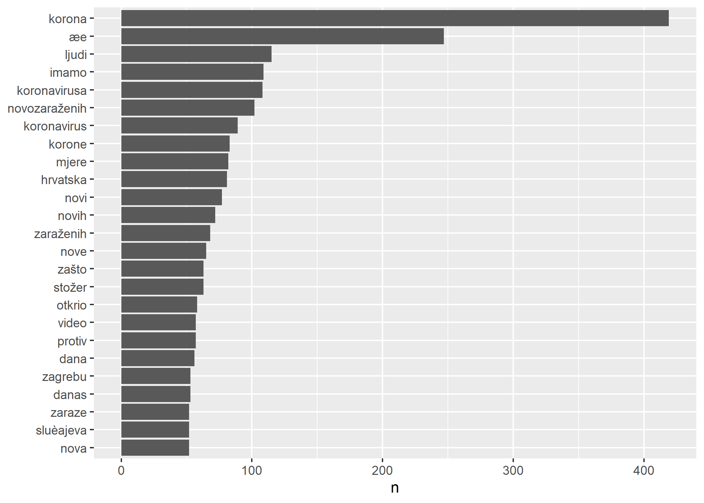<!-- -->

```r
## Vizualizacija najčešćih riječi kroz vrijeme
newsCOVID_tokenTidy %>%
   mutate(Datum = floor_date(datum, "day")) %>%
   group_by(Datum) %>%
   count(word) %>% 
   mutate(gn = sum(n)) %>%
   filter(word %in%  c("virus", "mjere", "korona", "stožer", "beroš", "maske")) %>%
   ggplot(., aes(Datum,  n / gn)) + 
   geom_point() +
   ggtitle("Učestalost korištenja riječi u člancima o pandemiji COVID-19") +
   ylab("% ukupnih riječi") +
   geom_smooth() +
   facet_wrap(~ word, scales = "free_y") +
   scale_y_continuous(labels = scales::percent_format())+
   theme_economist()
```

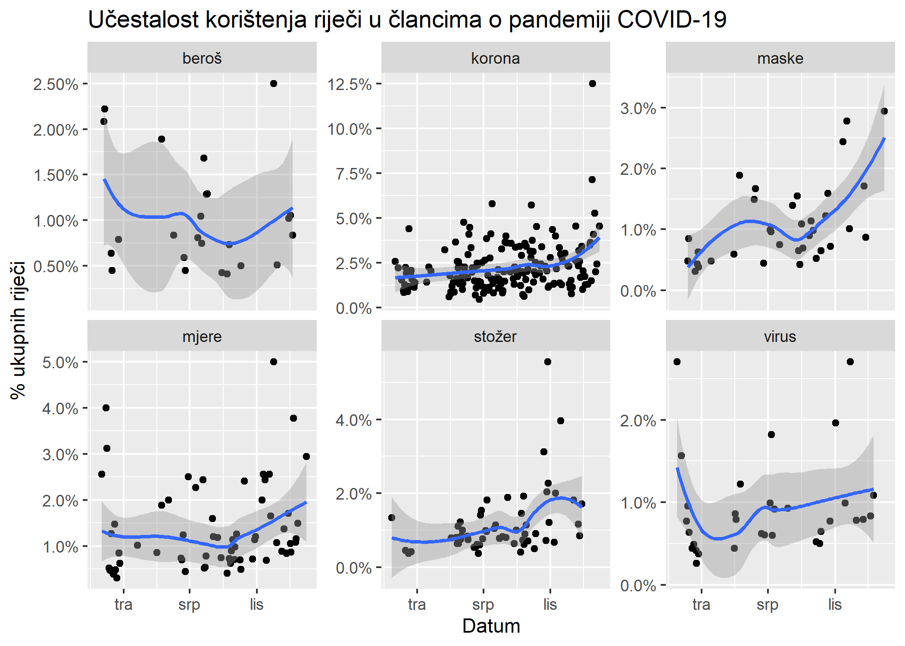<!-- -->

Također je moguće napraviti i deskriptivno-statistički pregled domena:


```r
# DESKRIPTIVNI PREGLED DOMENA

## Broj domena
newsCOVID_tokenTidy %>% 
  summarise(Domena = n_distinct(domena))
```

```
##   Domena
## 1      3
```

```r
## Broj članaka po domeni

newsCOVID %>% 
  drop_na(.) %>%
  group_by(domena) %>%
  summarise(n = n()) %>%
  arrange(desc(n)) %>% 
  head(20)
```

```
## # A tibble: 3 x 2
##   domena      n
##   <chr>   <int>
## 1 nethr    1170
## 2 index    1002
## 3 tportal   451
```

```r
## Broj članaka po domeni kroz vrijeme

newsCOVID %>% 
   mutate(Datum = floor_date(datum, "week")) %>%
   group_by(Datum, domena) %>%
   summarise(n = n()) %>%
   ungroup() %>%
   ggplot(., aes(Datum,  n)) + 
   geom_line() +
   ggtitle("Članci o pandemiji COVID-19 na najvažnijim RH portalima") +
   ylab("Broj objavljenih COVID članaka") +
   geom_smooth() +
   facet_wrap(~ domena, scales = "free_y") +
   theme_economist()
```

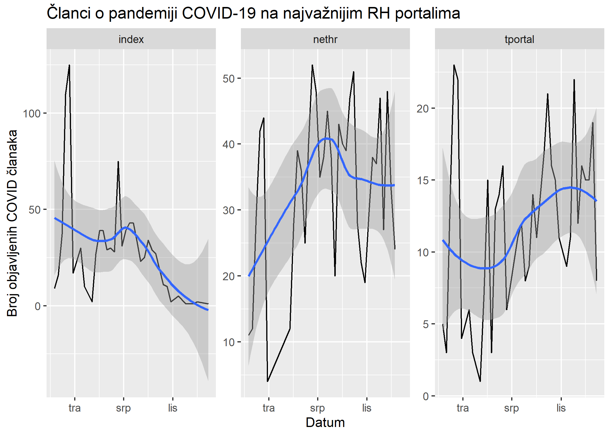<!-- -->

## Analiza sentimenta

Nakon uređivanja podataka i osnovnog pregleda najvažnijih riječi, dinamike kretanja članaka kroz vrijeme i pregleda deskriptivne statistike domena ćemo provesti analizu **sentimenta**. Za analizu sentimenta je potrebno preuzeti leksikone sentimenta koji su za hrvatski jezik dostupni kroz FER-ov [Croatian Sentiment Lexicon](http://meta-share.ffzg.hr/repository/browse/croatian-sentiment-lexicon/940fe19e6c6d11e28a985ef2e4e6c59eff8b12d75f284d58aacfa8d732467509/). Analiza sentimenta i uključuje sentiment kroz vrijeme, doprinos riječi sentimentu, 'wordCloud' i analizu negativnosti portala.

Pogledajmo prvo kako izgledaju leksikoni (koje smo učitali na početku):


```r
## Pregled leksikona
CroSentilex_n %>% sample_n(10)
```

```
##                 word sentiment brija
##  1:          toplica   0.47290   NEG
##  2:         komunati   0.14723   NEG
##  3:        preostati   0.39368   NEG
##  4:         cvjetača   0.14295   NEG
##  5:        sklapanje   0.50151   NEG
##  6:     kompatibilan   0.25909   NEG
##  7:          leipzig   0.34337   NEG
##  8:        proštenik   0.26667   NEG
##  9: diskriminirajući   0.36625   NEG
## 10:      kolažiranje   0.12735   NEG
```

```r
CroSentilex_p %>% sample_n(10)
```

```
##              word sentiment brija
##  1:       berishe  0.179200   POZ
##  2: bjelosvjetski  0.258700   POZ
##  3:       rogošić  0.266480   POZ
##  4:      laurence  0.385980   POZ
##  5:       posudba  0.503180   POZ
##  6:    napomenuti  0.267380   POZ
##  7:       naravan  0.219290   POZ
##  8:          obod  0.284240   POZ
##  9:       corinna  0.083348   POZ
## 10:     zastanuti  0.390960   POZ
```

```r
Crosentilex_sve %>% sample_n(10)
```

```
##              word sentiment brija
##  1:       zagovor   0.11602   NEG
##  2:          owen   0.45149   POZ
##  3:   skandiranje   0.49131   POZ
##  4: strossmayerov   0.30755   POZ
##  5:    pčelarstvo   0.24969   POZ
##  6:          iljo   0.27278   NEG
##  7:       ročnica   0.22567   POZ
##  8:       osimski   0.27088   NEG
##  9:         obići   0.42460   POZ
## 10:         štrig   0.23390   NEG
```

```r
CroSentilex_Gold %>% sample_n(10)
```

```
##          word sentiment
## 1       dužan         1
## 2     učinjen         0
## 3      ležati         0
## 4      hektar         0
## 5      odgoda         0
## 6  podsjećati         0
## 7       svađa         1
## 8    dokument         0
## 9  priznavati         0
## 10   povratak         0
```

Provjerimo kretanje sentimenta u vremenu:


```r
## Kretanje sentimenta kroz vrijeme
vizualiziraj_sentiment <- function(dataset, frq = "week") {

dataset %>%
  inner_join( Crosentilex_sve, by = "word") %>%
  filter(!is.na(word)) %>%
  select(word, brija, datum, sentiment) %>% 
  unique() %>%
  spread(. , brija, sentiment) %>%
  mutate(sentiment = POZ - NEG) %>%
  select(word, datum, sentiment) %>% 
  group_by(word) %>% 
  mutate(count = n()) %>%
  arrange(desc(count)) %>%
  mutate( score = sentiment*count) %>%
  ungroup() %>%
  group_by(datum) %>%
  arrange(desc(datum)) -> sm

 
sm %>%
  select(datum, score) %>%
  group_by(Datum = floor_date(datum, frq)) %>%
  summarise(Dnevni_sent = sum(score, na.rm = TRUE)) %>%
  ggplot(., aes(Datum, Dnevni_sent)) +
  geom_bar(stat = "identity") + 
  ggtitle(paste0("Sentiment kroz vrijeme;frekvencija podataka:", frq)) +
  ylab("SentimentScore") +
  theme_economist()-> gg_sentiment_kroz_vrijeme_qv


gg_sentiment_kroz_vrijeme_qv

}

vizualiziraj_sentiment(newsCOVID_tokenTidy,"week")
```

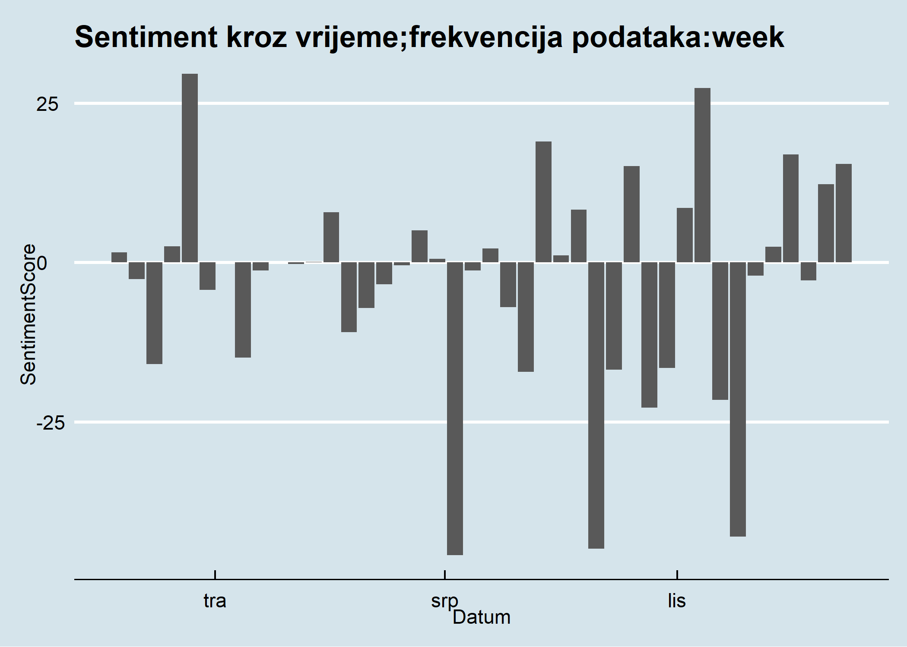<!-- -->

Korisno je i promotriti koje riječi najviše doprinose sentimentu (pozitivnom, negativnom i neutralnom):


```r
## Doprinos sentimentu
doprinos_sentimentu <- function(dataset, no = n) {
dataset %>%
  inner_join(CroSentilex_Gold, by = "word") %>% 
  count(word, sentiment,sort = TRUE) %>% 
  group_by(sentiment) %>%
  top_n(no) %>%
  ungroup() %>%
  mutate(sentiment = case_when(sentiment == 0 ~ "NEUTRALNO",
                                 sentiment == 1 ~ "NEGATIVNO",
                                 sentiment == 2 ~ "POZITIVNO")) %>%
  mutate(word = reorder(word, n)) %>%
  ggplot(aes(word, n, fill = sentiment)) +
  geom_col(show.legend = FALSE) +
  ggtitle( "Doprinos sentimentu") +
  labs( x = "Riječ", y = "Broj riječi") +
  facet_wrap(~ sentiment, scales = "free_y") +
  coord_flip() +
  theme_economist() -> gg_doprinos_sentimentu
  
 gg_doprinos_sentimentu
 
}


doprinos_sentimentu(newsCOVID_tokenTidy,15)
```

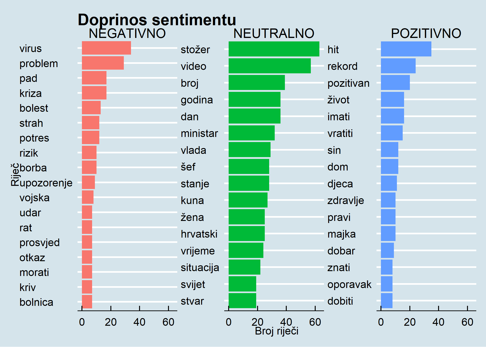<!-- -->

Korisno je pogledati i WordCloud sentiment. Pogledajmo "obični" WordCloud prije toga:


```r
## WordCloud(vulgaris)
newsCOVID_tokenTidy %>%
  anti_join(CroSentilex_Gold,by="word") %>% 
  count(word) %>% 
  arrange(desc(n)) %>%
  top_n(100) %>%
  with(wordcloud(word, n, max.words = 80)) 
```

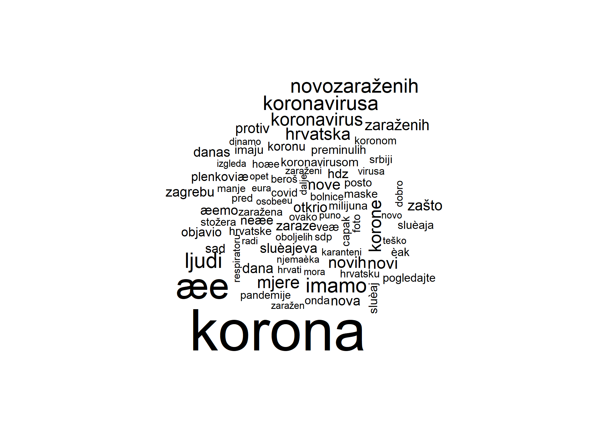<!-- -->

Ovako izgleda WordCloud koji sadržava i prikaz sentimenta:


```r
## ComparisonCloud
newsCOVID_tokenTidy %>%
  inner_join(CroSentilex_Gold,by="word") %>% 
  count(word, sentiment) %>% 
  top_n(200) %>%
  mutate(sentiment = case_when(sentiment == 0 ~ "+/-",
                                 sentiment == 1 ~ "-",
                                 sentiment == 2 ~ "+")) %>%
  acast(word ~ sentiment, value.var = "n", fill = 0) %>%
  comparison.cloud(colors = c("firebrick3", "deepskyblue3","darkslategray"),
                   max.words = 120)
```

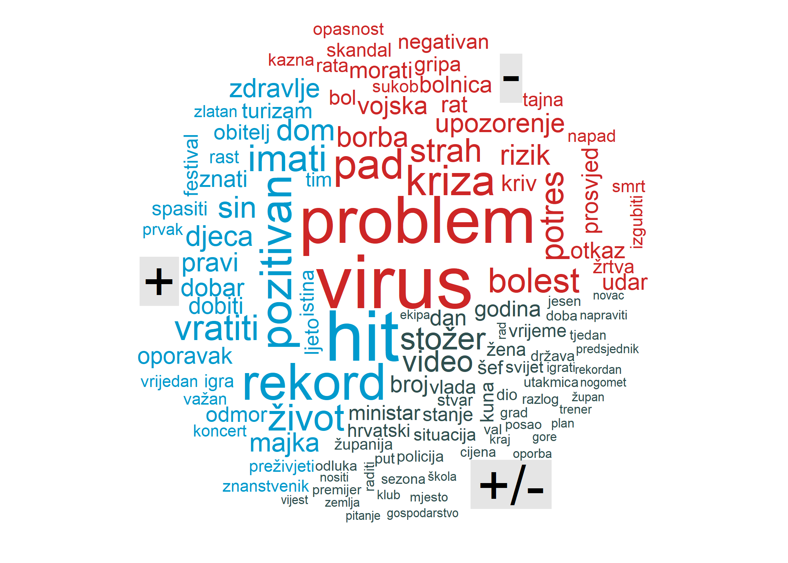<!-- -->

Analiza sentimenta se može iskoristiti za pregled negativnosti pojedinih portala:


```r
## Najnegativniji portali

wCount <- newsCOVID_tokenTidy %>% 
  group_by(domena) %>%
  summarise(word = n())

CroSentilex_Gold_neg <- CroSentilex_Gold %>% filter(sentiment == 1)
CroSentilex_Gold_poz <- CroSentilex_Gold %>% filter(sentiment == 2)


newsCOVID_tokenTidy %>% 
  semi_join(CroSentilex_Gold_neg, by= "word") %>%
  group_by(domena) %>% 
  summarise(negWords = n()) %>%
  left_join(wCount, by = "domena") %>%
  mutate(negativnostIndex = (negWords/word)*100) %>%
  arrange(desc(negativnostIndex))
```

```
## # A tibble: 3 x 4
##   domena  negWords  word negativnostIndex
##   <chr>      <int> <int>            <dbl>
## 1 nethr        226 13581             1.66
## 2 tportal       62  4674             1.33
## 3 index         99  7660             1.29
```

...također i pozitivnosti portala:


```r
## Najpozitivniji portali

CroSentilex_Gold_poz <- CroSentilex_Gold %>% filter(sentiment == 2)

newsCOVID_tokenTidy %>% 
  semi_join(CroSentilex_Gold_poz, by= "word") %>%
  group_by(domena) %>% 
  summarise(pozWords = n()) %>%
  left_join(wCount, by = "domena") %>%
  mutate(pozitivnostIndex = (pozWords/word)*100) %>%
  arrange(desc(pozitivnostIndex))  
```

```
## # A tibble: 3 x 4
##   domena  pozWords  word pozitivnostIndex
##   <chr>      <int> <int>            <dbl>
## 1 index        138  7660             1.80
## 2 tportal       81  4674             1.73
## 3 nethr        204 13581             1.50
```


## Analiza važnosti pojmova

Nakon analize sentimenta je korisno analizirati i **najbitnije** riječi. To se radi pomoću IDF (inverse document frequency) metode. IDF metoda omogućuje identifikaciju važnih (ne nužno čestih) riječi u korpusu i može poslužiti za analizu najvažnijih pojmova po domenama.


```r
## Udio riječi po domenama

domenaWords <- newsCOVID %>%
  unnest_tokens(word,naslov) %>% 
  count(domena, word, sort = T)
  
ukupnoWords <- domenaWords %>%
  group_by(domena) %>%
  summarise(totWords = sum(n))

domenaWords <- left_join(domenaWords, ukupnoWords)


# domenaWords %>% head(15)

# domenaWords %>% 
# ggplot(., aes(n/totWords, fill = domena)) +
#   geom_histogram(show.legend = FALSE) +
#   xlim(NA, 0.0009) +
#   facet_wrap(~domena, ncol = 2, scales = "free_y")

## Najbitnije riječi po domenma

idf <- domenaWords %>%
  bind_tf_idf(word, domena, n)

idf %>% head(10)
```

```
##     domena word   n totWords          tf idf tf_idf
## 1    nethr    u 647    21015 0.030787533   0      0
## 2    nethr   je 580    21015 0.027599334   0      0
## 3    nethr    i 527    21015 0.025077326   0      0
## 4    index    u 469    11447 0.040971434   0      0
## 5    nethr   se 393    21015 0.018700928   0      0
## 6    nethr   na 380    21015 0.018082322   0      0
## 7    index   je 311    11447 0.027168690   0      0
## 8  tportal    u 300     7253 0.041362195   0      0
## 9    index   se 205    11447 0.017908622   0      0
## 10   nethr   su 199    21015 0.009469427   0      0
```

```r
# idf %>% 
#   select(-totWords) %>%
#   arrange(desc(tf_idf))

idf %>%
  arrange(desc(tf_idf)) %>%
  mutate(word = factor(word, levels = rev(unique(word)))) %>% 
  mutate(domena = factor(domena)) %>%
  group_by(domena) %>% 
  top_n(10) %>% 
  ungroup() %>%
  ggplot(aes(word, tf_idf, fill = domena)) +
  geom_col(show.legend = FALSE) +
  labs(x = NULL, y = "tf-idf") +
  facet_wrap(~domena, ncol = 2, scales = "free") +
  coord_flip() +
  theme_economist()
```

<!-- -->

## nGrami

Do sada smo analizirali tekst tako da je tekst tokeniziran na jednu riječ. To može prikriti bitne nalaze do kojih je moguće doći kada se tekst tokenizira na fraze (dvije ili N riječi). U sljedećemo koraku ćemo tokenizirati tekst na bigrame (dvije riječi) kako bismo proveli frazeološku analizu. Korištenje bigrama omogućava korištenje dodatnih metoda pa ćemo provesti i analizu korelacije među riječima.


```r
newsCOVID_bigram <- newsCOVID %>%
  unnest_tokens(bigram, naslov, token = "ngrams", n = 2)

newsCOVID_bigram %>% head(10)
```

```
##         datum domena clanak               bigram
## 1  2020-02-26  nethr   2648      civilna zaštita
## 2  2020-02-26  nethr   2648 zaštita mobilizirala
## 3  2020-02-26  nethr   2648   mobilizirala hotel
## 4  2020-02-26  nethr   2648             hotel na
## 5  2020-02-26  nethr   2648          na sljemenu
## 6  2020-02-26  nethr   2648  sljemenu tomislavov
## 7  2020-02-26  nethr   2648       tomislavov dom
## 8  2020-02-26  nethr   2648          dom postaje
## 9  2020-02-26  nethr   2648    postaje karantena
## 10 2020-02-26  nethr   2648   karantena izbacili
```

```r
newsCOVID_bigram %>%
  count(bigram, sort = T) %>%
  head(15)
```

```
##             bigram   n
## 1      u hrvatskoj 110
## 2            da je  82
## 3        u zagrebu  52
## 4            da se  46
## 5            ae se  45
## 6  novih slueajeva  45
## 7            to je  45
## 8           što je  44
## 9           ovo je  38
## 10            je u  32
## 11         koji je  30
## 12         ae biti  29
## 13       je korona  29
## 14        u srbiji  29
## 15  na koronavirus  28
```

```r
newsCOVID_bigram_sep <- newsCOVID_bigram %>%
  separate(bigram, c("word1","word2"), sep = " ")

newsCOVID_bigram_tidy <- newsCOVID_bigram_sep %>%
  filter(!word1 %in% stop_corpus$word) %>%
  filter(!word2 %in% stop_corpus$word) %>%
  mutate(word1 = gsub("\\d+", NA, word1)) %>%
  mutate(word2 = gsub("\\d+", NA, word2)) %>%
  mutate(word1 = gsub("^[a-zA-Z]$", NA, word1)) %>%
  mutate(word2 = gsub("^[a-zA-Z]$", NA, word2)) %>% 
  drop_na(.)


newsCOVID_bigram_tidy_bigram_counts <- newsCOVID_bigram_tidy %>% 
  count(word1, word2, sort = TRUE)

#newsCOVID_bigram_tidy_bigram_counts

bigrams_united <- newsCOVID_bigram_tidy %>%
  drop_na(.) %>%
  unite(bigram, word1, word2, sep = " ")

#bigrams_united

bigrams_united %>% 
  count(clanak,bigram,sort = T) -> topicBigram

# Najvažniji bigrami po domenama

 bigram_tf_idf <- bigrams_united %>%
  count(domena, bigram) %>%
  bind_tf_idf(bigram, domena, n) %>%
  arrange(desc(tf_idf))

bigram_tf_idf %>%
  arrange(desc(tf_idf)) %>%
  mutate(bigram = factor(bigram, levels = rev(unique(bigram)))) %>% 
  group_by(domena) %>% 
  top_n(7) %>% 
  ungroup() %>%
  ggplot(aes(bigram, tf_idf, fill = domena)) +
  geom_col(show.legend = FALSE) +
  labs(x = NULL, y = "tf-idf") +
  facet_wrap(~domena, ncol = 2, scales = "free") +
  coord_flip() + 
  theme_economist()
```

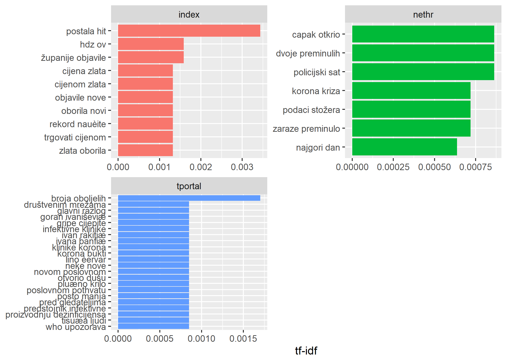<!-- -->


```r
# Analiza bigramskih fraza

newsCOVID_bigram_tidy %>%
  filter(word1 == "covid") %>%
  count(word1,word2,sort=T)

# Vizualiziraj bigrame

bigram_graph <- newsCOVID_bigram_tidy_bigram_counts %>%
  filter(n >50) %>%
   graph_from_data_frame()

a <- grid::arrow(type = "closed", length = unit(.15, "inches"))

ggraph(bigram_graph, layout = "fr") +
  geom_edge_link(aes(edge_alpha = n), show.legend = FALSE,
                 arrow = a, end_cap = circle(.07, 'inches')) +
  geom_node_point(color = "lightblue", size = 5) +
  geom_node_text(aes(label = name), vjust = 1, hjust = 1) +
  theme_void()
```


Provjerimo koje su riječi najviše korelirane sa izabranim ključnim riječima:


```r
# Korelacije riječi ( R crash na T=30)

#newsCOVID_tokenTidy %>% 
#  filter(published == "2020-04-22") %>%
#  pairwise_count(word, domena, sort = T) %>%
#  filter_all(any_vars(!is.na(.))) -> pairsWords

newsCOVID_tokenTidy %>% 
#  filter(datum > "2020-02-20") %>%
  group_by(word) %>%
  filter(n() > 20) %>%
  filter(!is.na(word)) %>%
  pairwise_cor(word,datum, sort = T) -> corsWords

#corsWords %>%
#  filter(item1 == "oporavak")

corsWords %>%
  filter(item1 %in% c("stožer", "beroš", "mjere", "maske")) %>%
  group_by(item1) %>%
  top_n(10) %>%
  ungroup() %>%
  mutate(item2 = reorder(item2, correlation)) %>%
  ggplot(aes(item2, correlation)) +
  geom_bar(stat = "identity") +
  facet_wrap(~ item1, scales = "free") +
  coord_flip() + 
  theme_economist()
```

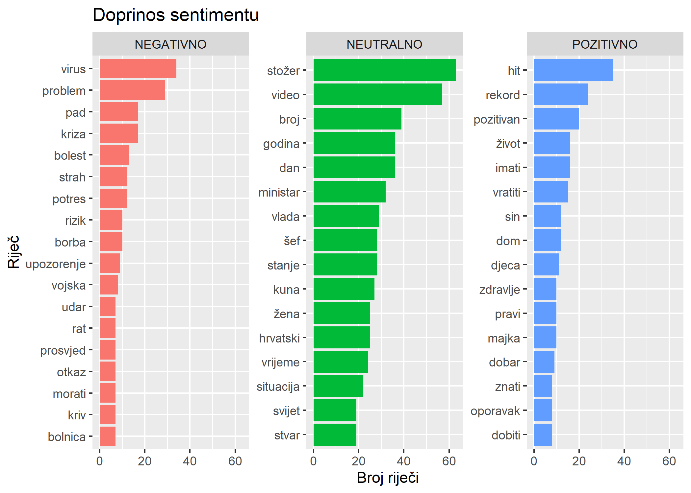<!-- -->

## Tematska analiza

Na kraju provodimo tematsku analizu kao najsloženiji dio do sada provedene analize. Pri tome koristimo LDA (Latent Dirichlet allocation) algoritam kako bismo pronašli najvažnije riječi u algoritamski identificiranim temama. Ovdje je važno primijetiti da prije provedbe LDA modela valja tokenizirane riječi pretvoriti u matricu pojmova (document term matrix) koju ćemo kasnije koristiti kao input za LDA algoritam.


```r
newsCOVID_tokenTidy %>%
  count(clanak, word, sort = TRUE) %>%
  cast_dtm(clanak, word,n) -> dtm

newsCOVID_LDA <- LDA(dtm, k = 4,  control = list(seed = 1234))

newsCOVID_LDA_tidy <- tidy(newsCOVID_LDA, matrix = "beta")
#newsCOVID_LDA_tidy

newsCOVID_terms <- newsCOVID_LDA_tidy %>%
  drop_na(.) %>%
  group_by(topic) %>%
  top_n(15, beta) %>%
  ungroup() %>%
  arrange(topic, -beta)

#newsCOVID_terms

newsCOVID_terms %>%
  mutate(term = reorder_within(term, beta, topic)) %>%
  ggplot(aes(term, beta, fill = factor(topic))) +
  geom_col(show.legend = FALSE) +
  facet_wrap(~ topic, scales = "free") +
  coord_flip() +
  scale_x_reordered() + 
  theme_economist()
```

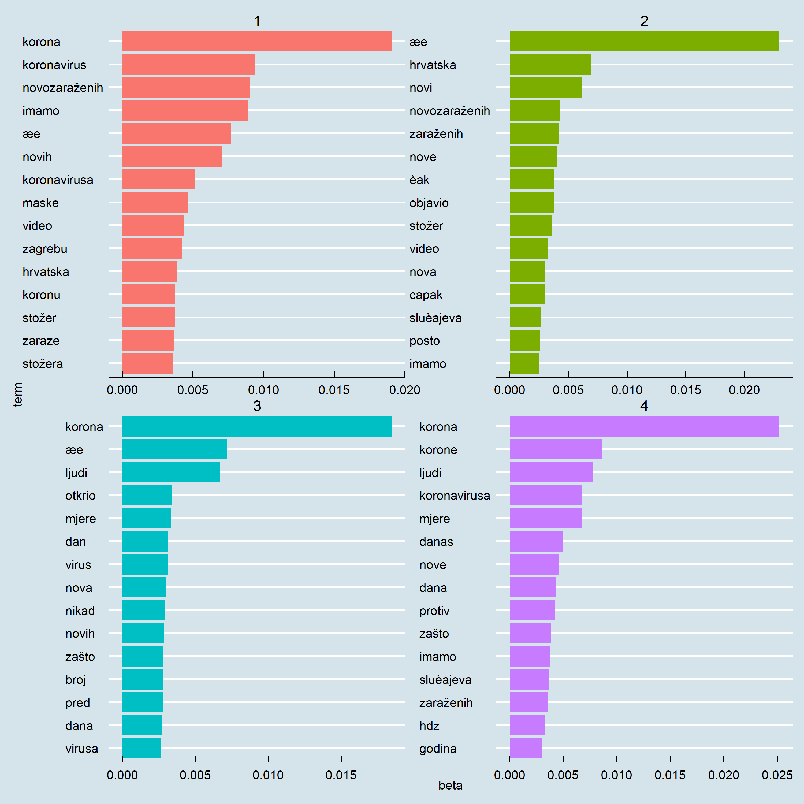<!-- -->

Tematsku analizu je moguće i napraviti na bigramski tokeniziranom tekstu. Tada je često moguće doći do preciznijih i kontekstualno relevantnijih uvida:


```r
# Bigrami 

topicBigram %>%
  cast_dtm(clanak, bigram,n) -> dtmB

newsCOVID_LDA <- LDA(dtmB, k = 4,  control = list(seed = 1234))

newsCOVID_LDA_tidy <- tidy(newsCOVID_LDA, matrix = "beta")
#newsCOVID_LDA_tidy

newsCOVID_terms <- newsCOVID_LDA_tidy %>%
  drop_na(.) %>%
  group_by(topic) %>%
  top_n(10, beta) %>%
  ungroup() %>%
  arrange(topic, -beta)

#newsCOVID_terms


newsCOVID_terms %>%
  mutate(term = reorder_within(term, beta, topic)) %>%
  ggplot(aes(term, beta, fill = factor(topic))) +
  geom_col(show.legend = FALSE) +
  facet_wrap(~ topic, scales = "free") +
  coord_flip() +
  scale_x_reordered() + 
  theme_economist()
```

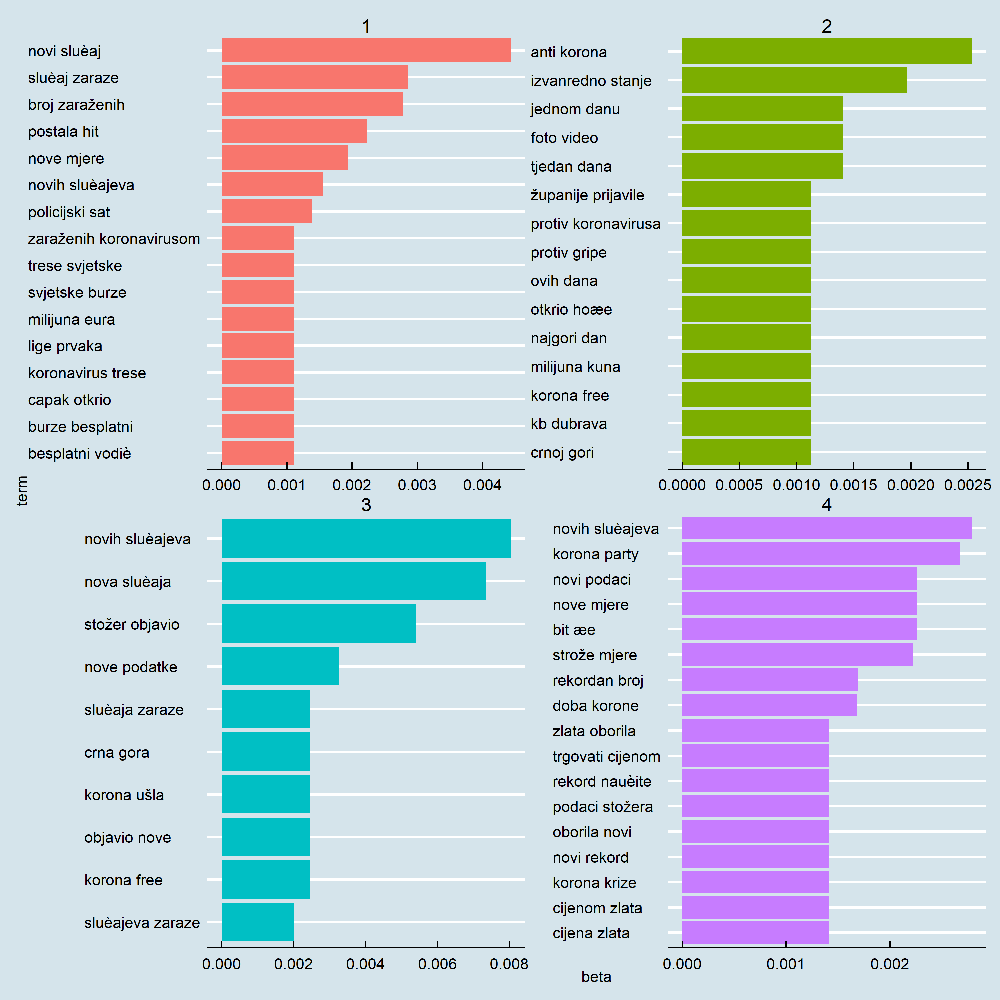<!-- -->


## Zaključak

U ovom smo predavanju dali uvodni pregled mogućnosti analize teksta u okviru `tidytext` paketa. Riječ je o skupu alata koji omogućavaju "prilagodbu" teksta u *tidy* format i daljnu analizu s `tidyverse` alatima koje smo do sada već dobro upoznali. `tidytext` nije jedini dostupan okvir za analizu teksta u R, već postoji i niz drugih paketa (vidi na početku) koji omogućavaju korištenje naprednijih (algoritamkskih tehnika.

U predavanju su korišteni tekstovi objavljeni na tri domaća portala o temi COVID-19 u razdoblju od prvog zabilježenog slučaja u RH do danas. Analiza je pokazala mogućnosti tekstualne analize te osnovnih tehnika i alata na aktualnom primjeru.

Analiza teksta je trenutno (brzo) rastuće istraživačko područje sa sve većim brojem primjena, novih metodoloških pristupa i perspektiva. Dostupno je mnoštvo kvalitetnih i korisnih resursa pa se zainteresiranim studentima preporuča uključivanje u ovu (vrlo perspektivnu) istraživačku paradigmu.
